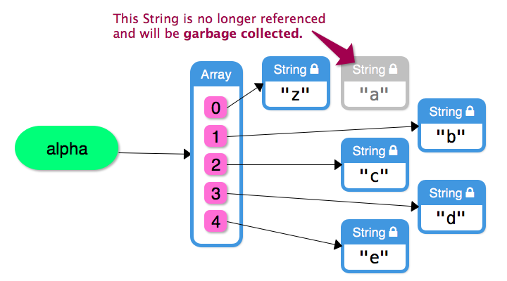

# JS210 Notes (Rewritten)

## Terminology

- In terms of the official documentation:

  - `Constructor.prototype.methodName()` refers to an `instance method` which can be referred to as `prototype methods`
  - `Constructor.methodName()` refers to a `static method`

- Traditional JavaScript means ECMAScript versions up to and excluding ES6

- Modern JavaScript means ECMAScript versions starting at and including ES6

- `Explicit coercion` means using functions to convert between data types

- `Implicit coercion` means the JavaScript engine determines the data type based on the context.

  This mechanism can also be referred to as `silent` or `automatic` coercion.

- `Initializer` refers to the expression a newly declared variable is bound to on creation on the same line.

- `template literal syntax` are strings literals that allow embedding/interpolating of expressions and are nested between a pair of back-ticks:

  ```javascript
  const name = 'Heisenberg';
  const sayMyName = `${name}. Daaamn right!` // uses template literal syntax
  console.log(sayMyName);
  ```

  


## The JavaScript language and other random JavaScript facts

JavaScript's official name is `ECMAScript` and is commonly abbreviated as `ES`.

JS/ES versions are often abbreviated using either:

- The release year, like for example `ECMAScript 2019` or `ES2019`
- The number of the version like for example `ECMAScript 10` or `ES10`

The version`ES6+` is considered `modern JS` because many improvements have been made starting at that version, but since many code bases still use older JS, also referred to as `traditional ES/JS` that was in use around `2005`, **we should know both for some time to come**.

Most modern browsers support ES6+ features well but older browsers do not, so when the compatibility is questionable:

- Use a [Compatibility Table](http://kangax.github.io/compat-table/es2016plus) to determine if the feature is supported
- Use a transpilation tool like [Babel](https://babeljs.io/) to automatically mutate scripts into code that used only features for a particular environment


**More facts:**

- Dynamically typed language which means that a variable can point to any data type

- A rule about hoisting. When a scope contains declaration for multiple functions with the **same name**, these functions are apparently hoisted in the order from top to bottom, and in the end, the last i.e. the declaration at the bottom is the one invoked **where ever** that function is invoked.

    ```javascript
    function some() { console.log('first'); };
    some(); // third
    function some() { console.log('second'); };
    some(); // third
    function some() { console.log('third'); };
    some(); // third
    
    // because after hoisting
    function some() { console.log('first'); };
    function some() { console.log('second'); };
    function some() { console.log('third'); }; // this is the last declaration
    ```

- The JS `%` is **not** the module operator but the remainer

- `NaN` is the only JS value that is not equal to itself in terms of using equality operators. To equality between `NaN` values, one of the following two method can be used:

    - `Number.isNaN(value)`
    - `Object.is(value, NaN)`

- `Infinity` is considered to be a `Number`

- `\` at the end of a line forces JS to ignore the new line, this is great to chain long strings together.
    But beware the spaces because JS treats each space/tab etc as an actual space/tab in the string

    - The verbose version

      ```javascript
      let longText = 'esfesvsfawesvef ef sev es esfse es\n' +
                     'esfesf ef sef osjefn sief iosnevion';
      ```

    - The less verbose and less flexible version

      ```javascript
      let longText = 'awdd awca cesesfsefs es se\n\
      dawd  awdwdwad wad wa dwa\n\
      dwawd wf ffesfes skf sef';
      ```

    **Note**: When wrapping lines using `\`, the backward slash must be the last character on the wrapped line. Any character after the backward slash raises a `SyntaxError`.

- JavaScript functions are first-class function that have the following attributes:

    1. can be assigned to variables and as elements of data structures (array, objects)
    2. can be passed to a function as argument
    3. can be returned as return value from a function/method

- When 'stringifying' values, depending on what the value is and how it is stringifyed, the result string is different, here some examples:

    - Passing a function value as argument to `console.log`  outputs `[Function: functionName]`
    - Using a function value in string interpolation and concatenation results in the full definition of the function as string

- Apparently the object literal notation interprets the following two key-value pair definitions the same way `let obj = {a: 25, 'a': 35}` and the value for  `a` ends up being `35` because `'a'`' and `a` are interpreted the same way.

- All this time I wondered the following code needs parentheses around the number part to call Number methods on:

    ```javascript
    17.toString();   // does not work
    (17).toString(); // that does work
    ```

    The first line does not work because we attempt to invoke a method on a number primitive, which has no methods associated with it. The second line implicitly coerces the primitive value `17` into a `Number` object which is why we can invoke Number methods on line `2`.
    
- ES is loosely typed, which means that any type can be stored in a variable, passed as a parameter to any function etc.

- apparently it is very important to use `PascaleCase` as identifiers for constructors, which require the `new` keyword. Do not use `PascaleCase` for anything but constructors.

- identifiers start with letter of `_`  or `$` followed by zero or more letters, digits, `_` or `$`  and do not use `_` and `$` as leading character because they are used in the implementation

- Bitwise operators convert the operand to a signed 32-bit integer, apply the bitwise operator and then turn the result back into a 64-bit floating point.

    So bitwise operators cannot be used to make things faster because of this, use the appropriate operator for that.

- Switch statements have a fall-through hazard. The switch value can be an expression i.e. does not need to be a constants. This expression can then evaluate to anything? It does not have to evaluate to a string or an integer and the cases will be compared using the strict-equality operator.

- An object prototype is not enumerable

- An array length property is not enumerable


## Data types

JavaScript differentiates between `primitive` and `complex`data types.


### Primitive data types

Traditional JS specifies `5 primitive data types`:

- `String`
- `Number`  -  The only numerical data type. Used for both integer and floating point numbers.
- `Boolean`  -  Can only every hold the value `true` or `false`
- `Undefined`  -  Represents the absence of a value and can be used explicitly through the literal `undefined`
- `Null`  -  Represents the absence of a value similar to `undefined`


Modern JS introduces `2` more primitive data types over the previous `5`: 

- `Symbol` introduced in `ES6`
- `BigInt` introduced in `ES9`

**Primitive values are immutable. No operation can ever mutate the value of a primitive value but always returns a new value.**


### Complex/Compound/Composite data types

All data types that are not one of the traditional or modern JS primitive data types are referred to as `complex`; `compound` or `composite` data types. These can be made up of other objects and values.

Examples of complex data types are the built-in `Array` and `Simple Object`; `Date` and `Function` .


#### The `typeof` operator

The `typeof` operator returns a string that represents the data type of the operand. Some quirks to be aware of:

- `typeof(null)` returns a string with the value `object` which is an implementation error in the JavaScript implementation which cannot be fixed without breaking all code written so far. So this behavior will stay as is for the forseeable future.

  The ECMAScript  standard specifies that `null` is a `primitive` and **not** an `object` i.e. `null` is to be treated as a primitive value and **not** an object.

- `typeof` with an array operand returns a string with the value `object` because an array is actually an object under the hood


#### `undefined` VS  `null`

- `undefined` is a primitive value that is used when a variable is declared but not initialized.
  This data type can arise implicitly through non-initialized variables.
- `null` is a primitive value that is used when a variable is declared and initialized with an 'empty' value i.e. the absence of a value.


## Type coercion

### Explicit type coercion

Explicit type coercion occurs when functions are used to convert one data type to another. A non-exhaustive list of explicit type coercions:

- **Converting Strings to Numbers**
  - `Number(string)`  -  Returns a `String` representing the number or `NaN` if the string cannot be converted

  - `parseInt(string, radix (optional))`  -  Global function  -  Returns a `Number` as integer or `NaN` if the string cannot be converted

  - `parseFloat(string)`  -  Global function  -  Returns a `Number` as float or `NaN` if the string cannot be converted

- **Converting Numbers to Strings**
  - `String`
  - `Number.prototype.toString`

- **Converting Booleans to Strings**
  - `String`
  - `Boolean.prototype.toString`

- **Converting any value to Booleans**
  - `Boolean`
  - Using the binary negation operator twice `!!someValue`


### Implicit type coercion

Implicit type coercion occurs when the JavaScript engine makes sense of an expression and determines the data type to convert a value to implicitly based on the context of the code in question. Depending on the rules applied, multiple cycles and level of coercions may be triggered before the actual operations are performed.

**Note**: Implicit type coercions in to be avoided in general!


## Operators

### The plus `+` operator

The `+` operator can be used as unary and binary operator.

**As unary operator - The rules are complex and not necessarily useful**

```javascript
+('123')        // 123
+(true)         // 1
+(false)        // 0
+('')           // 0
+(' ')          // 0
+('\n')         // 0
+(null)         // 0
+(undefined)    // NaN
+('a')          // NaN
+('1a')         // NaN
```


**As binary operator - The rules depend on the type of both operands**

- If one operand is of type String, the respective non-string operand is implicitly coerced into a String and the expressions boils down to string concatenation.

  ```javascript
  '123' + 123     // "123123" -- if a string is present, coerce for string concatenation
  123 + '123'     // "123123"
  null + 'a'      // "nulla" -- null is coerced to string
  '' + true       // "true"
  ```

- When operands are any combination of Numbers; Booleans; null and undefined, all operands are converted to numbers and summed together.

  ```javascript
  1 + true        // 2
  1 + false       // 1
  true + false    // 1
  null + false    // 0
  null + null     // 0
  1 + undefined   // NaN - JS considers 'undefined' to be NaN
  ```

- When any of the operands is an object, i.e. an Array; Object or a function, both operands are coerced to a String and concatenated together.

  ```javascript
  [1] + 2                     // "12"
  [1] + '2'                   // "12"
  [1, 2] + 3                  // "1,23"
  [] + 5                      // "5"
  [] + true                   // "true"
  42 + {}                     // "42[object Object]"
  (function foo() {}) + 42    // "function foo() {}42"
  ```


### Arithmetic operators `-`; `*`; `/` and `%`

Non-number operand are coerced into numbers if possible and then the arithmetic is carried out of both number operands.
In case an operand cannot be coerced into a number, the operator evaluates to `NaN` because the operation cannot possible result in a number.
This implies how other data types such as strings and booleans are implicitly coerced into a number.

```javascript
1 - true                // 0
'123' * 3               // 369 -- the string is coerced to a number
'8' - '1'               // 7
-'42'                   // -42
null - 42               // -42
false / true            // 0
true / false            // Infinity
'5' % 2                 // 1
'Meep' * 255            // 'Meep' cannot be converted to a Number so becomes NaN
```

 

### Equality operators

There are two types of equality operators that vary in their strictness and how the operands and interpreted.


**Strict equality operator -  Identity Operator  -  No implicit type coercion occurs before comparison**

- `true` only when **both** the **type** and **value** of the operands are the exact same
- `false` otherwise

```javascript
1 === 1               // true
1 === '1'             // false
0 === false           // false
'' === undefined      // false
'' === 0              // false
true === 1            // false
'true' === true       // false
```

**Strict in-equality operator - The same as the strict-equality but opposite result**

- `true` when the type **or** value of the operand is different
- `false` when the operand have the same type and value


**Non-strict equality operator  -  Loose equality operator  -  Implicit type coercion may occur before comparison**

Works the same as the strict-equality operator if, and only if both operand types are the same, otherwise the operands may be implicitly coerced to the same type before their values are compared. Here some cases:

- When one operand is a string and the other a number, the string is coerced into a number

  ```javascript
  '42' == 42            // true
  42 == '42'            // true
  42 == 'a'             // false -- becomes 42 == NaN
  0 == ''               // true -- becomes 0 == 0
  0 == '\n'             // true -- becomes 0 == 0
  ```

- When one operand is a boolean, that boolean operator is coerced into a number 

  ```javascript
  42 == true            // false -- becomes 42 == 1
  0 == false            // true -- becomes 0 == 0
  '0' == false          // true -- becomes '0' == 0, then 0 == 0
                        // (two conversions)
  '' == false           // true -- becomes '' == 0, then 0 == 0
                        // (two conversions)
  true == '1'           // true
  true == 'true'        // false -- becomes 1 == 'true', then 1 == NaN
                        // (two conversions)
  ```

- When both operands are either `null` or `undefined`, always evaluates to `true`

  ```javascript
  null == undefined      // true
  undefined == null      // true
  null == null           // true
  undefined == undefined // true
  ```

- When one of both operands is `null`; `undefined` or `NaN` , always returns `false`

  ```javascript
  undefined == false     // false
  null == false          // false
  undefined == ''        // false
  undefined === null     // false -- strict comparison
  ```


  ```javascript
  NaN == 0              // false
  NaN == NaN            // false
  NaN === NaN           // false -- even with the strict operator
  NaN != NaN            // true -- NaN is the only JavaScript value not equal to                       // itself
  ```


**Non-strict in-equality operator  -  Loose in-equality operator  -  The same as non-strict inequality but opposite result**


### Relational operators `<`; `>`; `<=` and `>=`

Specified exclusively for numbers and strings. There are two cases:

- When both operands are strings, both operands are compared `lexicographically`

- Otherwise both operands are coerced into numbers first

  ```javascript
  11 > '9'              // true -- '9' is coerced to 9
  '11' > 9              // true -- '11' is coerced to 11
  123 > 'a'             // false -- 'a' is coerced to NaN; any comparison with NaN is false
  123 <= 'a'            // also false
  true > null           // true -- becomes 1 > 0
  true > false          // true -- also becomes 1 > 0
  null <= false         // true -- becomes 0 <= 0
  undefined >= 1        // false -- becomes NaN >= 1
  ```

  

### Logical operators `!`; `&&` and `||`

Logical operators enable us to combine other operators in various ways.

**The not operator `!`  -  Evaluates to the opposite of the boolean value of it's operand**

The following works for both boolean and non-boolean operands.

- `true` if the operand evaluates to `false`
- `false` if the operand evaluates to `true`


**The and operator `&&`**

Think of it in terms of short-circuit logic. When the first operand is falsy, then and operator is done and returns the first operand. But when the first operand is truthy, we want to check the second operand as well, so that one is returned, boolean or any other type of value.

- returns the first/left operand when the first/left operand is `falsy`
- returns the second/right operand otherwise


**The or operator `||`**

Again, think of it in terms of short-circuit logic. When the first operand is truthy, the operator is done and returns the first opeand. But when the first operand is falsy, we want to check the second opeand as well, so the second operand is returned, boolean or any other type of value.

- returns the first/left operand when the first/left operand is `truthy`
- returns the second/right operand otherwise


### Short Circuit Evaluation

Given a logical expression, JavaScript stops evaluating that logical expression as soon as the result is known and does not evaluate subsequent logical/conditional expressions unless the answer is unknown.


## Expressions and statements

### Expressions

Any piece of code that resolves to a value is an expression, this includes the values `undefined` and `null`.

These expressions can be used anywhere a value is expected. Some examples that evaluate to a value are:

- Literals
- Mathematical operations
- Assignment


### Statements

Any piece of code that **does not** evaluate to a value is a statement. Some examples that **do not** evaluate to a value are:

- Variable declaration **with and without** an initializer
- Control flow constructs such as if-statements; while-loops etc.


The following is an example of an invalid statement. The problem is that the initializer of the `e` variable attempts to use a statement as part of an expression, in this case the variable declaration of the `u`  variable:

```javascript
let e = (let u = 15);
```


## Declaration and assignment of variables and constants

In terms of assigning a value to a variable/constant as part of declaration through an initializer, the `=` is referred to as `assignment operator` rather than just the `equal` operator. In that context, initializing a variable is distinct in terminology:

- `Assignment` is a standalone expression that gives a variable a new value **not during declaration**
- An `initializer` is an expression to the right of an `assignment operator` **during variable declaration**


### Declaration and assignment of variables

Variable can be declared with and without initializer on declaration.
When a variable is not explicitly initialized with an initializer it is implicitly initialized to `undefined`.


### Declaration and assignment of constants

Constants are declared using the `const` keyword and must be initialized upon declaration. Constant identifiers are immutable in that:

- their value cannot be mutated
- they cannot be re-assigned to another value


## Variable scope

**Remember:** Every function definition and block creates a new variable scope in terms of the call stack.

### Conceptual types of scopes

- **Global scope**

  Variables declared outside any function and block have global scope which makes them accessible everywhere in the program.
  This includes declarations using `let` and `const`.

- **Function scope and block scope**
  Function and block scope can both be referred to as `local variable scope` in terms of how the scope works in different parts of the program.
  Both of the following types of conceptual scopes work the same way in terms of relative, i.e. inner and outer scopes, but at different levels because we want to differentiate between function and further, more deeply nested scopes.


  **The differentiation to make is the following:**

  `Function scope` means that a variable/constant is declared immediately inside a function definition but outside any block inside that function. These variable/constants are accessible in the function as well as any nested/inner function relative to the top level of the function definition, but the specifics depend on which keyword has been used for the declaration, i.e. `let`; `const` or `var` and where the variable/constant was declared.

  

  __*Code example*__

  ```javascript
  let name = 'Julian'; // global scope  -  Accessible to everyone?
  
  function greet() { // function declared in global scope - which makes this a global function
    function say() { // nested function is declared directly in function scope - equivalend to local variable/block scope
      console.log(name); // function invocation in nested function scope
    }
  
    say();  // function scope invocation of the 'say' function
  }
  ```

  

  `Block scope`  means that a variable/constant is declared in the confines of a curly-braces delimited block which can be achieved in different ways, for instance:

  - Simple `{}` block that contains the declarations
  - Control flow such as if-statements and switches
  - Looping constructs
  - etc.


  __*Code example*__

  ```javascript
  let name = 'Julian'; // global scope  -  Accessible to everyone?
  
  function greet() { // declared in global scope -  nothing special
    function say() { // function scope  -  behaves as local vaiables would
      console.log(name); // nested function scope  -  again, nothing special
    }
      
    while(true) {
     console.log("Hello!"); // block scope
    }
  
    say();  // function scope of 'greet' function
  }
  ```

  

### Common variable scoping rule gotcha

***Given the following code***:

```javascript
if (true) {
  // We assume that the 'some' variable has not previously been defined in any scope i.e.
  // the following is a declaration and not assignment or re-assignment
  some = 'I am a global now';
}

console.log(some); // 'some' is in scope since it is a global
```

**What is expected**: The `some` variable is declared inside the block scope delimited by the conditional and not accessible outside the conditional

**What actually happens**: The `some` variable ends up being declared as a new global variable

**The lesson**: When a block scope variable is desired declare the variable using `let` or `const`

**The mechanism**: When JavaScript sees the assignment on line `4` it searched up the lexical scope up to the global scope and does not find a declaration for a variable with the identifier `some`. The engine then finally declares a new local variable at the global scope with the identifier `some` and initializes it to the string value `I am a global now`.


## Lexical scope

Lexical scope means that the structure of the source code defines a variable's scope, lexical scope has nothing to do with how the program is executed i.e. the 'static' source code so to say, which is why lexical scope is often referred to as `static scope`.

Every time a function or block is declared, a new variable scope is introduced to that scope structure, executed or not, which is why this type of scoping is referred to as `static scoping`. Every time we refer to some variable in a 'local scope', JavaScript walks up that hierarchy of scope structures from the local up to the global scope (possibly) and resolves a variable with the **first** occurrence of that particular identifier/name.

This implies that variable shadowing can occur over this scope hierarchy.

Whenever we references/access or declare a variable, JavaScript walks up the lexical hierarchy of the source code up to the global scope in order to check if a particular identifier is already declared.


#### Here a few ways new variables are added to a local scope

- By using the `let`,  `const` or `var` keyword

  ```javascript
  let a = 15;
  const MEEPS = 5;
  ```

- By defining parameters for a function

  ```javascript
  function woof(a, b) {
    // a and b are local variables in the 'woof' function scope
  }
  ```

- Declaring a function creates a variable with the same name as the function

  ```javascript
  function eek() { /* do stuff */ }
  // eek is now accessible as local variable
  ```

- Declaring a class also creates a variable with the class name


## Declared scope VS visibility scope  -  A mental model by Launchschool

### The problem with the term `global scope`

While the scope where identifiers are accessible to the whole program or file are typically referred to as `global scope`, the terms `module scope` and `file scope` would technically be more representative of what is actually happening.

In JavaScript, identifiers cannot have their scope specified as global explicitly as is typical in many other languages, but rather, the global scope is a consequence of where and how specifically an identifier is declared.  The keyword used to declare something  has a great impact on the scope at the declaration level:

- When using the `var` and `function` keywords the identifier has `function scope`
- When using the `let`; `const` and `class` keywords the identifier has `block scope`

**Note**: When used at top-level, both `function scope` and `block scope` coincide with `global scope`!


### Example of the ambiguity

***Given the following code***

```javascript
let foo = 1;      // variable declaration at top-level i.e. global
console.log(foo);
```

When we answer the question `What scope does the variable 'foo' have?`, we can deduce the following from the previous explanation:

- Since `foo` was declared using the `let` keyword, `foo` has `block scope`
- But since the variable is declared at top-level, `foo` ends up having `global scope` merely because of where it is declared

**Note**: The result would be the same if `foo` were declared using the `var` keyword. 


This is the ambiguity in talking about what scope a variable has specifically, to clarify the ambiguity in terms of the example, we could say in other words:

- `foo` was declared in `block scope` but  the declaration location is at the top-level so `foo` ends up having `global scope`


**This is the basis for the mental model, the point is to differentiate between:**

- how and where an identifier has been declared

  **and**

- what the final scope of that identifier is


### The mental model

In order to express the actual scope of an identifier with less ambiguity, determine **both** of the following scopes for a particular case:

#### 1) Declared scope  -  Based on which keyword was used to declare something

The declared scope can be one of the following two options:

- If the keyword for declaration used is `var` or `function`, the declared scope is `function scope`
- If the keyword for declaration used is `let`; `const` or `class`, the declared scope is `block scope`


**Note**: Here we disregard where something is declared i.e. we only consider how specifically something was declared based on the keyword!

***A few examples of declared scope***

```javascript
let foo = 1;        // declared scope is block scope
var bar = 2;        // declared scope is function scope

if (true) {
  let foo = 3;      // declared scope is block scope
  var qux = 4;      // declared scope is function scope
}

function bar() {    // declared scope is function scope
  let foo = 5;      // declared scope is block scope
  var bar = 6;      // declared scope is function scope

  if (true) {
    let foo = 7;    // declared scope is block scope
    var qux = 8;    // declared scope is function scope
  }
}
```


#### 2) Visibility scope  -  Based on where something is accessible in terms of the scope of an executing program

When talking about the concept of 'scope' in general, this is typically the scope we are interested in when programming because this tells us where exactly identifiers are accessible.

The visibility scope can be one of the following options:

- If the declaration occurs outside any function and/or block, the visibility scope is `global scope`

  **Note**: An exception here seems to be the case where an identifier is inside a block at top-level and declared with `var`. This is hoisted to a global.

- If the declaration occurs inside any function and/or block, the visibility scope is `local scope`.

  Here we can additionally specify whether an identifier is:

  - `local scope -> function scope`  -  the identifier is not global and has function scope

    **or**

  - `local scope -> block scope`  -  the identifier is not global and has not function scope


***A few examples of declared scope***

```javascript
let foo = 1;        // visibility scope is global
var bar = 2;        // visibility scope is global

if (true) {
  let foo = 3;      // visibility scope is local (block)
  var qux = 4;      // visibility scope is global - it is inside a block but 'var' is used which hoists to top of current scope
}

function bar() {    // visibility scope is global
  let foo = 5;      // visibility scope is local (function)
  var bar = 6;      // visibility scope is local (function)

  if (true) {
    let foo = 7;    // visibility scope is local (block)
    var qux = 8;    // visibility scope is local (function)
  }
}
```


## Hoisting

### Difference between declarations using `let` or `const` and `var`

When a variable is declared using `var` at top-level that identifier is added to the `global` or `window` object as new property.
If the code is executed through Node.js the `global` object is used, in a browser environment the `window` object is used.

When a variable is declared using `var` but **not** at top-level, **no** property is added to the global/window object.

Identifiers declared using `var` have `function scope` while identifiers declared with `let` or `const` have `local scope`.


### The two phases of a JavaScript engine

JavaScript does not just execute code straight away, but rather executes a procedure that can be divided into two steps, the `creation phase` and `execution phase`.

- **Creation phase  -  Before the program is executed**

  Does preliminary work to prepare for the execution phase. One task of this creation phase is to find all declarations, such as variables; constants; and functions, and move them up to the top of their respective containing scope. **This process is referred to as `hoisting`**.

  - Function scoped declarations,  `var` and `function` declarations, are 'moved' to the top of their respective function, which can be global scope!
  - Block scopes declarations, `let` and `const` declarations, are 'moved' to the top of their respective block, which can also be global.


  The creation phase can also raise exceptions. This happens for example when declarations use the same identifier multiple times:

  ```javascript
  let foo = "hello";
  
  function foo() {         // 'foo' has already been declared
    console.log("hello");
  }
  ```

  

- **Execution phase  -  The actual execution of the prepared program**

  Executes the program prepared by the `creation phase`.


### The temporal dead zone

Variables declared with `let`; `const` and `var` are all hoisted, but in different ways, which affects the values a given variable has at different points in the program:

- **When `var` variables are hoisted** during the creation phase (before any execution occurs), they are initialized with the value `undefined`.
  This includes both declarations that will be executed and declarations that will never occur since every declaration is hoisted during the creation phase. 

  ***Example of a defined identifier for a declaration that is never executed during the execution phase***

  ```javascript
  // the 'meep' variable was initialized with value 'undefined' when hoisted
  console.log(meep === undefined);
  
  if (false) {
    // even though this block is never executed, the creation phase
    // still hoists the declarations based on the source code and initialized them
    var meep = 'piep pieep';
  }
  
  // the 'meep' identifier is still defined but un-initialized in terms of the
  // execution phase
  console.log(meep === undefined); 
  ```

  **Note**: Accessing `var` variables resolves to `undefined` before they are initialized during the execution phase

- **When `let` and `const` variables are hoisted** during the creation phase they:

  - are **not initialized** to a value

  - stay **not defined** as if they do not exist up to the lexical point in the program where the variable is declared.

    **Note**: If they are accessed before they are declared in the lexical sense, JavaScript raises a `ReferenceError`.

  In other words, `let` and `const` variables **cannot be accessed before they are declared lexically**.


  ***Example of a program that attempts to access a local variable in the temporal dead zone***

  ```javascript
  console.log(foo); // ReferenceError: Cannot access 'foo' before initialization
  let foo;
  ```

  

  When talking about variables in the temporal dead zone do not call them `undefined` as this is misleading in terms of the language terminology, but call them `not defined`.


The `Temporal Dead Zone` is the region in a program where hoisted variables/constants are not accessible until they are declared, so the dead zone ranges from the point where the hoisting process raises the variable to up to and excluding where the variable is declared.


#### Error messages differentiate between different reference cases

JavaScript engines make the difference between variables that are declared and variables that are not declared:

- If the variable `qux` is declared, hoisted and accessed before definition/initialization:

  > // ReferenceError: Cannot access 'qux' before initialization

- If the variable `baz` is never declared:

  > console.log(baz); // ReferenceError: baz is not defined


### Hoisting functions

There is an important difference between the way variables and functions are hoisted:

- When a function declaration is hoisted, both the local variable identifier and the value that is the function are hoisted together.
  Functions are not initialized to `undefined` when hoisted!
- When a normal variable is hoisted using `var`, the variable is initialized to `undefined`.


Other than that, function declarations of different types such as function declarations and functions expressions behave exactly the same like 'normal' variables when hoisted, with the difference that the variables point to a function instead of anther primitive of object.

This is the reason why functions can be accessed before they are declared lexically.


### Undefined JavaScript behavior in terms of function declaration

Implementations of JavaScript engines are inconsistent when `function declarations` are nested inside `non-function blocks`.

***For example***

```javascript
function someFunction() {
  if (true) {  // conditionals have block scope
    function mayWorkMayNot() { // this function declaration occurs in a non-function block
        // code goes here
    }
  }
    
  mayWorkMayNot(); // this may or may not work
}
```


So never do this, when a conditional function declaration is needed or a function declaration needs to be positioned inside a non-function, use function expressions with variables instead.

```javascript
function someFunction() {
  if (true) {
    // use a function expression instead
    var thisWillWork = function () { // this function declaration occurs in a non-function block
      console.log('This will work!');
    }
  }
    
  thisWillWork();
}
```


### Hoisting when both functions and variables are declared

When a scope contains both functions and variables (including constants) then we can assume that:

1. Function declarations are hoisted **first** i.e. **above variable declarations**
2. Variables and constants are hoisted **second** i.e. **below function declarations**


### Best practices to reduce hoisting based problems

- Do not use `var` for declarations unless it is really necessary for some very good reason

- If `var` must be used for declaration (again, for a very good reason), position the declarations at the top of the scope so the lexical structure of the program resembles the conceptual structure of the program after the creation phase i.e. hoisting.

  ```javascript
  function foo() {
    var a = 1;
    var b = 'hello';
    var c = false;
    // now we know which variables are used in this function and do not have to go hunting for them
  }
  ```

- Declare `let` and `const` variables as close to their usage as possible.

- Declare functions before using them when possible. Even though hoisting enables us to invoke functions before they are declared lexically, we should not leverage that mechanism without a good reason. It is confusing.


### Hoisting is not actually real  -  It is a mental model to explain scope

The behavior we try to explain using the `hoisting` model is merely a consequence of the `creation` and `execution` phase.

The `creation` phase prepares code for execution. Each time the `creation` phase encounters a declaration, this identifier is added to the current scope, which depending on the context, is either the local or global scope (either function or block).

At this point JS know which identifiers exist and what exact scope each one belongs to.

During the `execution` phase JS does not care about the declarations, but it does care about the initialization and function/class definitions. At this point JS merely needs to lookup identifiers as they arrive.


### Hoisting and scope examples

- When using `let` to declare a variable, think of it in terms of `block scope` when the same identifier is used multiple times.

  When the same identifier is used successively in the **same** scope, an error is raised, that that same identifier has been declared:

  ```javascript
  let a = 5; // identifier 'a' now declared
  let a = 8; // identifier 'a' taken because in the same scope - error raised
  ```

    When the same identifier is used in another scope though, that is not a problem.

  ```javascript
  let a = 5; // identifier 'a' now declared in this outer scope
  {
    let a = 8; // identifier 'a' now declared in this inner scope and shadows the
               // previous 'a' identifier
  }
  ```

- When successive `var` declarations are made using a previously declared identifier, the variable is hoisted as if there were only one during the creation phase. When the program is executed, the variable is the re-assigned as the code executes:

  ```javascript
  function meep() {
    var a = 1;
    console.log(a === 1);
  
    if (false) {
      // this code never executes
      var a = 33;
      console.log(a === 33);
    }
    
    var a = 44;
    console.log(a === 44);
  }
  
  meep();
  ```

- **Demonstration:** *The variable is not in scope in the function definition*!

  **Before**:

  ```javascript
  bar();              // logs undefined
  var foo = 'hello';
  
  function bar() {
    console.log(foo);
  }
  ```

  **After**:

  ```javascript
  function bar() {
    console.log(foo);
  }
  
  var foo;
  
  bar();          // logs undefined because it has not bee re-assigned before invocation
  foo = 'hello';
  ```

- **Demonstration** : *Variable is a function and then re-assigned to a string primitive (Not used in this example)*

  **Before**:

  ```javascript
  bar();             // logs "world"
  var bar = 'hello';
  
  function bar() {
    console.log('world');
  }
  ```

  **After**: 

  ```javascript
  function bar() {
    console.log('world');
  }
  
  bar();
  bar = 'hello';
  ```

- **Demonstration**: *Functions are hoisted first, the variables follow. In this case the `bar` variable follows the function definition and thereby shadows the function 'variable' through which the function was available* 

  **Before**:

  ```javascript
  var bar = 'hello';
  bar();             // raises "TypeError: bar is not a function"
  
  function bar() {
    console.log('world');
  }
  ```

  **After**:

  ```javascript
  function bar() {
    console.log('world');
  }
  
  bar = 'hello';
  bar();
  ```

- all from [this](https://launchschool.com/lessons/7cd4abf4/assignments/1d43f233) and the previous page

- When a `var` variable is declared many times as in the following example:

  ```javascript
  var a = 'hello';
  
  for (var index = 0; index < 5; index += 1) {
    // merely re-assigns the local variable 'a' 
    var a = index;
  }
  
  console.log(a); // 4
  ```

  The creation phase scans the code for declarations and ends up initializing the `a` identifier once with the value `undefined` and does not care about the rest. Then during the execution phase, JavaScript merely re-assigns the `a` variable. 

  **Note**: Duplicate declarations of `var`  variables are ignored during the creation phase.


## Flow control

### Truthiness  -  Truthy and Falsy

When an expression in a conditional context does not evaluate to a boolean value, the values are evaluated i.e. coerced based on the following rules:

- **Only the following six values are falsy in a conditional context**

  ```javascript
  if (false)        // false => falsy
  if (null)         // falsy
  if (undefined)    // falsy
  if (0)            // zero  => falsy
  if (NaN)          // falsy
  if ('')           // empty string => falsy
  ```


  **Note**: All types of zero's, i.e. zero, negative and BigInt zero evaluate to falsy in a conditional context!

- **Every other value is truthy in a conditional context  -  i.e. every non-falsy value is truthy**

  ```javascript
  if (true)         // truthy
  if (1)            // truthy
  if ('abc')        // truthy
  if ([])           // truthy
  if ({})           // truthy
  ```


### Operator precedence

Operator precedence governs the order in which operators in a multi-operator expression are evaluated. Operators are resolved in the order governed by operator precedence.

***Example of operator precedence***

```javascript
// multiplication and division operators have precedence over addition and subtraction
const result = (11 - 2 / 5 * 3 + 2);
console.log(result === 11.8);
```


### Operator associativity

Operator associativity governs the order in which operators in a multi-operator expression are evaluated in case the precedence of said operators in that expression are the same.

***Example of operator associativity when the precedence of all operators is the same***

```javascript
// precedence of the multiplication operator is the same accross the expression
// and the associativity of the multiplication operator is left to right
// which means that the order of computation is ((1 * 2) * 3)
const result = 1 * 2 * 3;
console.log(result === 6);
```


### Complex expressions using operators

When expression using operators become complex, we should make our intentions clear with parentheses instead of relying on precedence and associativity rules. 

JavaScript evaluates parenthesized expressions in `algebraic order` which means:

- innermost parentheses are evaluates first towards to outer parentheses
- multiple parentheses at the same 'depth' are evaluated from left to right


### Looping and controlling loop flow

**There are different types of loops**

- **`While Loop`**

  Executes the loop as long as the expression after the `while` keyword evaluates to `true`:

  ```javascript
  while (condition) { // first JS checks is the condition is still truthy
   // runs once, only if the condition is truthy
  }
  ```

- **`Do/While Loop`**

  Executes the loop **at least once** and then works exactly like a `While Loop` after the initial loop execution:

  ```javascript
  do {
    console.log('You see this at least once!');
  } while (condition); // the loop runs again only if the condition is truthy
  ```

- **`For Loop`**

  Executes the loop based on the first line which includes the `initialization`; `condition` and `incrementation`:

  ```javascript
  for(initialization; condition; incrementation) { // looped code ... }
  ```

  **Note**: There are more `for` loop variants in terms of the keywords used. See `iteration of objects`.


**The loop flow can be controlled using the following two keywords**

- **`continue`**  -  Skip the rest of the current iteration and go to the next step based on the loop type
- **`break`**  -  Stop executing the loop immediately and resume execution at the line right after the loop


**Increment and decrement operators**

- **`someVariable++`  -  `Post-Increment Operator`**

  Increments the operand by one and returns the value of the variable **before incrementation**

- **`++someVariable`  -  `Pre-Increment Operator`**
  Also increments the operand by one and returns the new value of the variable **after incrementation**


### Iteration of objects

There are different ways of iterating compound objects, but all of them are based on loops and compound object methods. **Keep in mind that arrays are objects!**

- `[info::1]`

##### Iteration using basic looping constructs

*Using basic loops to iterate over an array for example*

```javascript
const numbers = [5, 88, 14, 39, 27];

for(let index = 0; index < numbers.length; index += 1) {
  console.log(`${index}) ${numbers[index]}`);
}
```


##### Iterating arrays and objects using built-in methods

Using the built-in `Array.prototype.forEach` method:

```javascript
const numbers = [5, 88, 14, 39, 27];

numbers.forEach((num, index) => {
  console.log(`${num} is at index ${index}`);
});
```

Using the built-in `Object.prototype.keys` method. Note that the `keys` method:

- does not include the keys of the object prototype
- does not include un-initialized array elements
- returns the keys as strings

```javascript
const obj = {a: 65, b:66, c:66};

const keys = Object.keys(obj);
keys.forEach(key => {
  const value = obj[key];
  console.log(`${key}: ${value}`);
});
```


##### Iterating over enumerable object properties

While ES6 iterates objects in a predictable patterns (whereas traditional JS did not), that order should
never be relied on.

We can use a for loop to iterate over objects in two different ways:

- **Iterating all `enumerable properties`  using `for/in`  -  Both traditional and modern JavaScript**

  This technique iterates over the object keys, where the keys of array object are merely the indices.

  When the object iterated over has a prototype, `for/in` iterates over
  the keys of the object specified in the for loop first and then
  over the keys in the prototype object.

- **Iterating all values of an `iterable collection`  using `for/of`  -  Modern JavaScript only**

  This technique iterates over the object values, where the keys of an array are the values stored in cells.

  Another data type that can be iterated over are strings.


  ```javascript
  const someString = 'abc'
  for(character of someString) console.log(character);
  
  const numbers = [11, 22, 33];
  for(number of numbers) console.log(number);
  ```

  

## Functions

### Pass by reference or pass by value

JavaScript used both, there are two cases to differentiate

- primitive values are pass by value
- objects are passed by reference
  

### Mutating the caller

Mutability depends on the type of JavaScript value:

- JavaScript primitives are immutable. They cannot be mutated through methods or functions.
- JavaScript objects are mutable, but not every methods mutates an object. This depends on the specifics of the method.


### Types of functions and ways to declare them

##### `Function declarations`  -  `Function statements`

A function declaration must start with the `function` keyword and defines a variable of type `function` with the same name as a function that has the function as it's value. This 'function variable' obeys the same exact rules as any other local variables in terms of scope etc.

**Note**: Re-assigning this function variable to some value other than the function, irreversibly shadows the function!

```javascript
function foo() { /* function declaration */ }
(function bar) { /* function keyword not the first in this line, so not a function declaration! */ })
```

##### `Anonymous function expressions`

An anonymous function expression defines a function without a function name as part of a larger expression, typically to a local variable and does not start with the `function` keyword.

```javascript
const someFunction = function () { ... } // could also use let for the local variable
someFunction(); // invoke the function just as normal
```

```javascript
// function expression assigned to a local variable  
let meep = function sumsum(a, b) { return a + b; }
```

```javascript
// function expression in parentheses that almost looks like a function declaration
(function woof(food) { // function wrapped in parenthesis
  console.log(`Woofy likes ${food}!`);
})
```

```javascript
// unction expression in higher order function   
function better() {
  return function evenBetter() { // does not start with keyword 'function'
  console.log('This is so much better!');
  }
}
```

##### `Named function expressions`

Are declared and behave the same as an `anonymous function expression` with the difference that we associate the function to an identifier. The function name is **not** actually in the scope the function is declared, but it is accessible in the function definition itself through `methodName.name`:

```javascript
let someFunction = function someName() {
 console.log(`I am a named function expression. My name is: ${someName.name}`);
}

someFunction(); // outputs: I am a named function expression. My name is: someName
```

 A useful advantage of named function expressions rather than anonymous ones is that the debugger can use the function name in the stack trace so that an error is, possibly, easier to track down.

##### `Arrow functions`

Arrow functions are sort of a shorthand way to write function expressions. If the arrow function fits onto a single line, the function returns the value  the expression in the function definition evaluates to implicitly without the need of the `return` keyword.

If the arrow function takes only a single argument, the parameter does not have to be encased in parentheses. An arrow function inherits the `execution context` from the context the function is declared in and so has access to the declaration scope.

If the function spans multiple code lines, the function does not return the last value implicitly as with one-liners and needs to be encased with curly braces.

```javascript
// multiline arrow function
 let getNumber = (text) => { // multiline needs curly-braces
   let input = prompt(text);
   return Number(input);    // must return desired value explicitly because of multiple lines
 };
```


### Function Declaration and Function Expression subtleties

If a declaration starts with the keyword `function`, as the very first words **without any leading characters** it is a function declaration, otherwise it is a function expression (anonymous or names).

Wrapping a function declaration inside parentheses is enough to go from declaration to expression:

```javascript
function () { ... }; // proper function declaration
(function () {} );   // not a declaration but an expression since 'function' not first
```


### Return values

Every JavaScript function returns a value every time. This can happen **two** ways:

- A function returns the value `undefined` implicitly if no return value is specified explicitly using the `return` keyword
- A function return the value specified by the `return` keyword


### Nested functions

Function declarations; functions expressions and arrow functions can be nested in some other function's scope. Nested functions are 'created' and 'destroyed' exactly like any other local variable in function scope and behave the exact same as local variables otherwise.

```javascript
function outerFunction() {
  console.log('I am the outer function!');
  function nestedFunction() {
    console.log('I am the nested function!');
  }

  nestedFunction();
}

outerFunction();
```


### Function composition

This is merely the technique of invoking a function/method as argument to another function/method without intermediate variable creation.

```javascript
function sum(a, b) { return a + b; }
function sub(a, b) { return a - b; }
function mult(a, b) { return a * b; }

// using function composition rather than intermediate variables
mult(sum(1, 5), sub(10, 8));
```


### Variable function arguments

JavaScript does not raise an error for the reason of a function being invoked with the wrong set of arguments. But there are two things to keep in mind:

- An actual argument, for which no corresponding parameters is defined, is discarded
- A formal parameter, for which no corresponding argument is passed, in bound to `undefined`


##### Variable arguments  -  The traditional approach

All arguments passed to the invocation can be inspected using the `arguments` object that is passed to every function that is executed. The `arguments` object is an array-like local variable which contains all the arguments passed to a particular function invocation:

- The `arguments.length` property return the number of arguments passed

  ```javascript
  function countingArguments() {
    console.log(`countingArguments received '${arguments.length}' arguments`);
  }
  
  countingArguments(1, 2, 3, 4, 5);
  ```

- The arguments can be accessed as a normal array using bracket notation

  ```javascript
  function countingArguments() {
    console.log('countingArguments received the following arguments');
    for (let argumentIndex = 0; argumentIndex < arguments.length; argumentIndex += 1) {
      const currentArgument = arguments[argumentIndex];
      console.log(`  ${argumentIndex}) ${currentArgument}`);
    }
  }
  
  countingArguments(true, [], 12345, 'Heidi');
  ```

This is where the similarities end, the `arguments` object does not have a `forEach` method for example.


##### Variable arguments  -  The modern approach

ES6 introduces a new mechanism to access an arbitrary number of argument through an array bound to a local variable that we can choose a name for by specifying a so called `rest parameter` in the parameter list.

***Example specifying a rest parameter***

```javascript
function manyArguments(a, b, ...rest) {
 console.log(a);
 console.log(b);
 console.log(`a parameter is a true array: ${Array.isArray(rest) === true}`)
 console.log(`rest content: ${rest}`);
}

manyArguments('first', 'second', 'all', 'the', 'rest');
```

This is the preferred, ES6+ way to specify variable parameters

**Note**: Do not use the identifier `arguments` for the rest parameter as that will shadow `arguments`


### Other functions facts and terminology

- Functions that always return a boolean value, true or false, are referred to as `predicates`
- Functions that are called on some receiving object/value are referred to as `methods`
- Functions are merely local variables that have a function as the value
- No exceptions/error is raised when a function is invoked with the wrong number of arguments, more or less but when a parameter does not have a correspondent argument on function invocation, that parameter is bound to `undefined`
- **While it is convenient** to think of the following two cases of `block`s **they are technically not blocks**:

  - braces that surround an objects literal such as `{ a: 65, b: 66 }`
  - braces that surround a function body such as `function meep() { // do stuff }` are not blocks but **can be treated as blocks most of the time** which is why other blocks are usually referred to as `non-function blocks` i.e. blocks that exclude function definitions.


## Pure functions and side-effects

### What are side-effects

A function that does any of the following is considered to have side-effects

##### The function call re-assigns non-local variables

When variable, that is not local to the function, is re-assigned:

```javascript
let number = 42;
function incrementNumber() {
  number += 1; // side effect: number is defined in outer scope
}
```

##### The function call mutates a value referenced by a non-local variable

When an object, that is passed as argument, is mutated in the function and the mutation persists in state outside of the function:

```javascript
let letters = ['a', 'b', 'c'];
function removeLast(array) {
  array.pop(); // side effect: alters the array referenced by letters
}

removeLast(letters);
```

##### The function call reads from or writes to any data entity that is non-local to that program

This concerns all input and output operations executes during the lifespan of an executed function.

**Examples of this are:**

- **Reading and writing to/from**:

  - files on disk
  - networks
  - keyboard
  - command line
  - display
  - speakers
  - system hardware such as: pointing devices; clock; random number generator, system clock, camera etc.

- **The function call raises an exception**

  When a function raises an exception and does not handle that exception itself.

  ```javascript
  function divideBy(numerator, denominator) {
    if (denominator === 0) {
      throw new Error("Divide by zero!"); // side effect: raises an exception
    }
  
    return numerator / denominator;
  }
  ```

- **The function call invokes another function that has side-effects**

  This includes a very wide range of situations where the function itself only has side effects because the functions it invokes do have side effects.

  **Some illustrative examples are:**

  - `console.log`  -  Writes to the command line
  - `readline.question`  -  Read and writes from/to the command line and probably more under the hood
  - `new Date()`  -  Accesses the system clock
  - `Math.random()`  -  Accesses the system random number generator


### When is a function used as intended

A function is used as intended when:

- all the required arguments are passed to the function on invocation
- all the arguments passed to the function on invocation are of the expected type
- all preparations and precautions specified by the requirements of that function must be met before the function is invoked


### Mixing side-effects and return value

A function should, in general, **either** have a side-effect  **or** return a useful value and **not both**.

This is because we tend to forget one or the other. We may disregard the return value for the side-effect and vice-versa, which is a bad thing.

There are exceptions to this off course, when we want to read data from a database, we want to:

1. Access the database to read some data
2. Return the data returned by the database

When a function has both side-effects and returns a value, the return value should be a useful one!


### What are pure functions

**Pure functions have two principal attributes:**

1. They have **no** side effects
2. They return the **exact same** value given the **exact same input**, **every time**.
   This implies that the function returns a value based **solely** on the arguments.


**These rules assure us that:**

- Invoking a pure function does not affect anything outside the function.

- The inner working of a pure function is not affected by any state external to the function itself.

  This is great for testing because we know that no other part of the program affects how the function operates.


When talking about the purity of functions though, we should focus on the purity of the function `call` and not on the function itself, because the same function can pure when invoked/called with some arguments and not-pure when invoked/called with another set of arguments.


## Variables as pointers  -  A mental model

As usual in JavaScript we differentiate between the case where a value is a primitive and where it is an object.

### The case for primitive values

Primitives are stored at some memory location which is allocated when values are declared. Pointers to primitive values are merely pointers to a value in a piece of memory. A `primitive pointer` so to say.


***Example of initializing a variable to another, 'primitive pointer'***

```javascript
let a = 'I am Groot';
let b = a;

// a and b now point to the same immutable primitive value 'I am Groot'
console.log(a === 'I am Groot');
console.log(b === 'I am Groot');
console.log(a === b);

// re-assign 'b' to another primitive value
b = 'I am Superman';

// 'b' now points to a new memory location that contains the new
// primitive value 'I am Superman'
console.log(a === 'I am Groot');
console.log(b === 'I am Superman');
console.log(a !== b);
```


Primitive values are **immutable** in that **their content cannot be mutated**


Operations on primitives always return a new value of the same type of the immutable value.


### The case for object values

Objects are stored in memory and identifiers that point to object values just point to these pieces of memory. 


When multiple identifiers point to the same object in memory, any mutative and non-mutative operation occurs on the same object pointed at by the identifiers no matter which identifier is used.
This scenario is referred to as `aliasing`, one identifier can be an `alias` for another identifier.

***Example of aliasing***

```javascript
let a = [1, 2]
let b = a;

// both 'a' and 'b' now point the same array(an object) in memory
// 'b' is now an alias of 'a'
console.log(a);
console.log(b);

// operations on 'a' and 'b' now occur on the same exact piece of memory
b.push(3);

// so both identifiers reflect the change because the point to the same data
console.log(a);
console.log(b);
```


Objects **are mutable** in terms of **changing their content without changing the object reference itself**.


Operations on objects may mutate the object. Assigning or re-assigning an array index/element from one value to another value, means to **change what that particular cell is pointing to**.



### How arguments are passed to functions

Conceptually, here is how it works:

- Arguments are always passed by value apparently
- But when the value is an object, the value of that object happens to be it's refrence.
  This seems to coincide with the above table `case for object values`.

This means that inside functions, primitive values are copies of the original primitive and objects are references to the original object in memory. We could say that JS is similar to ruby, JS is:

- pass by value for primitive values
- pass by reference value for objects


## Closures

The concept of closures are technically a mix of lexical and runtime features, but right now it is more effective to think of closures as merely lexical features that depend on the raw structure of the source code.

### What is a closure

Closures and scope are intimately connected concepts because closures effectively use the scope at a particular point in the program lexically to determine what surrounding variables some closure can access. The variables that are in scope when a function is executed depends on the closure that is created when a function is defined.

> A closure is the combination of a function and the lexical environment within which that function was defined.

In the above definition, the term `defined` is accurate since a function can be declared and bound to a local variable using function declarations and function expressions of different types. This term includes both because saying `declared` would exclude function expressions such as arrow functions and anonymous functions.


### What a closure keeps track of

When a function definition accesses identifiers not declared in that function definition itself, these referenced identifiers (variables; constants ...) are then  'tracked' as part of the functions closure, so the function can access these identifiers when the function/closure is executed later.

In my words, a closure is a chunk of code that has access to the identifiers the chunk of code itself accesses based on what identifiers were in scope lexically when the closure was created.


Closures have access to:

- Identifiers that exist and are in scope lexically in the scope the closure is created
- Only the identifiers that are used in the closure. If the closure does not reference a given identifier, that particular reference is not part of the closure


When a closure is created, that closure then has access to the surrounding 'context' which is defined by what is in scope lexically.


### When is a closure created

A closure is created when a function is **defined**. Again, we say **defined** because that includes the definition of:

- functions through function declaration which defines the function body
- function expressions which are not function declarations but still **define** the function body, this includes `anonymous functions expressions`; `named function expressions` and `arrow functions`.


### What is the relationship between closures and scope?

Their relationship is somewhat circular but we can think of the following way conceptually:

- A closure is an executable piece of code that has access to it's lexical surroundings/context, which is based on the scope the closure was defined in and the available identifiers at the point of closure definition
- Under the hood, the scope makes use of closures that are created during the creation phase.
  That is because the closures track the lexical execution environment and with that what is accessible at a specific point in the program.


### What do we mean when say that closures are defined lexically?

It means that a closure determines the identifiers that are accessible to the closure itself based on the lexical/static structure of the source code.


### How does a closure keep track of identifiers?

An executing closure has access to the identifiers as if they were actually in scope, which means that these identifiers can be treated exactly as in their actual context, which, most interestingly, includes how variables can be re-assigned.

***Example: Re-assigning local variable in closure***

```javascript
let name = 'Abigale';

const closure = function(newName) {
  // this function has access to 'name' wherever it is executed
  // this is actual re-assignment of the local variable 'name'
  name = newName;
};

console.log(name === 'Abigale');

// the closure has access to the 'name' variable
closure('Jack');

console.log(name === 'Jack');
```


### Partial function application

A function is said to use `partial function application` when a function is invoked with one argument and returns a function, which when invoked takes the rest of the arguments including the initial function through the context.

This technique is useful when we need to call a function many times with the same, or partially same arguments.

```javascript
function add(first, second) {
  return first + second;
}

function makeAdder(firstNumber) {           // takes one argument  -  others later
  return function(secondNumber) {           // returns a function
    return add(firstNumber, secondNumber);  // gets parameters from two invocations
  };
}

let addFive = makeAdder(5);
let addTen = makeAdder(10);

console.log(addFive(3));  // 8
console.log(addFive(55)); // 60
console.log(addTen(3));   // 13
console.log(addTen(55));  // 65
```

In other words:

> The term 'partial function application' refers to the creation of a function that can call a second function with fewer arguments than the second function expects. The created function supplies the remaining arguments.


In order for a function to use partial function application, a **reduction of the number of arguments** must take place from the 'outer' function to the returned function, in other words, the returned function must take less arguments that the function that returns that function.


***Example: Not partial function application because there is not reduction in arguments***

```javascript
function makeLogger(identifier) {
  return function(msg) {                  // single argument
    console.log(identifier + ' ' + msg);  // also single argument
  };
}
```


***Example: Partial function application***

```javascript
function makeLogger(identifier) {
  return function(msg) {           // only one argument needed  -  reduced!
    console.log(identifier, msg);  // two arguments needed
  };
}

const loggerOne = makeLogger('First logger');
const loggerTwo = makeLogger('Second logger');

loggerOne('Beat it!');
loggerTwo('Fasteeeeer!');
```

**Note**: The `console.log` function takes two arguments where `loggerOne` and two require only one!


Partial function application is a good use case when repeated function invocations take take the same argument because partial function application can be used to pass the argument to a function once and then use that returned function, which has access to the repeated argument implicitly through it's closure.


### Use-cases for closures

##### Private containers of state and functionality

- The `counter` variable is private to the `makeCounter` function and cannot be accessed elsewhere.

  ```javascript
  function makeCounter() {
    let counter = 0;
  
    return function() {
      counter += 1;
      return counter;
    }
  }
  
  let incrementCounter = makeCounter();
  console.log(incrementCounter()); // 1
  console.log(incrementCounter()); // 2
  ```

- Partial function application and `currying`

- Emulating private methods

- Creating functions that can be executed only once

- Memoization

- Iterators and generators

- The module pattern i.e. putting code and data into modules

- Asynchronous operations


### Intuitive closure facts

- When a function i.e. a closure is executed and accesses an identifier, that identifier must be resolved which JavaScript does by:

  1. Checking if the identifier is accessible through the local function scope

     **and if the identifier is not in scope**

  2. Checking the closure of the function context and whether it has access to that identifier through the closure.

- The closures used in the execution phase (which are used to look-up up tracked identifiers) are created during the creation phase. **Is this accurate through?**

- The thing that determines what identifiers a closure has access to is the context in which the closure is created and in and **not** what context the closure is executed in.

- Right now it's useful to think of closures as being based solely on source code structure

- Closures can access everything that is accessible at the point of closure creation

- Closures are **not snaphots** of the context they are created in but rather has access to everything that was accessible when the closure was created as if these entities were actually in scope. This implies that the  closures have the ability to:

  - re-assign variables to another value
  - and do every other thing that can be done in the original context

- Example of creating a closure that has access to and uses a variable that was available in the creation context.

  ```javascript
  const numberList = [];
  
  const closure = function(number) {
    // this context has access to the 'numberList' constant
    numberList.push(number + number * 10);
  };
  
  [1, 2, 3].forEach(closure);
  
  // the closure add the number to the list for every item in [1, 2, 3]
  // which means that the 'numberList' variable ends up being [11, 22, 33]
  console.log(numberList);
  ```

  


## Arrays

JavaScript arrays are `heterogenous`, which means that a single array does not have to contain a single data type but can contain all sorts of data types concurrently.


### Arrays are JavaScript objects

Arrays are implemented as JavaScript `Object`, which has many consequences in terms of an array's capabilities. This is why the `typeof` operator returns `object` and why arrays can house key-value pairs other that indexed array elements.

To check whether a value is an array the `Array.isArray` method must be used since `typeof` does not differentiate between objects and 'arrays' because arrays are implemented in terms of objects.

```javascript
let array = ['hello', 'world'];
let object = {0: 'hello', 1: 'world'};
console.log(typeof(array) === typeof(object)); // true
```


Keep in mind that bracket notation on arrays implicitly coerces the value.

***Example of implicit coercion when using the bracket operator on array***

```javascript
let array = ['a', 'b', 'c'];
console.log(array[1] === 'b');

// integer in bracket operator is implicitly coerced into a string representation
array[1] = 'f';
console.log(array[1] === 'f');

// strings are used as is and access the same array elements
array['1'] = 'z';
console.log(array[1] === 'z');
```

**Note**: Despite the similarities, arrays and objects differ beyond this point


### Array properties

Array have some interesting properties:

- The array `length` property is always a non-negative integer less than 2^32
- The array `length` is always one larger than the largest array index


### Types of array entries

Since arrays are objects, every entry in an array is internally represented as a key-value pair, but we differentiate between entries where the key has a natural relationship with non-negative array indices, in other words when the key is in the range `[0; +inf[`. 

Because any other array index such as negative numbers or any other value for that matter would not make sense in a raw array, we differentiate between the two following types of array entries:


##### Array index properties  -  True array elements

These array elements/properties have non-zero key that is a typical, zero-based array index and are reflected by the arrays `length` property.

##### Array properties

These array elements/properties can have any key apart from non-zero integers that do not make sense as ordinary array indices and behave a little different as one would expect, such as negative indices or any other value that is not automatically coerced into a non-negative number.

Array properties have a few quirks to be aware of:

- these do not count towards the array `length` property although they add key/value pairs to an array
- these are added as key/value pairs and treated separately from true array elements
- these are disregarded by many built-in methods such as `Array.prototype.forEach`, which does not iterate array properties


### Arrays automatically shrink and expand

Setting the `length` property of an array directly affects the array cells in various ways:

- Adding a true array element at an out-of-bounds index automatically expands the array length and pads the array with `empty` elements
- Increasing or decreasing the length property of an array directly affects the size of the array in memory.
  Depending on the previous and new size, elements may be created, deleted or padded.


### Sparse arrays

A sparse array refers to an array that contains less initialized elements than the `length` property returns. In other words, a sparse array contains `non-defined` elements which do not count to the array length.

***Examples of sparse arrays***

```javascript
let array = [1, 2]; 
array.length += 2;
console.log(array);              // 1, 2, <2 empty>
console.log(Object.keys(array)); // '0', '1' Object.keys ignores non-initialized elements

// initializing an empty item to undefined is interpreted like any other value
array[3] = undefined;
console.log(array);             // 1, 2, <1 empty item>, undefined
console.log(Object.keys(array)) // '0', '1', '3'
```


When `empty` cells are accessed, the bracket operator returns `undefined`, but that does **not** mean that the value of the cell is `undefined` because the value of that array cell is not set to a value at all!

From the moment an `empty` value is initialized to any value, including `undefined`, it is treated as a true array element.


### What is an empty array

Again, this adds ambiguity in terms of what an empty array actually is. Adding to the previous notes about `what is an empty array`:

- If the array only contains non-initialized values, the array could be considered 'empty' in terms of the absence of an initialized value based on `Object.keys`
- If the array only contains non-initialized values, the array could be considered 'non-empty' in terms of the `array.length` because non-initialized elements are still counted towards the length of the array

```javascript
let arr = [];
arr.length = 3;

// whether array is empty or not depends on how you look at it
console.log(arr.length);       // 3      No it is not empty - It contains three elements
console.log(Object.keys(arr))  // []     Yes it is empty in terms of Object.keys
```


### Constant arrays

Constant identifiers such as identifiers pointing to arrays must be initialized to a value, but cannot be re-assigned to point to another value, but the array cells are not constant by default, which means that they can be re-assigned to anything even through the array (the identifier pointing to the array) is constant.

```javascript
const array = [1, 2, 3];
array[1] = 'X';    // does work even in a constant array because the cell is not constants
array = [4, 5, 6]; // constant identifers cannot be re-assigned,including array references
```

I think this is a consequence of how pointers work. We cannot change the address a constant pointer is pointing to but we can still change the memory contents of what the constant pointer points to.

**Note**: This may not be accurate in how JS works under the hood, but it seems to be conceptually correct.


### Arrays and equality

When comparing arrays, both the strict and loose comparison operators compare array operands based on their pointer value and completely disregard the length and contents of the array. The same thing happens for nested arrays off course:

There are three cases to be aware of:

- `someArray === otherArray` evaluates to `true` only if both values are aliases of each other
- `someArray == otherArray` works the exact same as the strict version
- `someArray === notAnArray` the array is coerced into a string first and other rules may apply


Here a few examples:


```javascript
[] == '0';               // false -- becomes '' == '0'
[] == 0;                 // true -- becomes '' == 0, then 0 == 0
[] == false;             // true -- becomes '' == false, then 0 == 0
[] == ![];               // true -- same as above
[null] == '';            // true -- becomes '' == ''
[undefined] == false;    // true -- becomes '' == ''
[false] == false;        // false -- becomes 'false' == 0, then NaN == 0
```


### Arrays and other operators

Using arithmetic operators such as `+`; `-`; `*` and `/` are generally not useful as they rely on complex implicit coercion rules. Here a few interesting cases though:

```javascript
[5] - 2;              // 3
[5] - [2];            // 3
5 - [2];              // 3
5 - [2, 3];           // NaN -- becomes 5 - '2,3', then 5 - NaN
[] + [];              // '' -- becomes '' + ''
[] - [];              // 0 -- becomes '' - '', then 0 - 0
+[];                  // 0
-[];                  // -0
```


Do not use relative operators such as `>`; `<`; `>=` and `<=` with arrays as they evaluate to boolean values in completely unexpected and typically useless ways.


### Array CRUD operations

JavaScript includes a variety of methods and functions to operator on arrays and the contents of an array.

These operations can be divided into categories. Some methods belong in more than one of these categories. (I made these categories up to remember typical use-cases for the functions better)

- **Insertion**

  Methods like: `push`; `concat`; `unshift`; `splice`

- **Deletion**

  Methods like: `pop`; `splice`; `shift`

- **Access**

  Using the `[]` operator and using methods such as `slice`; `indexOf`; `lastIndexOf`

- **Transformation**

  Methods like `map`; `filter`; `reverse`; `join`

- **Aggregation**

  Methods like `reduce`

- **Inclusion**

  Methods like `includes`


### Intuitive array facts

- When using bracket notation on an array, think of accessing an array property rather than an array elements. This way the notion of the array as an object is always in context.
- Always be aware of how functions interpret `non index` and `empty` elements as well as how the array `prototype` properties are interpreted
- When talking about `empty` arrays, make sure to define what `empty` means in that context


### Do not misuse arrays as objects

While many Object operations such as `delete object.property` work on arrays, it is generally a bad idea for multiple reasons. Use idiomatic array functions and operators for arrays to avoid weird edge cases and to make the intentions clear.

Some examples to be aware of are:

- Instead of deleting array properties using the object `delete` operator use the `splice` method
- Access array properties directly instead of using the object `in` operator to determine if property is defined


## Objects

A JavaScript Object is based on the idea of a hash map, which in JavaScript are used for two purposes conceputally:

1. As hashes, like hashes, dictionaries et. Al in other language
2. As basis for object-oriented programming i.e. bundling state and functionality


### Terminology example

***Declaring an object***

```javascript
const someObject = {
  name: 'Bob',
};
```

- the `someObject` is an object
- `someObject` has a property called `name`
- the `value` of the `name` `property` is the string primitive `Bob`


### JavaScript Objects as state/functionality containers

JavaScript objects can be used to mimic how an instance of a class in other languages could behave by using an Object as a means to map from properties to state and functions, which in terms of the Object itself are the exact same key-value pairs where:

- **Properties** refer to an object's key-value pair that represents the **attributes** or **state** of that particular object. These are typically accessed using dot notation but can also be accessed using bracket notation.
- **Methods** refer to an object's key-value pair that holds a function as **functionality** that operates on that particular object's properties. These methods, which are functions contained in objects as properties, can then be accessed like any other property and be invoked by appending parentheses.


### Discerning the difference between primitives and objects

JavaScript provides many built-in objects such as for instance `String`; `Array`; `Object`; `Math`; `Date` and many more, but these are not to be confused with their primitive types counterparts such as `strings` and `numbers` even though their names are the same.

In other words, technically, we cannot invoke methods on primitive values:

```javascript
'hello'.length // evaluates to 5 - this works through, why is that?
```

The reason the above code works is because JavaScript automatically and temporarily coerces the primitive into a built-in object counterpart so we can indeed invoke that method on the 'primitive', which means:

- **we do not need to instanciate built-in objects just use the methods on values**
- **we do not to make a difference between primitives and Objects for the purpose of invoking methods**


```javascript
let stringPrimitive = 'doctor';                    // using a string literal
let uppercase = stringPrimitive.toUpperCase();     // DOCTOR
console.log(uppercase === 'DOCTOR');               // temporarily coerced to String object
console.log(typeof(stringPrimitive) === 'string'); // true

let stringObject = new String('who?');             // using a constructor
console.log(typeof(stringObject) === 'object');    // true because String is a built-in 
                                                   // Object
```


### Setting and accessing object properties

Object properties can be specified and accessed using `bracket notation` and `dot notation`.

```javascript
let person = {};
person.name = 'Sheila'; // dot notation
person['age'] = 29;     // bracket notation
```

Dot notation does not work for invalid identifiers such as for example when the object property key/identifier contains a space:

```javascript
let animal = {};
animal.the sound = 'Grrrrr'; // SyntaxError: Unexpected identifer
animal['the sound'] = 'Grrrrrrrr!'; // works fine
```

Values used inside the brackets are implicitly coerced into a string before the operation is executed, this is the case for all values provided between brackets such as numbers; booleans etc:

```javascript
> let myObj = {}
> myObj[true] = 'hello'   // implicitly coerces the boolean true to the string 'true'
> myObj['true'] = 'world' // overrride the value store previously using the boolean
> myObj[true] // world
```

When re-assigning an already existing object property, the existing property value is overriden by the new one.

                                                     **Use dot notation whenever possible**


##### Property keys and values data types

- Property keys must strings
- Property values can by any object value


### Object properties insertion and deletion

- **Property insertion**  -  Using bracket and dot notation

- **Property deletion**  -  Using the `delete` keyword with either dot or bracket notation:

  ```javascript
  let colors = {red: 'red', green: 'green'};
  delete colors.red;
  delete colors['green'];
  ```


### Common operations on objects

##### Iterating object properties and/or property values

- `Object.values(someObject)`  -  returns an array of properties as strings
- `Object.entries(someObject)`  -  returns a nested array where the arrays are two element arrays with the first element representing a property as string and the second element the property value as the data type it is stored as.

##### Merging objects

Multiple objects can be merged into another object using the `Object.assig(target, ...sources)` method. This function mutates the `target` by adding all property-value pairs into `target` and returns `target`.

```javascript
const objA = {a: 'A entry'};
const objB = {b: 'B entry'};
const objC = {b: 'Last entry'};
const merged = Object.assign({}, objA, objB, objC);
console.log(merged);
```


**Note**: Property values are overriden in the `target` object when `sources` contain the same properties!
**Note**: When extracting the properties and values from an object, never rely of the order of those key-value pairs.


### Ways to declare custom objects

There are three ways to declare objects. The terms `object` refers to a unit of state and functionality and not the concept of a hash in order to move towards understanding object-oriented concepts as they are implemented in JavaScript. (OO specifics are discussed in a later object-oriented specific course)

- **Custom object using object literal notation**

  ```javascript
  const customObject = {
    color: 'green',
    toString: function () { return 'I like green!'; },
  };	
  console.log(customObject.color === 'green');
  console.log(customObject.toString()) // I like green
  ```

- **Declaring an object through built-in and custom classes through a constructor**

  ```javascript
  let string = new String('Meep');
  console.log(typeof(string) === typeof({}));
  console.log(typeof(string) === 'object');
  
  let array = new Array(0);
  console.log(typeof(array) === typeof({}));
  console.log(typeof(array) === 'object');
  ```

- **Using the `Object.create` method using a prototype**

  ```javascript
  let prototype = {};
  let newObject = Object.create(prototype);
  
  console.log(typeof(newObject) === 'object');
  ```


### Prototypes  - The basis for object-oriented JavaScript

When an object inherits from another object in terms of object-oriented concepts, the 'parent' is referred to  as `prototype`. So when `object b inherits from object a` we say `object b has object a as it's prototype`.


### ES6 compact method notation

Specifying a function as property value is a matter of setting a property value to a function:

***Using a function expression as property value***

```javascript
const dog = {
  speak: function() {
    console.log('Dogs go woof!');
  }
};
```

But ES6 adds syntactic sugar to set a property value to a function in a less verbose manner

```javascript
const dog = {
  speak() {
    console.log('Dogs go woof!');
  }
};

dog.speak();
```

**If ES6 features are available, the preferred way is to use compact method notation**.


### Constant objects

An `Object` behaves the same as an `Array` in terms of it being a constant.

A constant `Object` pointer can not be pointed to something else but any values in the object are not constant by default and hence can be changed. To make the key and values, i.e. `properties` adhere to the same rules, the `Object.freeze();` method must be used one the object to 'freeze' the properties.

```javascript
const MyObj = Object.freeze({ foo: "bar", qux: "xyz" });
```

**Note**: The behaviour works 1-level deep again and not for nested properties.


### Carry over from other parts of the notes

- When one operand is an object and the other operand is not, JS coerces the object to the string `[object Object]`


## JavaScript exceptions

JavaScript is generally a more 'forgiving' language in terms of the reasons that trigger exception-throwing.
The language often fails silently in that a return value such as `null`; `undefined` or `-1` signal an error, which must then be handled on that return value.

The problem is that these errors can be ignored and are not necessarily handled gracefully.

Exceptions close this gap, in that exceptions are not silent and must be dealt with one way or another based on the [error type](https://developer.mozilla.org/en-US/docs/Web/JavaScript/Reference/Global_Objects/Error) raised.


### Catching an exception/error

***Example: Catching an exception/error***

```javascript
try {
  // code that may throw an exception
} catch(exception) {
  // do something when an exception occured with access to that specific exception
} finally {
  // executes whether an exception has been raised or not
}
```


### Raising/throwing exceptions/errors

***Example: Throwing and exception***

```javascript
throw new TypeError('Some error message');
```

**Note**: Use exceptions only for exceptional circumstances and avoid throwing exceptions when a return value does the trick.


### Some types of JavaScript errors

- **`ReferenceError`**  -  When the program attempts to access a variable or function that does not exist

- **`TypeError`**  -  When the program attempts to access a property on a value that does not have properties such as for example `null` and when the program attempts to invoke something that is not a function:

  ```javascript
  var a;      // a is declared but is empty, as it has not been set to a value.
  typeof(a);  // "undefined"
  
  a.name;     // TypeError: Cannot read property 'name' of undefined
  
  a = 1;
  a();        // TypeError: Property 'a' is not a function
  ```

  

- **`SyntaxError`**

  This type of error can occur in different contexts such as during:

  - `creation phase`

    When the JavaScript engine finds a problem with the syntax of the source code.

    ```javascript
    function ( {}                   // SyntaxError: Unexpected token (
    ```

  - `execution phase` i.e. during runtime

    ```javascript
    try {
      JSON.parse('Now a real json :(');
    } catch(exception) {
      console.log(`Error thrown ==> ${exception}`);
    } finally {
      console.log('I am always there');
    }
    
    ```

    

### When to use try/catch statements

In general, use try/catch statements when the following conditions are given:

1. The functionality used in the `try` block can actually raise an Error
2. A guard clause is impossible or impractical to avoid the error


## **Input** and Output

### Output

While `node.js` has more output methods through it's environment, the method that works both in node.js and the browser is `console.log();`.

Depending on what environment the program runs in, the `console.log();` method pipes the output to the browser console or the command line interface through node.js.

 ### Input

There are typically two contexts in which we want to get input and both have different mechanisms in place to do so.

1. **Input in the context of a program running in `node.js`**

   The JS input API depends on asynchronous programming concepts and higher order functions. These are explored later in the course.
   A workaround to not deal with asynchronous concepts is to use the `readline-sync` library which can be used as follows in a node.js program:

   ```javascript
   let rlSync = require('readline-sync');
   let number1 = rlSync.question('Prompt message here ...');
   ```

2. **Input in the context of a program running in a browser**

   The browser environment is vastly different from the one node.js operates in and communicates with a JavaScript program in a different manner tht required working knowledge of the concepts:

   - DOM - The Document Object Model
   - Asynchronous programming

   Browsers also typically support the `prompt` input method that uses a pop-up in the browser to get text, user input and pipes it to the executing JavaScript program similar to the terminal application through node.js.

   The `prompt` method can be used as follows:

     ```javascript
   // This JavaScript program should be executed in a browser through HTML
   let name = prompt('Your name: '); // browser uses a pop-up to get user input
   console.log(`Hi, ${name}!`);
     ```

   **The `prompt` function returns the following values based on the user input**

   - if the user pushes the `OK` button, `prompt` returns the entered value as a String, which can be empty
   - if the user pushed the `Cancel` button, `prompt` returns `null` whatever the input was

var a;      // a is declared but is empty, as it has not been set to a value.
typeof(a);  // "undefined"

a.name;     // TypeError: Cannot read property 'name' of undefined

a = 1;
a();        // TypeError: Property 'a' is not a function

## The Call Stack

The concept of a Call Stack in terms of JavaScript as a programming language coincides with the concepts I learned in `Grokking Algorithms`.
Nevertheless, here is the concept as illustrative sequence in terms of a JavaScript program:

1. When a JavaScript program starts the `main` call frame is pushed onto the call stack.
2. The flow of the program then dictates, through the functions executes, what other stack frames are pushed onto the stack
3. When a function is executed, a stack frame is pushed onto the call stack containing contextual information about that particular function and it's argument data:
   - function name/address
   - arguments
   - space for local variables

4. Only the topmost stack frame is executed and the stack frames below are paused

5. When a function finished execution, the stack frame from that particular function is popped of the call stack and the stack frame below (if any exists) resumes execution where it left of

6. This happens until the `main` stack frame finished execution and the program exits because it has nothing more to execute


## Discrepancies of code execution between the Node.js REPL and Node.js

### How the same code changes structure

When Node.js executes code, that code is not executed as is but is wrapped inside the following function, and then executed thereafter:

```javascript
(function (exports, require, module, __filename, __dirname) {
  // code executed by Node.js is wrapped in this anonymous function
});
```

**The Node.js REPL does not to that, rather the REPL executes the code line-by-line as is.**

The consequence is that the execution of the same code can behave differently based on whether it is executed through Node.js directly or the REPL.


### Typical problems

Typical problems involve the declarations at the top-level when using the `var` keyword. Running the following code through Node.js and the REPL produces wildly different results:

***The code to to be executed in both contexts***

```java$var bar = 42;
// without any further context we are at top-level here
console.log(global.bar);
bar += 1;
console.log(global.bar);

let foo = 86;
console.log(global.foo);
```


#### Running the code through the REPL line-by-line

*How the code executes in the context of an active Node.js REPL session*

```javascript
var bar = 42;
console.log(global.bar); // 42
bar += 1;
console.log(global.bar); // 43

let foo = 86;
console.log(global.foo); // undefined
```

**Observations to make:**

- The code is executes as is
- Since the code executes at top-level i.e. global scope, the `var` keywords adds a `bar` property to the `global` object
- Declaring the variable `foo` at top-level using `let` does not add a property to the `global` object


#### Running the code through Node.js

*How the code executes in the context of being executed by Node.js*

```javascript
(function (exports, require, module, __filename, __dirname) {
  // with this context we know the code is not executed at top-level as in the REPL
  var bar = 42;
  console.log(global.bar); // undefined
  bar += 1;
  console.log(global.bar); // undefined

  let foo = 86;
  console.log(global.foo); // undefined
});
```

**Observations to make:**

- The code is wrapped into an anonymous function declaration implicitly by Node.js before execution

- Since the variable declaration using `var` is not at top-level, no property is added to the `global` object and is thus `undefined`.

  `bar` is not a global but a variable with `function scope`.

- The situation does not change for the `foo` variable


## ECMAScript conventions


### Styling and formatting conventions

#### Control flow

- Spacing and positioning of curly braces around control flow

  ```javascript
  if (this_is_true) { // do not forget the space before the opening curly bracket
    // more code here
  }
  ```

- `if` `for` and `while` statements always use spaces around around the keywords between parentheses

  ```javascript
  if(true) { // bad - spaces missing }
  if (dingDong) { // good - spaces missing }
  ```


#### Variable Declarations

- Always prefer `let` and `const` to `var`

- Declare variables as close to their use as possible **when not using `var`**

- When declaring variables using `var`, **do declare at the top of the scope**

- Use `const` if the 'variable' will never be re-assigned (but it might still be mutated unless the contents are frozen).

  Use `let` or `const` as you see fit, but keep the naming and intentions clear and constants.


#### Functions

- Use named function declarations instead of declaring functions.
  This is good  because function declarations are hoisted while variables are not.
  
- When declaring functions using function expressions, always name the function expression with a clear and descriptive name because this can help in a stack trace.

  The variable name that points to the function can be short.
  
- Spacing and positioning of curly braces around function definition/declaration

  ```javascript
  function meep() { // do not forget the space before the opening curly bracket
      // more code here
  }
  ```
  
- Never declare functions in a non-function block. Part of the reason is that the function will be accessible in the 'outer ' scope regardless, and putting a function declaration inside a conditional does not change that.

  If you must declare a function in a non-function block such as a conditional, use a function expression instead and bind the function to a local variable with the expected scope.

  ```javascript
  // bad - Do not declare functions in non-function blocks
  if (someThing) {
    function meep() {  // this function is accessible outside conditional anyway
      // do stuff
    }
  }
  
  // good - clear intention of defining the function if conditional executes
  let maybe;
  if (true) {
    maybe = () => console.log('Yep. This works!'); // can also be multi-line
  }
  ```

- Never use the identifier `arguments` for a parameter or variable, constant or not inside function scope. If you do, the built-in `arguments` object, that is passed to every function invocation implicitly is 'shadowed'. Instead use an identifier such as `args`.

  ```javascript
  function meep(name, arguments) {
    // 'arguments' parameter now shadows 'arguments' that is passed to every function
  }
  
  function meep(name, args) {
    // this is fine
  }
  ```

- Passing a callback function to a function invocation can be done a few ways, where if it the complexity oft the function allows, arrow functions are the preferred way to do this.

  ```javascript
  // pass as function expression to a function invocation as callback
  [1, 2, 3].map(function (value) {
    return value * 2;
  });
  
  // do the same thing using an arrow function - better here because the function is // simple to contain everything in a single line
  [1, 2, 3].map(value => value * 2);
  ```

- Prefer `String()` over `.toString()` when converting from other types to strings. This is for two reasons:

  1. The `String()` constructor works with all types, including `undefined` and `null`.
     Invoking `toString` on `null` etc results in an error.
  2. `String()` always returns a string whereas `toString()` can be overridden by a custom implementation.


#### Looping

- Apparently the modern opinion is to **not** use incrementing/decrement operators for incrementing/decrementing numbers, apart from a for loop `for(var index = 0; index <= 5; index++) ...` because they can lead to strange bugs/results, especially if programmers are not aware/mindful of the return value.

  The problem here is not the fact that these operators increment and decrement in various ways, but rather what exact value the operator evaluates to if it is not used with numbers etc.


#### Expressions

- Spacing between operands and operators

  ```js
  let meep = 5 + 8
  ```

#### Objects

- Multi-line object declarations should be declared with a trailing `,` after every key-value pair, including the last one, to make copying and stuff easier:

  ```javascript
  let someObject = {
    a: 65,
    b: 66,
  };
  ```

  But single single object declarations should not have a trailing comma after the last property

  ```javascript
  let singleLineObject = { a: 65, b: 66 };
  ```


#### Blocks

- Leave a blank line after blocks and before the statements after that block

  ```javascript
  if (goNoGo) {
    // do stuff
  }
  
  moreStuff();
  ```

- Do not padd blocks with empty lines

  ```javascript
  if (someThing) {
                   // bad - unnecessary padding  
    return 5;
  } else {
    return -1;
                   // bad - unnecessary padding
  }
  
  
  ```

- single line control flow can go without braces **on the same line**

  ```javascript
  if (someThing) doThis(); // good
  ```

- always use braces for multi line statements

  ```javascript
  if (someThing) {  // good
    doThis();
  }
  ```

- function declarations should always use multiple lines and braces (this excludes arrow functions!?

  ```javascript
  function woof() { return false; }  //  bad
  
  function woof() {  // good
    return false;
  }
  ```

- For if-else if statements put the else (and else if) on the same line as previous closing brace

  ```javascript
  if (truthy) {
    // event 1
  } else {        // on the same line as previous block closing brace
    // event 2
  }
  ```

**Semicolons**

- Use semicolon after every statement apart from behind a block **unless that block is a function expression (both function expressions in normal and arrow syntax)**

  ```javascript
  let woof = 'doggy';  // good  -  finalize statements with semicolon
  
  while (true) {
    // do epic stuff
  };                   // bad  -  no semicolon after block
  
  while (true) {
    // do more good stuff
  }                    // good  -  no semicolon ...
  ```

  ```javascript
  // do not finalize function declaration with semicolon
  function meep() {
    // do stuff
  }                   // good  -  this is not a function expression
  
  // DO finalize a function expression with semicolon
  const foo = function () {
   return -1;
  };                  // good  -  this IS a function expression
  
  // DO finalize function expression for arrow style syntax, TOO!
  const melon = () => true;  //  good  -  this is also a function expression
  ```

  

#### Semicolons

- Use semicolon after every statement apart from behind a block **unless that block is a function expression (both function expressions in normal and arrow syntax)**

  ```javascript
  let woof = 'doggy';  // good  -  finalize statements with semicolon
  
  while (true) {
    // do epic stuff
  };                   // bad  -  no semicolon after block
  
  while (true) {
    // do more good stuff
  }                    // good  -  no semicolon ...
  ```

  ```javascript
  // do not finalize function declaration with semicolon
  function meep() {
    // do stuff
  }                   // good  -  this is not a function expression
  
  // DO finalize a function expression with semicolon
  const foo = function () {
   return -1;
  };                  // good  -  this IS a function expression
  
  // DO finalize function expression for arrow style syntax, TOO!
  const melon = () => true;  //  good  -  this is also a function expression
  ```

  

#### Spacing

- Use only spaces for indentation. If using tabs convert tabs to spaces. Use two spaces per level.

  ``` javascript
  // a  represents a single space
  function foo() {
  let bob = 'omp';
  }
  ```

- Use single space before the opening curly brace

  ```javascript
  function test(){
    // do stuff
  }
  ```

- Place single space before opening parenthesis in control statements:

  ```javascript
  if(someThing){
    // do stuff
  }
  ```

- Do not precede a function parameter list with a space

  ```javascript
  functionmeep(a, b){  // not good, no space before argument list!
    // do stuff
  }
  
  functionmeep(a, b){  // good, no space before argument list
    // do stuff
  }
  ```

- Distance operators and operands with single space

  ```javascript
  let x=5*u; // bad
  let x = 5 * u;
  ```

- Do not padd parenthesis with spaces

  ```javascript
  if ( someThing ) { /**/ } // bad
  if (someThing) { /**/ }   // good
  ```

- No spaces preceeding `,` and `;`

  ```javascript
  someFunc(a ,b) ; // bad
  someFunc(a, b);  // good
  ```

- No whitespace at the end of lines and no white space in 'empty' lines

  ```javascript
  let x = 5 * 9; // bad
  let x = 5 * 9;   // good
                // bad  -  this is supposed to be an empty line
  ```

- Never nest ternary operators


#### Numbers

- Always use the  `Number` constructor for type casting values into numbers (if `parseInt` is not used)

  ```javascript
  let toNumber = Number('3.1415');
  ```

- Always specify the `parseInt` `radix` argument to make intentions clear (if `Number()` is not used)

  ```javascript
  let toInt = parseInt('154.58');
  ```


#### Booleans

- When converting any value to the boolean equivalent based on the value's truthiness, use one of the following two methods

  ```javascript
  let toBoolean = Boolean(25);  // good
  let alsoToBoolean = !!99;     // best    
  ```


#### Source code editor

- Always use spaces and not tabs for indentation


### Naming conventions

#### Functions

- Use `camelCase` for both variables and function names

  ```javascript
  let fooBar = () => true;
  let heightMap = [1, 2, 3];
  ```

- Use `camelCase` for non-constructor function identifiers

  ```javascript
  function oneTwoThreePrint() { /* do stuff */ }
  ```

- Use `PascalCase` for constructor function identifiers

  ```javascript
  function DidYouYeet() { // do stuff }
  ```

#### Variables

- Use `camelCase` for all variables

  ```javascript
  let someThing = 5;
  ```

#### Constants

- Constants **can** be `SCREAMING_SNAKE_CASE` but it is acceptable to use `camelCase`

  ```javascript
  const PI_SQUARED = (3.1415 ** 2);
  const piSquared = (3.1415 ** 2); // acceptable
  ```

- For constants that do not point to a function and un-changing configuration values use screaming snake case

  ```javascript
  const MILES_PER_HOUR = 100;
  ```

- For constants that point to a function

  ```javascript
  const someFunction = ... // non constructor functions use camelCase 
  const SomeConstructor = ... //  constructor functions use PascalCase
  ```

#### Variables; Constants and functions

- Identifiers should use only alphanumerical characters and
  - the first character should be an alphabetic letter; underscore `_` or dollar sign `$`
  - should not use consecutive underscores
  - should not use an underscore as last character
  - cannot be a reserved word

#### Idiomatics

- Acronyms should use uppercase

  ```javascript
  function tinyURL() {}; // URL is uppercase because it is an acronym
  ```


### Other best practices

- Use strict-equality comparison whenever possible to make the intentions clear and not rely on implicit coercion
- Even though strict-equality should be used, only the same type of values should be compared. The implication is that then, the loose-equality operators are totally fine to use since there would be no implicit coercion.
- Use single quotes for strings wherever possible
- Prefer explicit coercion over implicit coercion


## Douglas Crockford . JavaScript the good parts

### Objects - Good and bad parts

ES objects are dynamic collections of properties where every property has a string key unique withing that object. Each object property is a named collection of attributes. The attributes of object properties are:

- **property value**  -  the value associated to the unique property string key
- **writeable boolean**  -  specifies if the property is writeable
- **enumerable boolean**
- **configurable boolean**
- **get**
- **set**


There are **two types** of properties in ES:

- **Data properties**

  A data property associates the property name to the value, so the property name can be used to retrieve the value directly, like public class instance fields.

  There is no control over how property values are accessed and no encapsulation.

- **Accessor properties**

  An accessor property associates the property name with **one or two** accessor functions, i.e. a `get` and/or `set` function which then specify how the properties are to be accessed and set.

  This seems to be done by associating an object to the property name that specifies any or both of the get and set functions to specify said getter and setter functions.

  This gives us control over how the property values are accessed and enables us to encapsulate object state.
  

The fundamental operations on objects are:

- getting
- setting
- deleting


### Data types - Good and bad parts

##### Numbers

ES uses a single data type to represent all numbers, that is a 64-bit floating point `double` number.
All number with a decimal fraction are approximate even with this precision.

The mathematical 'associative' rule typically does not hold with mathematical operations in ES

```javascript
a = 0.1;
b = 0.2;
c = 0.3;

(a + b) + c === a + (b + c); // false - because fractions are approximate
```

In order for numbers to behave as expected when associativity is needed or when we want to compare decimals between numbers, an approach is to:

1. **Convert the 64-floating point numbers to integers.**

   Example: Convert a dollar amount to cents.

2. **Do the work on the numbers.**

   Example: Compare if two dollar amounts match in terms of the whole number of cents.

3. **Convert the numbers back to decimal representation for intended use.**


ES handles number up to about 9 quadrillion properly, which means that when working with huge numbers (when converting decimal numbers to integers for instance) the number and the work done on them **should never exceed 9 quadrillion** in order for operations to work as expected.

ES starts doing weird stuff to larger numbers.


##### Strings

ES strings are sequences of 16-bit unicode characters.


### Constructors


### Converting between data types  - Good and bad parts

##### Converting strings to numbers

The `parseint` function stops reading the string given when on the first non-digit character.
The radix argument should always be used to avoid the following, very common problem where a number starting with a zero is interpreted as octal number:

```javascript
parseInt('08') === 0 // true
parseInt('08', 10) === 8 // true
```


### Arrays  - Good and bad parts

Inherit from `Object` and uses that hash-like data structure to simulate array functionality by converting array indices to strings and mapping these index strings to a value in the object hash using standard hash operations and linked-lists.

This makes arrays in-efficient compared to other implementation where arrays are consecutive cells of memory. For sparse arrays (arrays with holes in them) ES objects are more efficient, but these are rarely used nor are they generally useful.

The implementation has advantages though:

- No need to specify a length because the array is based on a hash data structure
- No need to specify a type because there is no need to map values into a sequence of memory cells with the same size


While arrays are technically objects, we can technically access array 'cells' using dot notation and bracket notation. Usage of dot notation for array properties such as `length` is a good thing, accessing 'elements' should always be done using bracket notation for idiomatic use of the prototype and clear intentions.

##### The size of an array

An array has a special `length` property, which is always `1` larger than the largest **array element index key**.


##### Iteration and order of array 'elements'

Iteration of elements in an array occurs by iterating the array object key-strings in numerical, ascending order. There are two ways to do this excluding explicit iteration:

- `for/in`  -  Iterates over the keys of an object. In the case of an array, these are the indices.

  This is discouraged for arrays when the order of iteration is important, because the algorithm may change in the future, potentially ruining previously working code. So do not use for array iteration if order is important.

- `for/of`  -  Iterates over the values of an object. In the case of an array, these are the elements.


##### Deleting elements from an array

Array elements should be deleted using the `splice` method and never using the `delete` operator.

The principal reason is that `delete` merely removes the object property, as in the key-value in the underlying hash, leaving a hole in the array in terms of the indices, whereas `splice` does the same as `delete` first and then shifts array elements around to reflect the new indices by re-building the entire hash in the worst case.

```javascript
// using the delete operator leaves whole in the array
const arr1 = [50, 60, 70];
delete arr1['1'];
arr1; // [ 50, <1 empty item>, 70 ]

// using the splice method rebuild the array and leaves no holes
const arr2 = [110, 120, 130];
arr2.splice(1, 1);
arr2; // [ 110, 130 ]
```


##### When to use arrays VS when to use objects

- Use objects when properties/keys are arbitrary strings
- Use arrays when properties/keys are sequential integers and order is important


### Idiom to avoid null references 

```javascript
// I think the talker made a mistake here, since we want to avoid null references based on the property we pull

if (a) { // this should be a.member right?
  // a is truthy so we could access a member - bear with the example, because the member could be not-defined
  return a.member;
} else {
  return a;
}

// can be written in short, using the ternary operator too off course, but it is common in JavaScript to
a && a.member
```

**Note**: The similar but 'reverse' thing can be done using the `||` operator logic based on what it evaluates to


### How inheritance works in ES

ES inheritance is class-free at it's basis, objects inherit from other objects directly using `delegation`, also referred to as `differential inheritance`.

Each object contains only what makes it different from the object it inherits from, which can make objects much smaller.

```javascript
let newObject = Object.create(oldObject); // newObject inherits from oldObject
```


##### Constructors

The `new` operator is **required** when invoking a constructor function. If it is omitted erroneously, the global object is 'clobbered' by the constructor and there is **no compile or runtime warning** about this.


##### Encapsulation pattern using closures

A nice pattern to package data and code to contain code where it is needed and nowhere else is to use closures and returning functions:

```javascript
var digit_name = function() {
  const names = ['one', 'two', 'three', etc...];
    
  return function(digitIndex) {
    names[digitIndex];
  };
}

// since the constant array 'names' is allocated and deallocated everytime the function is invoked we use a closure
// which keeps track of the established array in the returned function, which means that, as long as the closure 'lives'
// and has access to the 'names' array, ES will just keep track of it as is.
digit_name(2); // three
```


##### Encapsulation pattern with interface and private state

This same pattern can be used to build objects with a particular interface and private + public state as similar to instantiating an instance from a class, but without the need for a class since we build the object directly in code and return it. This is referred to as the `module pattern` to create singletons, which can be used as constructor.

```javascript
const singleton = function(type, legs) {
  // we could leak i.e. state could be injected with references!
  let privateType = type;
  let privateLegs = legs;

  // the following function are closures that keep the above in context
  return {
    type: () => privateType,
    legs: () => privateLegs,
    speak: function() {
      console.log(`I am a ${privateType} with ${privateLegs} legs!`);
    },
  }
};

const human = singleton('Human', 2);
human.speak();

const dog = singleton('Dog', 4);
dog.speak();

```

The above technique follows the following recipe to create an object with **state; behaviour and an interface** through a simple ES object.
  `Crockford` refers to this as the `Power Constructor`:

  1. **Make an object through one of the many mechanisms**

     This could be using an **object literal**; **`new`**; **`Object.create`** or a call to another `power constructor`.
     For previously documented reasons, usage of the `new` keyword is highly discourages because of the dangers it poses.

  2. **Define state and functions through variables and functions**

     These represent the private members of that particular object that will be laid out based on the interface.

  3. **Augment the object with 'privileged method'**

     This is synonymous to building the interface of that particular object.

  4. **Return the object**

     Return the established object to be used through it's interface.


### Extending and augmenting language functionality

The built-in prototypes can be 'extended' or 'augmented' by changing the properties of said objects directly. This is useful when a desired feature is not yet supported by the environment or language standard.

We can then simply specify the functionality as if it were part of the language, but this has a drawback, when the functionality is supported at some point, our implementation is probably slower, less robust, and the behavior and documentation probably does not match the language reference.


## Strict mode

### What is strict mode? What does strict mode do?

Strict mode changes JavaScript in **three** significant ways:

- Errors are thrown in strict mode for which no errors are thrown in sloppy mode.
  In other word, strict mode is less silent in terms of problems that occur.
- Disables some JS functionality to make the language engine perform better.
- Prohibits the usage of names and syntax that may conflict with future JS versions.


### What are the benefits of strict mode?

When strict mode is enabled:

- some bugs are prevented/mitigated
- debugging is typically easier
- code typically executes faster
- conflicts with future language changes are avoided


### Enabling strict mode

Strict mode can be enabled at global scope or individual function scope with a`pragma` either at the very beginning of the file or the very beginning of a function, not anywhere else.

Once strict mode is enabled, it cannot be disabled!

```javascript
"use strict" // double quote version at the start of global scope

function meep() {
  'use strict' // single quote version in function scope
}
```

**Note**: a `pragma` instructs the compiler; interpreter etc. to process the code in a different way

Strict mode is lexically scopes i.e. strict mode is enabled where it occurs in the source code, and because we can specify strict mode in different scopes, different portions of code can run in sloppy and strict mode when the program flow  changes.

***Example: Sloppy mode function invokes strict mode function***

```javascript
function foo() {
  "use strict";
  // All code here runs in strict mode
}

function bar() {
  // All code here runs in sloppy mode
  foo(); // This invocation is sloppy mode, but `foo` runs in strict mode
  // All code here runs in sloppy mode
}
```

***Example: Strict mode function invokes sloppy mode function***

```javascript
function foo() {
  // All code here runs in sloppy mode
}

function bar() {
  "use strict";
  // All code here runs in strict mode
  foo(); // This invocation is strict mode, but `foo` runs in sloppy mode
  // All code here runs in strict mode
}
```


JavaScript always treats code within the body of a `class` in strict  mode and this cannot be configured. 


### Implicit global variables

Implicit global variables are global variables that are created when when a value is assigned to an identifier that is not defined in a particular scope. That variable is also added the global object `global` or `window` as new property.

***Example: Creation of implicit global variable***

```javascript
function foo() {
  bar = 3.1415;
}

foo();
console.log(bar); // 3.1415
```


Strict mode disables this mechanism by setting the implicit execution context to `undefined`  instead of the `global` or `widow` object. I understand this to be a concept similar to the Ruby default object `self`, where that default object self is the receiver of messages in case not explicit receiver is specified.

In other words, in strict mode, JS does not use the global object as 'default receiver' if none other is specified.

***Example: Strict mode does not use the global object implicitly***

```javascript
"use strict";

function foo() {
  bar = 3.1415; // ReferenceError: bar is not defined
}

foo();
console.log(bar);
```

***Example: Better way to declare global variables in a clearer way***

```javascript
"use strict";

// intention to make this a global variable are now clear
// and strict mode keeps us from using the global object implicitly
let bar;

function foo() {
  bar = 3.1415;
}

foo();
console.log(bar); // 3.1415
```


The same problem often occurs in the scenario when a local variable is re-assigned with the identifier spelled wrong. Instead of re-assigning the local variable, a global variable is created implicitly. Strict mode helps to catch these problems because the global variable is not used implicitly


### Strict mode and numbers with a leading zero

In sloppy mode, when an integer literal:

- starts with a zero

  **and**

- does not contain the digits `8` and `9`

JavaScript interprets the number as octal number.

```javascript
console.log(1234567);  // 1234567
console.log(01234567); // 342391 (the same as octal 0o1234567)
```


In strict mode, any number that JS would otherwise interpret as octal, an error is raised for  to avoid this problem.

***Example: Errors raised for integer literals that look like octals in strict mode***

```javascript
"use strict";

console.log(1234567);   // 1234567
console.log(0);         // This is okay
console.log(0.123);     // So is this
console.log(-0.123);    // So is this
console.log(01234567);  // SyntaxError: Octal literals are not allowed in strict mode.
console.log(089);       // SyntaxError: Numbers can't begin with 0
console.log(01.23);     // SyntaxError: Numbers can't begin with 0
console.log(-01234567); // SyntaxError: Octal literals are not allowed in strict mode.
console.log(-089);      // SyntaxError: Numbers can't begin with 0
console.log(-01.23);    // SyntaxError: Numbers can't begin with 0
```


**Note**: Modern implementations seem to make decimal the default mode for `parseInt`


### Additional rules strict mode enforces

- (*****) prevents you from using function declarations in blocks.
- (*****) prevents declaring two properties with the same name in an object.
- prevents declaring two function parameters with the same name.
- prevents using some newer reserved keywords, such as `let` and `static`, as variable names.
- prevents you from using the `delete` operator on a variable name.
- forbids binding of `eval` and `arguments` in any way.
- disables access to some properties of the `arguments` object in functions.
- disables the `with` statement, a statement whose use is not recommended even in sloppy mode.

(*****) These prohibitions were in effect for ES5, but both are now allowed. However, we recommend that you avoid declaring functions inside blocks and declaring multiple properties with the same name.

Use  a linter to avoid these problems.


###  When should strict mode be used or not be used?

- Use strict mode when writing new code

- When adding functions to and old codebase, we can use strict  mode inside the new functions.
  This works because the strict mode is contained within the function and has no effect on the rest of the program

- When adding code to an old codebase that is not inside new functions, we should probably not use strict mode because the changes in semantics; variable declarations; how `this` operates and previously silent failures now raise errors/exceptions.

  In other words, it may break the assumptions of the environment the code was designed to operate in. 


## Modern JavaScript - Syntactic sugar

ES6 introduced many shorthand notations to work with objects and arrays. While not mandatory, these are very useful and see widespread use in modern JS code.


### Concise property initializers - [MDN Object initializer](https://developer.mozilla.org/en-US/docs/Web/JavaScript/Reference/Operators/Object_initializer)

When we want to initialize object property values using variables when the variables have the same identifier as the property name we can use

```javascript
function xyzzy(foo, bar, qux) {
  return {
    foo,
    bar,
    qux,
  };
}
```

Instead of the more tedious, but totally valid

```javascript
function xyzzy(foo, bar, qux) {
  return {
    foo: foo,
    bar: bar,
    qux: qux,
  };
}
```

These two notations can even bee mixed

```javascript
function xyzzy(foo, bar, qux) {
  return {
    foo,
    bar,
    answer: qux,
  };
}
```


### Concise methods - [MDN Concise methods](https://developer.mozilla.org/en-US/docs/Web/JavaScript/Reference/Operators/Object_initializer)

When declaring a function as a property of an object, we can specify the function to be a property as usual

```javascript
// adding a property named 'foo' with a function as value
let obj = {
  foo: function() {
    // do something
  },
}
```

but the shorthand notation lets us skip the property name. The function name is then taken as the property name and the function is then taken as the value for that property

``` javascript
// adding a property with the name of the function using concise method notation
let obj = {
  foo() {
    // do something
  },
}
```


### Object destructuring

Destructuring is a shorthand syntax to perform multiple assignment in a single expression and it has different uses:.

##### Creating variables from objects

We can declare variables from object by specifying the object property names to be pulled from the object.

```javascript
// the object to pull the data from
let obj = {
  foo: "foo",
  bar: "bar",
  qux: 42,
};

// long and tedious version
let foo = obj.foo;
let bar = obj.bar;
let qux = obj.qux;

// the same thing as the 3 previous lines but shorter using destructuring syntax
let { foo, bar, qux } = obj;

// the order of property names does not matter
let { qux, foo, bar } = obj;

// we can use only a sub-set of the properties needed
let { qux, bar } = obj;
```


Additionally, we can specify the variable identifier using the following notation:

```javascript
// let { actualPropertyName: actualIdentifer } = obj;

// declare a variable with identifier 'someThing' that points to 'obj.qux' property value
let { qux: someThing, foo } = obj;
```


##### Using destructuring in parameter lists

Destructuring can be used to pull out properties in parameter list when an object is passed as actual argument:

```javascript
function xyzzy({ foo, bar, qux }) {
  console.log(qux); // 3
  console.log(bar); // 2
  console.log(foo); // 1
}

let obj = {
  foo: 1,
  bar: 2,
  qux: 3,
};

xyzzy(obj);xxxxxxxxxxfunction xyzzy({ foo, bar, qux }) { console.log(qux); // 3 console.log(bar); // 2 console.log(foo); // 1}let obj = { foo: 1, bar: 2, qux: 3,};xyzzy(obj);
```


##### Using destructuring for assignment

For assignment/re-assignment the lexical context matters. If destructuring is used for assignment without declaring variables, the whole statement must be wrapped inside parentheses:

```javascript
// throws a syntax error: the curly braces are interpreted as object literal notation
{ foo, bar, qux } = obj;

// wrapping this inside parentheses fixes that problem
({ foo, bar, qux } = obj);
```


### Array destructuring

The syntax is similar but the destructuring syntax binds the values of the array elements to the identifiers starting at the first array element i.e. elements with property names = `0`; `1` etc.

```javascript
// the array to pull data out of
let foo = [1, 2, 3];

// the long and tedious version
let first = foo[0];
let second = foo[1];
let third = foo[2];

// using array destructuring
// 'first' is bound to the value of foo[0]
// 'second' is bound to the value of foo[1]
// etc
let [first, second, third] = foo;
```


We can skip array elements explicitly, but the syntax still pulls the values from the array from start to end

```javascript
let bar = [1, 2, 3, 4, 5, 6, 7];
let [ first, /*second*/,/*third*/ , fourth, fifth, , seventh ] = bar;
```


##### Swapping two values

```javascript
let one = 1;
let two = 2;

[ one, two ] =  [two, one];

console.log(one);   // 2
console.log(two);   // 1
```


### Spread syntax

The spread and rest syntax look identical through the `...` but they are interpreted differently based on context.

The spread syntax uses `...` to spread the elements of an array into separate items as if they were typed out in the source code

```javascript
// some function that specifies three single parameters
function add3(item1, item2, item3) {
  return item1 + item2 + item3;
}

// the array to be passed to the 'add3' function but cannot be passed as array
let foo = [3, 7, 11];

// we can pass every array item manually using index/object notation - this is tedious
add3(foo[0], foo[1], foo[2]); // => 21

// we can spread the array into separate items and implicitly pass every array element
// one-by-one
add3(...foo)
```


##### Common use cases for spread syntax

- **Cloning arrays**

  ```javascript
  let foo = [1, 2, 3];
  let bar = [...foo];
  console.log(bar);         // [1, 2, 3]
  console.log(foo === bar); // false -- bar is a new array
  ```

- **Concatenating arrays**

  ```javascript
  let foo = [1, 2, 3];
  let bar = [4, 5, 6];
  let qux = [...foo, ...bar];
  qux;  // => [1, 2, 3, 4, 5, 6]
  ```

- **Inserting arrays into other arrays**

  ```javascript
  let foo = [1, 2, 3]
  let bar = [...foo, 4, 5, 6, ...foo];
  bar; // => [1, 2, 3, 4, 5, 6, 1, 2, 3]
  ```

  

### Spread syntax on object

Object using spread syntax are similar to array using spread syntax:

- **Cloning objects**

  ```javascript
  let foo = { qux: 1, baz: 2 };
  let bar = { ...foo };
  console.log(bar);         // { qux: 1, baz: 2 }
  console.log(foo === bar); // false -- bar is a new object
  ```

- **Merging object**

  ```javascript
  let foo = { qux: 1, baz: 2 };
  let xyz = { baz: 3, sup: 4 };
  let obj = { ...foo, ...xyz };
  obj;  // => { qux: 1, baz: 3, sup: 4 }
  ```


**But there is an important difference for spread syntax on objects:**

- The spread syntax with objects returns the properties that `Object.keys` returns.

  This means only the **own** enumerable properties of an object, which excludes the properties of the parent object a child object inherits from.

- This has the consequence of 'loosing' the prototype for a particular object


### Rest syntax

The rest syntax can be though of the opposite of the spread syntax where multiple single items are collected into an array.

```javascript
let foo = [1, 2, 3, 4];
let [ bar, ...otherStuff ] = foo; // uses rest syntax inside destructuring syntax
console.log(bar);        // 1
console.log(otherStuff); // [2, 3, 4]
```


The same can be achieved with objects:

```javascript
let foo = {bar: 1, qux: 2, baz: 3, xyz: 4};
let { bar, baz, ...otherStuff } = foo; // rest syntax inside destructuring syntax
console.log(bar);        // 1
console.log(baz);        // 3
console.log(otherStuff); // {qux: 2, xyz: 4}
```

**Note**: The rest element must always be the last item in any expression that uses it and there may only ever 
            be a single rest element.


The typical use case is to use rest syntax as a ways to group an arbitrary number of arguments during a function call into an array

```javascript
function restParameters(first, ...moreArgs) {
  // first = 2
  // moreArgs = [6, 10, 4, -3]
}

maxItem(2, 6, 10, 4, -3);
```


### Finishing the JS210 course

- Make active learning flashcards for the whole thing in two contexts:
  - my notes as they are
  - the study guide for JS210
- Finish exercises
  - Go through lessons learned from the previous, finished exercises
  - all JavaScript language fundamentals
  - JS210 - Small problems Easy 1 to Easy 5 + optionally do all of them for exam prep
- Do the exam and focus on
  - precision of language
  - distinctions to be made and how to use certain terminology in the exam
  - each question tests on multiple levels of understanding, read the study guide again before the exam


## Documentation

- [Official ECMAScript Documentation](https://www.ecma-international.org/publications-and-standards/standards/ecma-262/)


## Questions and answers

- **What is, and how specifically does `import` work in JavaScript?**

  

- **I left markers in this document that map questions and comment to different parts of the document for fast mapping of additional information later.**

- **What are higher order functions?**

- **Go through this post and add any relevant concept.**
  **This will fit well into the `variables as pointer` (name of chapter may differ slightly)**

- **Make note and understand the difference in iteration techniques and how they interact with the inheritance model i.e for example:**

  **A `for..in` loop iterates over the prototype chain properties while `Object.entries()` does not return these properties.**

  **This may not be relevant right now, but in terms of OO JS this is really important.**

  **`[info::1]`**
  
- **What exactly are and what is the difference between`enumerable properties` and `iterable collections`**

- **What does console.log show exactly?** 
  **An empty empty does not have any output for example!**
  
- **the value `undefined` has no built-in object counterpart, what about `null`? As it seems both `undefined` and `null` have no built-in Object counterpart. Is this really true**

- **Apparently arrow functions solve a problem called `lost execution context`. What is that that `lost execution context` exactly?**

- **One example why knowing when what is coerced in to what is essential to know.**

  - When `x` is a `String`, the expressions `x = x + 1;` and `x++` are **not equivalent**.

  What happens is the following:

  - ```javascript
    > let x = "5" // declare a local variable with identifier 'x' to hold the string "5"
    > x = x + 1   // number 1 is coerced into a string and concatenated to the string "5" ==> "51"
    = "51"        // which changes the value of 'x' from "5" to "51"
    ```

  - ```javascript
    > let y = "5" // declare a local variables with identifier 'y' to hold the string "5"
    > y++         // string is coerced into a Number and that number is incremented from 5 to 6.
                  // 5 is returned since the post-increment operator returns the number BEFORE incr.
                  // and NOT the number after incrementation
    ```

- Does JS coerce values into strings implicitly when non-string values are used as Object keys?

- Be aware of how default sorting is executed in JS. Apparently `Array.prototype.sort` converts values to strings and then sorts the array based on that string?

- LS seems to make a difference between variable shadowing and dynamic typing in the following way:

  - If some variable is declared and initialized to some value and then re-assigned in the same scope,
    LS does not consider this to be variable shadowing but dynamic typing, since any variable can be
    re-assigned to a value of any type at any point in time.

    ```javascript
    var foo = 1;
    
    function foo() {}
    
    // after hoisting
    
    function foo() {}
    var foo = 1;      // 'foo' is simply re-assigned to Number 1
    ```

  - If some variable declared at an outer scope, and then an insider/deeper scope declares a new variable in that nested scope with the same identifier, LS considers this variable shadowing.

    ```javascript
    function bar() {
      let foo = 2;       // this is a new scope, so this 'foo' shadows the global 'foo'
      console.log(foo);  // logs 2
    }
    
    let foo = 1; // this global is not accessible until this line
    bar();
    ```

- What exactly is the `global` object?

- Understand how lexicographical string comparison works

- Why should arrow functions not be used to declare actual functions?

  #### Do not use arrow methods to define an actual method

  Arrow functions can be used as we did up until know i.e. passed as callback argument to a function invocation but arrows functions should never be used to define an actual method as arrow functions have the following  subtle difference in behavior as opposed to 'normally declared functions' which usually make arrow functions unsuitable for function/method declaration.

  This important distinction is ??? !!!

- What does a closure keep track of?

- Understand how a JavaScript program read from source code, how the modules are loaded into a program (which is probably different depending on the environment the program is executed in browser; node; other?) and what procedure the program goes through up to execution.

- Is it accurate that closures used in the execution phase (which are used to look-up up tracked identifiers) are created during the creation phase?

- How does JavaScript iterate arrays if the use of `for/in`, which is based on the array index keys is not recommended because the order might not be as expected?

  If `for/of` can properly determine the order of array elements by iterating the key from lowest to highest index, why can `for/in` not do that?
  
- Since objects are passed by reference, even when they are returned by a function, does the language keep track of what the program references and so return the pointer + does the usual garbage collection thing and deallocate memory if there is no reference to the thing anymore, or does it work differently?

- What is the `execution context`?

