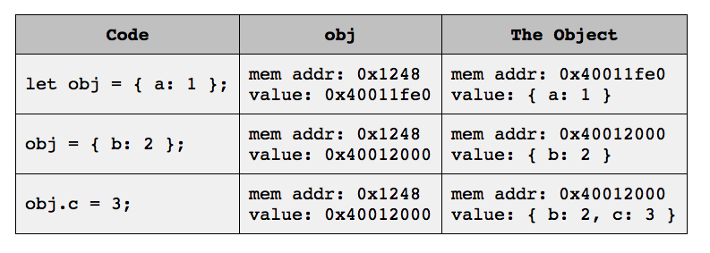
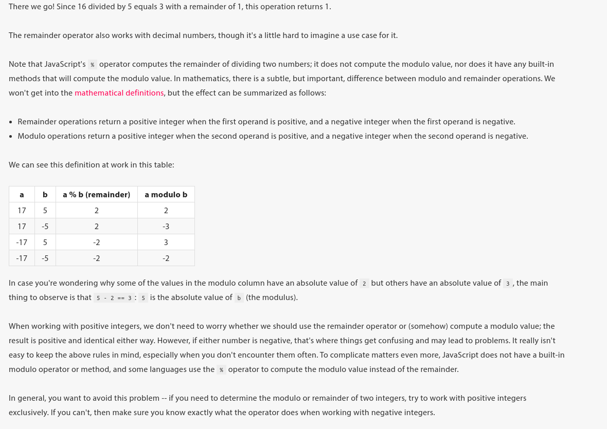

### Official Documentation

---

Oficial ECMAScript documentation: https://www.ecma-international.org/publications-and-standards/standards/ecma-262/


### Initial Stylistic conventions for JavaScript

---

- Control-flow or functions bodies using curly braces use the following style:

  ```javascript
  if (this_is_true) { // do not forget the space before the opening curly bracket
    // more code here
  }
  ```

- The same thing goes for functions

  ```javascript
  function meep() { // do not forget the space before the opening curly bracket
      // more code here
  }
  ```

- As usual use spaces between operators and operands

  ```js
  let meep = 5 + 8
  ```


### Naming Conventions

---

- Identifiers for variables; constants and functions should use only **alphanumerical** characters and:

  - the first character must be alphabetic
  - do not use consecutive underscores
  - do not use underscore as the last character

- Use camelCase for **all** variables and **non-constructor functions**

  ```javascript
  let theUltimateVariable = 5; // not readable at all woof
  function oneTwoThreePrint() {
      // function does some stuff
  }
  ```

- **Constructor function** identifiers should  use `PascalCase` also referred to
  as `camelCase with a capital C`

  ```javascript
  function DidYouYeet() { // do stuff }
  ```

- Constants

  - For **constants and un-changing** configuration values use **`SCREAMING_SNAKE_CASE`** 
    **Note**: Underscore are supposed to be used exclusively with uppercase constant identifiers and
               not for lowercase variable identifiers etc.

    ```javascript
    const MILES_PER_HOUR = 100;
    ```

  - For constants that **store a function**
    - use `camelCase` when the constant points to a **non-constructor** function
    - use `PascalCase` when the constant points to a **constructor** function
  - All other constants can use any, i.e.: `camelCase`; `PascalCase` or `SCREAMING_SNAKE_CASE`


### Initial MDN JavaScript documentation hints

---

#### Instance VS Static methods

- the format `Constructor.prototype.methodName()` refers to **instance methods**
- the format `Constructor.methodName()` refers to **static methods**


#### Terminology

- `Instance methods` are referred to as `Prototype methods`


### Data types

---

Traditional JavaScript (upto and exluding ES6) has **5 primitive data types** as follows.

- **`String`**

  - Double and single quotes can be escaped using `\` or the other type used for the
    respective other type of quote

  - Starting and ending the string with backticks (`) enables interpolation in the string using

    ```javascript
    ${someExpression}
    ```

    **Note**: feature is part of `template literals` and works only in a string between backticks!

- **`Number`**
  JavaScript uses a single data type for real numbers which includes integers and floating point numbers.

- **`Boolean`**
  Can only have one of two values, either `true` or `false` 

- **`Undefined`**
  Represents the absence of a value. This value can be used explicitly as literal.

- **`Null`**
  Represents the absence of a value similar to `undefined`.


#### The typeof operator and some type oddities

The `typeof` operator returns a string that represents the data type of the operand.

Some oddities to be aware of:

- `typeof(null)` returns a string with the value `object` which is an actual 'mistake' in JavaScript.
  The ECMAScript  standards specifies that `null` is and thus **is to be treated as a primitive value and not an object** .
- `typeof([1, 2, 3])` returns returns a string with the value`object`.
  Se one of the questions for reasons.


#### Undefined VS null

The difference between `undefined` and `null` is that:

- `undefined` can arise implicitly
- `null` must be used explicitly to be used through a literal


#### Object types

Every object type that **is not one of the primitive** data types is referred to as **`object type`**.


#### More primitive data types

JavaScript ES6 introduces **2 more primitive data types** over the previous 5 which are:

- `Symbol`
- `BigInt`


#### Literals

Data type values/objects can be represented by literals which enable us to represents fixed values in source code. In other words, a literal is a notation that instantiates an object of some type, such as the following examples:

```javascript
'Hello, world!'     // String literal
3.141528            // Number literal
true                // Boolean literal
{ a: 1, b: 2 }      // Object literal - Not a primitive data type
[ 1, 2, 3 ]         // Array literal - Derived data type? type of returns 'Object'
undefined           // Undefined literal
```


### Operations

---

#### Addition; Subtraction; Multiplication; Division an others

- If the result of one operand divided into another operand:

  - **is a decimal number** then the **result is also a decimal number**.
    In other words, the results has a decimal/fractional value.
  - **is an integer** then the **result is also an integer**.
    In other words, the result **does not have** a decimal/fractional value.

- The JS `%` operator is referred to as the `remainder operator` **and not the `modulo operator`**.
  **It does not compute the modulo value of the operands**.

- `NAN` stands for **N**ot **A** **N**umber
  This `Number` value **signals illegal or undefined operations of numbers** as principally happens in two cases:

  - Undefined operations in the mathematical sense such as `division by zero`
  - Attempting to convert a non-number value to a number

  **Note**: `NaN` is **the only value in JavaScript that is not equal to itself**!
  
  When comparing against `NaN` use one of the following two methods/functions:
  
    - `Number.isNaN(value)`
    - `Object.is(value, NaN)`
  
- `Infinity`
  Describes a number of infinite magnitude and has a negative counterpart. The mathematical operations on infinity are sometimes puzzling.
  Both `Infinity` and `-Infinity` are considered `Number`s

- **NaN vs Infinity**
  Most of the time the semantic difference does not matter but think of it this way:

  - `Infinity`  describes a number of infinite magnitude i.e. it cannot be expressed by writing it down because there is always another, larger number
  - `NaN` describes the result of a mathematical operation that is neither a valid number (a consequence of an undefined operation) nor an infinite number


### Coercion  -  Converting between data types (underlying objects)

---

#### Explicit Coercion  -  Using functions to convert between data types

- string to number using `Number('123')`
- string to integer using `parseInt('123x45')`
- string to float using `parseFloat('125.777')`
- number to string using `String(20)`

#### Implicit Coercion  -  The engine chooses how data types convert contextually

This happens for instance for the following situation: `'5' + 2` where the integer is **implicitly/silently coerced** into a string before the string are concatenated


### Data Structures

---

The most common complex data types (data structures) are:

- **`Arrays`**
  - can contain 'any' data type
  - literal  -  `arr = [1, 2, 3]`
- **`Objects`**  -  JS equivalent of a Hash data structure containing a set of key/value pairs
  - an object key is a string
  - a value is a value of any type
  - literal  -  `{ me: 'Jacob'}`


### Expressions and return values

---

An expression is any code that JS evaluates to a value, which includes `undefined` and `null`.
An expression can or cannot include operators.


### MDN Statements

---

A JavaScript statement is a group of keywords that cam span one or multiples lines.
Documentation: https://developer.mozilla.org/en-US/docs/Web/JavaScript/Reference/Statements

This seems to be a bunch of single (despite the definition) and groups of keywords that make up the language such as looping, scope etc.


The key differences between an expression and statement is:

- Statements often include expressions as part of their syntax
- but a statement itself **is not an expression/not part of an expression** and the value of a statement cannot be capture in a variable


### Declaring and Assigning Variables

---

- the modern preferred way to declare variables is `let identifier = value;` using the `let` keyword

- if a variable is not explicitly initialized with a value then it is implicitly initialized with value `undefined`

  ```javascript
  let some; // the value of some is implicitly initialized to 'undefined'
  ```

- we can override the default value of a variable using an `initializer` `let some = 15; `

- variable assignment evaluates to the expression/value of the right side of the assignment i.e. the value/expression of the right side of the assignment operator

  ```javascript
  let first = 25;
  ```

  while ...

- declarations using an initializer, evaluate to `undefined` whether we provide a value explicitly or not

  ```javascript
  let a = 15; // declaration with an initializer always evalues to 'undefined'
  let b;      // declaration without an initializer always evaluates to 'undefined'
  ```

- for variable initialization the `=` operator is referred to `assignment operator` rather than just the `equal (sign) operator`

- given the results of following example:

  ```javascript
  let a = 15;
  let b = a;
  a = 99;
  console.log(b); // still points to 15
  ```

  shows that (at least at this level) re-assignment merely changes what a particular identifier points to and does not mutate the variable value itself (because no mutating method/function is called?)


### Declaring Constants

---

The `const` keyword lets us defined a **constant identifier**. Constants are **immutable and can not be mutated or re-assigned once the are initialized** until the constant can be discarded (programs exits?).

Convention dictates that constant identifiers are uppercase and words divided by underscores such as `const SOME_FIXED_RATE = 0.057;`.

**Note**: Constants must always be initialized with a value on declaration/initialization.


### Variable Scope

---

Variables and constants declared with the keywords `let` and `const` have **block scope**.
A block is a portion in the program that is contained between a pair or opening and closing curly braces such as:

```javascript
if (expression) { // block starts here
  doEpicShazzam();
} // block ends here
```

These block scope variables and constants are accessible in the scope they are declared in and any scope contained in that initial scope.

```javascript
if (true) {
  let some = 15;
  console.log(some); // variable 'some' in block scope
}

console.log(some); // variable 'some' NOT in block scope
```


#### Exceptions  - Not everything between curly braces is a block, technically!

**While it is convenient** to think of the following two cases of `block`s **they are technically not blocks**:

- braces that surround an objects literal such as `{ a: 65, b: 66 }`
- braces that surround a function body such as `function meep() { // do stuff }` are not blocks but **can be treated as blocks most of the time** which is why other blocks are usually referred to as `non-function blocks` i.e. blocks that exclude function definitions.

**Note**: Variables declared with `let` and constants declared with `const` have the **same exact scope** !


#### Types of Scopes

JavaScript supports **two** **types of variables in terms of the scope**:

1. **Global Variables**  -  Available everywhere in the program
   Any variable **not** declared **inside a function or a block** is a global variable!
   **Note**: This includes variables prefixed with `let` and `const`!

   > Global variables are generally to be avoided

1. **Local Variables**  -  Available only in the confines of a function or block (as well as the nested scope(s))
   Any variable declared **inside a function or a block** is a local variable and their use is limited to only that scope they are declared in or nested scopes it contains.

   Local variables in terms functions (local variables and parameters) come into scope when the function starts execution and are discarded when the function finished execution.


#### Common Variable Gotcha

**The lesson**: Always declare constants and variables using the `let` and `const` keywords
**The Problem**: When a variable is **declared without `let` or `const`**, that variabel/constant has global scope:

```javascript
if (true) {
  some = 'I am a global now';
}

console.log(some); // 'some' is in scope since it is a global
```


### Input / Output

---

#### Output

While `node.js` has more output methods through it's environment, the method that works both in node.js and the browser is `console.log();`.

Depending on what environment the program runs in, the `console.log();` method pipes the output to the browser console or the command line interface through node.js.

#### Input

- **Input through `node.js`**

  The JS input API is not straightforwards but depends on:

  - asynchronous programming concepts
  - higher order functions

  Which are not explore in this book but certainly in the course. The work-around used here is the `readline-sync library` through node's `npm`.

  Using it in Javascript in a node.js environment goes as follows:

  ```javascript
  let rlSync = require('readline-sync');
  let number1 = rlSync.question('Prompt message here ...');
  ```

  

- **Input in a browser**
  The browser environment is vastly different from the one node.js operates in and communicates with a JavaScript program in a different manner, which means we need to understand concepts such as:

  - DOM - The Document Object Model
  - Asynchronous programming


  Browsers also typically support the `prompt` input method that uses a pop-up in the browser to get text, user input and pipes it to the executing JavaScript program similar to the terminal application through node.js.

  The `prompt` method can be used as follows:

  ```javascript
  // This JavaScript program should be executed in a browser through HTML
  let name = prompt('Your name: '); // browser uses a pop-up to get user input
  console.log(`Hi, ${name}!`);
  ```

  

### Functions

---

#### Declaration / Definition

JS functions are declared/defined as follows:

```javascript
function say() {
  // do something
}
```


#### Return Values

All JS functions evaluate to a value:

- In case a function does not specify an explicit return value through the `return` keyword,
  JS returns an implicit value of `undefined`.
- In case a function does however specify an explicit return value through `return`, that is the value returned


#### Nested functions

Nested functions can be specified by specifying a function in the scope of one another function:

```javascript
function funcOut() {
  function funcIn() {
    // the nested function
  }
  
  funcIn(); // in scope
}

funcOut();
funcIn(); // NOT in scope since the nested function is defined in another scope
```


**A nested function such as `funcIn`:**

- is created and destroyed every time the containing function is executed (`funcOut`)
- is `private` in the sense that it cannot be accesses/invoked from the scope outside the 'outside' function (`funcOut`)
- seems to have scope rules similar to variables/constants


#### Terminology

- functions that always return a boolean value, true or false, are referred to as `predicates`
- functions that are called on some receiving object/value are referred to as `methods`


#### Mutating the caller

We can mutate values by invoking mutative method on a particular value/object such as a string.

Some quirks of JavaScript:

- Primitive values are immutable - Their values never change -  Always return new values on operation
  Immutable primitives are: `Number`s; `String`s and `Boolean`s
- Non-Primitive values **may be** mutable through their methods - Not every method mutates the value
  Mutable values are: `Array`s and `Object`s

**Note**: Like in Ruby, to know which method mutates the value of a value use the documentation!


#### Pass-By-Reference or Pass-By-Value

JavaScript uses:

- pass-by-value for primitive values
- pass-by-reference for non-primitive values such as arrays and objects


### Function Composition

---

This is merely the technique of invoking a function/method as argument to another function/method without intermediate variable creation.

```javascript
function sum(a, b) { return a + b; }
function sub(a, b) { return a - b; }
function mult(a, b) { return a * b; }

// using function composition rather than intermediate variables
mult(sum(1, 5), sub(10, 8));
```


### Three Ways to Declare Functions in JavaScript

---

The following are different ways to declare functions:

1. **`Function Declaration`**
   The most common way to declare a method using a function definition block:

   ```javascript
   greetPeepz(); // invoking a function before it is even declared
   
   function greetPeepz() {
     console.log('Heeeeey peeps! :)');
   }
   ```


   **Quirks**:

   - Can be invoked in the code before it is declared. Before as in lines before the declaration.

2. **`Function Expression`**
   A function declared and bound to a variable/constant:

   ```javascript
   let functionExpression = function(name, age) {
     console.log(`${name} is exactly ${age} years old!`);
   }
   
   functionExpression('Jane', 28);
   ```


   **First-class functions**  - The thing about them is that first-class functions can treated as any other value

   In fact, all JavaScript functions are:

   - first-class functions
   - are just objects, and thus can be, for instance:
     - passed to a function as arguments
     - returned from a function

   **Quirks:**

   - **Cannot** be invoked before it is declared since it is bound to a particular variable/constant

   - Any function definition that **does not start with the keyword `function`** is a **function expression** and **not a function declaration**!


     **Examples of function expressions in different situations:**
    
     - Function expression bound to a variable:
    
       ```javascript
       let meep = function sumsum(a, b) { return a + b; }
       ```
    
     - Function expression in parentheses that almost looks like a function declaration
    
       ```javascript
       (function woof(food) { // function wrapped in parenthesis
         console.log(`Woofy likes ${food}!`);
       })
       ```
    
     - Function expression in higher order function
    
       ```javascript
       function better() {
         return function evenBetter() { // does not start with keyword 'function'
           console.log('This is so much better!');
         }
       }
       ```

3. **`Arrow Functions`**
   This type of function declaration is similar to `Function Expression` with the differences:

   1. Uses a different syntax
   2. Returns a return value implicitly


   An examples of an `add` function expressed as `Arrow Function` that return the expression implicitly:

   ```javascript
   let add = (a, b) => a + b;
   ```


   Behaviour and requirements of `Arrow Functions`:

   - we can omit the `return` keyword **only if the function body expression evaluates to a single value**. This can be a single expression, or expressions with sub-expressions.

   - if the body does not evaluate to a single value we must:
     **Note**: Here we can still use the `Arrow Function` syntax for the functions name and arguments!

     - explicitly specify a return value just as in normal functions
     - use curly braces around the multi-line function body


     **Example**:
    
     ```javascript
     // just use a function expression instead?
     let getNumber = (text) => {
       let input = prompt(text);
       return Number(input);
     };
     ```


​     

### The Call Stack

---

This is the same as for other programming languages but the idea, again is the following:

- When a JavaScript program starts the `main` call frame is pushed onto the call stack.
- The flow of the program then dictates, through the functions executes, what other stack frames are pushed onto the stack
- When a function is executed, a stack frame is pushed onto the call stack containing contextual information about that particular function and it's argument data:
  - function name/address
  - arguments
  - space for local variables
- Only the topmost stack frame is executed and the stack frames below are paused
- When a function finished execution, the stack frame from that particular function is popped of the call stack and the stack frame below, if any exists, resumes execution where it left of
- This happens until the `main` stack frame finished execution and the program exits because it has nothing more to execute


### Flow Control

---

#### Conditionals

JS allows a single line statement without curly braces after a conditional like so:

```javascript
if (something)
 console.log('something is true!');
```

**But this form should be avoided in general to avoid flow bugs because of missing curly braces**:

```javascript
// the following conditional is incorrect
if (something)
  console.log('Executed if something evaluates to true');
  console.log('This looks like part of it, but is not part of the conditional');

// prefer the following syntax
if (something) {
  console.log('Executed if something evaluates to true');
  console.log('This looks like part of it, but is not part of the conditional');
}
```


#### Comparisons

Comparison operators **always returns one of two boolean values** which is either `true` or `false`.

Here some important ones:

- **`===`  -  `Strict Equality Operator`  -  `Identity Operator`**

  **Evaluation**:

  - `true` when operands have the same **type and value**
  - `false` otherwise

- **`!==`  -  `Strict Inequality Operator`**

  **Evaluation**:
  **Note**: The **opposite** of `===` for the same operands!

  - `true` when operands have **different type and/or value**
  - `false` when operands have the same **type and value**

- **`==`  -  `Non-Strict Equality Operator`  -  `Loose Equality Operator`**

  **May attempt to coerce one or both operands to another operands type before comparison**.

  **Evaluation**:

  - **After the optional coercion of one or both operands **, returns `true`  when the **values are the same**
  - `false` otherwise

  - Weird examples to be aware of:
    - `'' == 0 ` evaluates to `true` because the String is coerced into a number using `Number('')` which evaluates to the number `0`

- **`!=`  -  `Non-Strict Inequality Operator`  -  `Loose Inequality Operator`** 

  **May attempt to coerce one or both operands to another operands type before comparison**.

  **Evaluation**:

  - **After the optional coercion of one or both operands **, returns `false`  when the **values are the same**
  - `true` otherwise

- **`<`  -  `Less Than Operator`**

  **May attempt to coerce one or both operands to another operands type before comparison**.

  **Evaluation**:

  - `true` when the left operator **value** is **less than** the right operator value
  - `false` otherwise

- **`> ` and `<=` and `>=`**

  **Same behaviour as the `<` but checking values in a specific way**!


#### Which comparison operator(s) to use?

LS's advice is to not use the loose types of equality operators such as `==`  and `!=` because the rules are complex and hard to remember, but they are totally fine to use if the programmer takes adequate precautions.

Here a few things to keep in mind:

- Good code should, in general, not compare different types of values/things to each other.
  If the case of operands not being of the same type is avoided, the loose equality operators do not trigger the coercion and hence we just need to reason about the values we want to compare.

  If a program compares different types, the design is probably flawed.

- **Launchschool dictates a style that uses the strict variant only**.


### Logical Operators

Logical operators enable us to **combine operators and conditions**:

- **`!`  -  `Not Operator`**

  **Inverts** the boolean value of it's operand that is situated to **the right of the operator**!

  **Evaluation**:

  - `true` when operand is `false`
  - `false` when operand is `true`

- **`&&`  - `And Operator`**

  **Evaluation**:

  - `true` when **both** operands are `true`
  - `false` when **either** operand is  `false`

- **`||`  -  `Or Operator`**

  **Evaluation**:

  - `true` when **either** operand is `true`
  - `false` when **both** operands are `false`

**Note**: The return value of one or multiple chained logical operators is always the last value evaluated
            Whether the logical operators short-circuit or not!


#### Short Circuit Evaluation

Given a logical expression, JavaScript stops evaluating that logical expression as soon as the result is known and does not evaluate subsequent logical/conditional expressions unless the answer is unknown.

The following examples illustrate this mechanism:

- ```javascript
  if isRed(item) && isSmall(item) { // if item red and small }
  ```

  The logical operator evaluates to `true`  only if both operands evaluate to `true`, this means that when any operand evaluates to `false`, the whole expression cannot be `true`.

  In other words, if `isRed(item) === false` then JS stops evaluating because `&&` can never be `true` and never evaluates `isSmall(item)`!

- ```javascript
  if isGreen(item) || hasWheels(item) { // if item green or has wheels }
  ```

  The logical operator evaluates to `true` if either operand is `true`, this means that when any operand evaluates to `true`, the whole expression cannot be `false`.

  In other words, if `isGreen(item) === true` then JS stops evaluating because `||` must be `true` and never evaluates `hasWheels(item)`!


#### Truthiness

An expression in a conditional does not have to evaluate to a boolean value of `true` or `false` because JS does coerce any non-boolean value into a boolean value in a conditional context.

**Again**: JS can use any value in a condition because it can coerce any value to a boolean value when needed.

Whenever a non-boolean value is used in a conditional and JS coerces that non-boolean value into a boolean, we refer to this process as `evaluate that non-boolean value into a boolean value`.

- **Values that evaluate to `false` in a conditional context**
  **Note**: We refer to these values as `truthy` because, while they are not booleans, they evaluate to `true`!
  - `false`
  - Empty String `''`
  - `undefined`
  - `null`
  - `NaN`
  - Zero in the following variations of zero in JavaScript:
    - `Number` zero value `0`
    - `Number` negative zero value `-0`
    - `BigInt` zero value `0n`
- **All other Expressions evaluate to `false` in a conditional context**
  **Note**: We refer to these values as `falsy` because, while they are not booleans, they evaluate to 


#### Operator Precedence and Associativity

For expressions that use multiple operators and sub-expressions, here are some precedences from
**high (top of the list) to low (downwards)** that are good to know by heart:

- `<=`, `<`, `>`, `>=`  - Comparison operators
- `===`, `!==`, `==`, `!=` - Equality operators
- `&&` Logical AND
- `||` Logical OR

Another mechanic to know about is associativity, which specifies in what order operators along with their operands are evaluated when the precedence between operators and their operands is the same.

**Note**: To make the intention of a program clear, always parenthesize the operators we want evaluated first
           instead of working with rules implicitly!


**The rules for complex expressions that use many parentheses to show intended precedence**:

- JS evaluates expressions in the parentheses in the algebraic order.
  This means that innermost parentheses are evaluates first towards to outer parentheses.
- When there are multiple parentheses at the same 'depth', the parentheses are evaluated from left to right.
- Once all parentheses are evaluates, the whole expression is evaluated.


**Note**: Short-circuiting does not change precedence but may be confusing if the expression is complex!


### Loops and Iteration

---

**A short overview of the types and quirks of loops:**

- **`While Loop`**

  Executes the loop as long as the expression after the `while` keyword evaluates to `true`.

  ```javascript
  while (condition) { // first JS checks is the condition is still truthy
   // runs once, only if the condition is truthy
  }
  ```

- **`Do/While Loop`**

  Executes the loop **at least once** and then works exactly like a `While Loop` after the initial loop execution.

  ```javascript
  do {
    console.log('You see this at least once!');
  } while (condition); // the loop runs again only if the condition is truthy
  ```

- **`For Loop`**

  Executes the loop based on the first line which includes the `initialization`; `condition` and `incrementation`:

  ```javascript
  for(initialization; condition; incrementation) { // looped code ... }
  ```


#### Controlling Loop Flow

JavaScript provides **two** keywords to provide more control over how loops execute:

- **`continue`**  -  Skips the rest of the loop and starts the next cycle as if the loop finished execution
- **`break`**  -  Stops looping altogether and resumes execution the line after the loop definition


**Operators**

- **`someVariable++`  -  `Post-Increment Operator`**

  Increments the operand by one and returns the value of the variable **before incrementation**

- **`++someVariable`  -  `Pre-Increment Operator`**
  Also increments the operand by one and returns the new value of the variable **after incrementation**

- **Pre and Post-Decrement operators function the exact same but decrement the value**.


**Note**: Apparently the modern opinion is to **not** use incr/decrement operators for incr/decrementing   
           numbers, apart from a for loop `for(var index = 0; index <= 5; index++) ...` because they can 
           lead to strange bugs/results, especially if programmers are not aware/mindful of the return value.


#### Iterating Arrays using built-in instance methods

One of many ways to iterate through an array is to use the `Array` `forEach` method.
This method is called on an `Array` value and passed a `function` as argument, which the `forEach` method then invokes for every item in the array in order:

```javascript
let names = ['Chris', 'Kevin', 'Naveed', 'Pete', 'Victor']

names.forEach(function(name) {
  console.log(name);
});
```


The following is what happens in the previous code snippet:

1. Line `1` declares an array of names using an initializer
2. Line `3` invokes the `forEach` method on the `names` array and passes it an `anonymous function`, which does not have a name
3. The `forEach` method then iterates the array implicitly and invokes the anonymous function we passed with each element as argument from first to last

**Note**: This `anonymous function` is another type of `first-class function`


The same can be achieved using `arrow functions`:

```javascript
let names = ['Chris', 'Kevin', 'Naveed', 'Pete', 'Victor'];

names.forEach(name => console.log(name));
```


#### Arrays

JavaScript arrays are `heterogenous`, which means that they can contain any value, including other arrays and objects.

**Quirks to understand at some point**

- Assigning a value to a positive, out-of-bounds array index grows the array and pads the array with empty in-between elements if needed.

- for constant array values:

  ```javascript
  const array = [1, 2, 3];
  array[1] = 'X';    // does work, even on a constant array value
  array = [4, 5, 6]; // does not work because the array is a constant
  ```

  - while the constant array variable itself cannot be made to point to another value
  - the array elements/content can be made to point to another valu
  
  
    **This happens because of pointer rules, in this case most importantly:**
  
    - we cannot change what a `const` declaration points to **but**
    - we **can** change the content, i.e. the actual values in memory the constant pointer points to
  
  **Note**: In order to make the array elements follow the same rules, use the `freeze` method.
  
- **JS arrays are `object` i.e.e hashes?** 

  **This has some implications**:

  - the `typeof(someArray)` operator returns a string of value `object` and **not** `array`
  - changing an array's `length` property can truncate and expand the array, where **new elements are not initialized** but left `undefined`.
  - Array can have non-integer and other objects as indexes. These are not true elements but are **properties** on the array `object` and **do not count toward the `length`** of the array!
  - can use the `Object.keys` method to get the object keys of an array `Object.keys(array);`
    This method ignores un-initialized elements that have not been explicitly initialized or re-assigned.

- When array contents are changed, un-initialized elements are treated differently to elements that have merely been set to `undefined` as JS interprets the slots as `empty items.` but the following expression evaluates to true for a given un-initialized array item:

  ```javascript
  let array = new Array(3); // declares a new array with 3 un-initialized elements
  let result = (array[0] === undefined); // true
  ```

  **In other words**, array elements that have not been initialized **can** be treated differently from elements that were set to `undefined` after the fact even though un-initialized elements compare to the primitive `undefined` as true.


**Primer to some common `Array` operations**:

- Accessing elements with `[]`

- Adding elements with `Array.prototype.push` actually **mutates** the array and returns the new length of the array

- Adding elements with `Array.prototype.concat(items, ...)`, which adds one or more values to the array and **returns a new array**.
  `concat` seems to automatically unpack arguments that are elements for that first layer, but deeper nested arrays stay as is.

- `Array.prototype.pop` removes and returns the last element in the array. Is **mutative**.

- `Array.prototype.splice(startingIndex, takeN)` removes the elements starting at the index and for takeN elements. This method **mutates** the array and returns an array with the deleted elements.

- Transforming Array with `Array.prototype.map`  returns a **new array** with the transformed values based on the caller

- `Array.prototype.filter` returns a **new array** that contains all the elements of the original array for which the callback function returns a truthy value.

- `Array.prototype.reduce` effectively reduces all the elements in the array to a **single value**.
  This methods takes a callback method that has two arguments:

  - `accumulator`  -  The current value of the accumulator **before** the accumulator is changes
  - `element`  -  The currently iterated elements of the calling array

  This callback method return the value of the accumulator for the next callback invocation.
  
- `Array.prototype.includes(searchedItem)` scans the caller and returns `true` or `false` wether the item has been found and makes **a strict comparison `===`** , which means that it comes with the same problems as when comparing using the `===` operator.

  ```javascript
  let inner = ['meep', 198];
  let array = [15, false, inner, {}];
  array.includes(['meep', 198]); // false because the arrays are not the same pointers
  array.includes(inner);         // true because the arrays are the same pointers
  ```

- `Array.prototype.slice` can be used to extract a region of the array or duplicate the array altogether

  ```javascript
  let array = ['a', 'b', 'c'];
  let arrayCopy = array.slice();
  console.log(array === arrayCopy); // false
  ```

- `reverse` reversed the array **in place destructively** and returns the same array pointer.
  **Tip**: Duplicate the array using the `slice();` method to not affect the original array


#### Array (and Object?) Equality

The rule is simply:

> JS considers two arrays to be the same if the array operands are the exact same pointer/data in memory

```javascript
/*
	Two different literals may have the same content and length but are
	not the two exact same 'objects' in memory and are therefore not the
	'same'.
*/
[1, 2, 3] === [1, 2, 3] // false

// the arrays are the same though if the variables point to she same array in memory
someArray = [];
thatSameArray = someArray;
someArray === thatSameArray; // true
```


**Note**: When creating custome functions to compare arrays remember that nested arrays, that are 
		   compared using the strict or loose evaluation operator probably do not return the expected result
		   as nested arrays are seldom bound to the same data in memory!


### Objects

---

A JS `Object` is the equivalent of a `Hash` that associates a set of keys with a set of values respectively, which are referred to as the `key/value pairs` of the `Object`.

- An object `key`  **must** be a `String` but note that JS implicitly coerces non-string values into strings before storing the key-value pair!

  **Does JS do the same when accessing a value? Does JS coerce a non-string key to a string?**

  The following will bite you at some point:

  ```javascript
  > let myObj = {}
  > myObj[true] = 'hello'   // implicitly coerces the boolean true to the string 'true'
  > myObj['true'] = 'world' // overrride the value store previously using the boolean
  > myObj[true] // world
  ```

- An object `value` can be any type, including other `object`s


**Ways to declare an object**:

- Using an `Object` `literal`: `let people = {};`
- Using a constructor: `let people = new Object();`


**Here an example of an object initialized with a few key-value pairs:**

```javascript
let person = {
  name:    'Jane',
  age:     37,
  hobbies: ['photography', 'genealogy'],
};
```


**Things about the syntax**:

- While the `key` is a `String` we typically omit the quotes `'` when the key consists of alphanumeric characters and underscores

- The value can be **set and accessed** two ways:

  1. Using the `dot notation`

     ```javascript
     let person = {};
     person.name = 'Willis'; // add key-value pair using dot notation
     person.name;            // access key's value using dot notation
     ```

  2. Using the `bracket notation`. This notation has to be used if the key is a variable and not a literal.

     ```javascript
     let person = {};
     person['name'] = 'Karen'; // add key-value pair using bracket notation
     person['name'];           // access key's value using bracket notation
     ```

- Deleting a key-value pair through the `delete` **operator**:

  ```javascript
  let person = { name: 'Jane', age: 25 };
  delete person.name; // true
  delete person['age']; // ture
  ```


**Objects and Constants**

An `Object` behaves the same as an `Array` in terms of it being a constant.

A constant `Object` pointer can not be pointed to something else but any values in the object are not constant by default and hence can be changed. To make the key and values, i.e. `properties` adhere to the same rules, the `Object.freeze();` method must be used one the object to 'freeze' the properties.

```javascript
const MyObj = Object.freeze({ foo: "bar", qux: "xyz" });
```

**Note**: The behaviour works 1-level deep again and not for nested properties.


#### Object VS Primitives

**JS has two categories of data types along with the respective types they cover**

1. **`Primitives`**

   **Primitives are always immutable and can only every be re-assigned, never mutated!**

   - `String`
   - `Number`
   - `Boolean`
   - `null`
   - `undefined`
   - `BigInt`
   - `Symbol`

2. **`Objects`  -  Include, but aren't limited to the following types**

   **Objects are complex values composed of primitive values and other objects and can be mutable, but do not have to be!s**

   1. `Simple Object`  -  Use keys and values
   2. `Array`  -  Also an `Object` but use indexes instead of keys
   3. `Date`
   4. `Function`

Any 'thing' that makes up a program that is **not** either a `primitive` or `Object` is one of (non-exhaustive list):

- variables/identifiers
- statements like `if`; `return`; `try` etc
- keywords like `new`; `function`; `let` etc
- comments
- any other 'thing' that is **not** a primitive or object


#### Prototypes

In terms of objects where a `child` inherits from a `parent`, the `parent` is referred to as the `prototype`.
When we specify some prototype for some object, we refer to this as follows:

> the child X uses parent Y as prototype


#### Iterating Objects

There are several ways to iterate over they keys; values or key-value pairs of objects:

- **`For/In Loop`**

  Iterates the object **keys** through a simplified syntax that enables us to access the value:

  ```javascript
  let person = { name: 'John', age: 28, height: '6 ft' };
  for(name in person) {
    console.log(name); // a key of the person object
  }
  ```

  **Note**: The `For/In Loop` implicitly iterates over the properties of the object's prototype,
         	 child properties first, then prototype properties.
  
- **`Object.keys`**
  Static method that returns the object's keys as array and apparently **does not return the keys of an object's prototype**.

**Note**: While modern JS, starting at ES6+ iterates an Object in a predictable pattern based on some rules,
           we should usually **not rely on these rules and should not depends on it** !

#### Terminology

- In JS, a key-value pair is referred to as `property` but typically we only refer to a pair's `key` to the `property`  **without** implying the value.

- In JS, an object `b` inherits from an object `a` is referred to as `object a is a prototype of object b` which means that the parent in this relationship is the `prototype`.

  

#### Common `Object` operations

- **`Object.values`**
  Returns an array of the object's values **in some order  - DO NOT rely on the order of the values!**

- **`Object.entries`**
  Returns an array of the object's key-value pairs as nested array **in some order**.

  The nested arrays contain:

  1. The key as the first element of the array
  2. The corresponding value as the second element of the array

- **`Object.assign(target, sources ...)`**
  Merges all the `sources` properties into the `target` object by **mutating the target object** and returns the `target` pointer.

  When a new Object is desired use something as the following code:

  ```javascript
  let a = { some: 12 };
  let b = { other: 25 }; 
  let result = Object.assign({}, a, b); // the Object literal is used to merge sources
  ```


### More Stuff

---

### Variables as Pointers

**Note**: The following explanations are models to understand the basic operation but do not reflect how the language actually works under the hood!


- **Working with Primitives  -  Primitive Values**

  Primitives are stored at some memory location which is allocated when values are declared. The identifier is a pointer that points to that particular piece in memory.


  When we have the following:

  ```javascript
  let a = 5;
  let b = a;
  b = 99;
  console.log(a); // 5
  console.log(b); // 99
  ```

  1. `a` points to the primitive value `5` in memory

  2. `b` points to the same primitive value `5` in memory, same as pointer `a`
  3. `b` is then re-assigned to point to the primitive value `99` in memory **without** changing the memory content of variable `a` not where `a` points to

  **The key idea:** The variable itself is a pointer directly to that particular value/data in memory.

  

  **Note**: Since primitive values are stored **directly** in the piece of memory allocated for a primitive value, one primitive value identifier **can never **
             **be** an alias for another primitive value!

- **Working with Objects and non-mutating operations**

  Objects are stored in some memory location similar to primitives, with the difference that:

  ``` javascript
  > let e = [1, 2]  // allocate storage for array [1, 2] and make 'e' point to another pointer that points to the actual array
  > let f = e       // allocate storage for pointer and make it point to the 'middle-pointer', equivalent to the identifier 'e'
  > e.push(3, 4)    // since 'e' and 'f' point to the same piece of memory indirectly, any mutative action on the data is
  > e               // is reflected by both identifiers/pointers because the point to the same exact memory location indirectly
  = [ 1, 2, 3, 4 ]
  
  > f
  = [ 1, 2, 3, 4 ]
  ```

  **Note**: This is referred to as `aliasing` because in the above code snippet, the identifier/pointer `f` is an `alias` for the `e` identifier/pointer!

  - The identifier of an Object points to **another pointer** `Code => obj`
  - That other pointer points to the actual object in memory `obj => The Object`

  

  **Intuitively**: When memory is allocated for an object JS keeps a pointer to that piece of memory and when we assign an object to a new identifier,
                        that identifier only needs to point to that 'middle-pointer' to the original data in memory and nothing is copied.

  **Question**: Why is it modeled with another pointer between the identifier an the object in memory?
                      Does the middle'-pointer' keep track of some meta-information about the data stored in memory?


#### `For/In` and `For/Of`

**Notes to order**:

- uses `variant syntax` for simpler looping over object properties
- `for/in` iterates over **all enumerable properties of an object** including the ones inherited form another object.
  - Using `for/in` on an object iterates the **keys**
  - Using `for/in` on an array **also iterates the keys** which for an array is the indices as strings!
    **Remember: Arrays are objects!**
  - **Supported in traditional and moderns JS**
- `for/of` iterates over **all the values of an iterable collection**. Examples are arrays and strings.
  - For a string, these iterable values seem to be the characters
  - For an array, these iterable values seem to be the array items
  - **Supported only in modern JS ES6 and over**


#### Regex

- Skipped this portion because getting into this is more than just reading this tutorial


#### The Math Object

- Provides mathematical functions through static methods


#### Dates

- Provides date related functionality that are sometimes hard to use


#### Exceptions

**Notes to order**:

- JS is a more forgiving language and usually fails silently by returning signals like `undefined`, `null` or even `-1`

- These silent errors are dangerous because they can be ignored, but we typically need to handle these problems

- JS exceptions are **not silent** and holds/exits the program when that exception is not 'caught' and dealt with.

- How to catch an exception:

  ```javascript
  try {
    // code that may throw an exception
  } catch(exception) {
    // do something when an exception occured with access to that specific exception
  } finally {
    // executes whether an exception has been raised or not i.e. every time
  }
  ```

- We can raise errors using the `throw` keyword along with an instance of the following [error types](https://developer.mozilla.org/en-US/docs/Web/JavaScript/Reference/Global_Objects/Error)

  ```javascript
  throw new TypeError('Some error message');
  ```

- Use exceptions only for **exceptional circumstances** and avoid throwing exceptions when a return value does the trick and document it well!


#### `SyntaxError`

The `SyntaxError` is a special type of error that executes **before the program is executes** in case there is problem with the syntax. This error **does not depend on runtime conditions** but the JS engine detects it solely based on the source code.


Here some things to keep in mind about how `SyntaxError` is **typically** generated:

- `SyntaxError`  has nothing to to with runtime conditions such as variables and control-flow
- `SyntaxError`  can be reported for a particular line that is far away from where the issue originates from, typically much later
- `SyntaxError`  are caught before the `execution phase`, so the program is not actually executed in this `preliminary phase`


**Note**: There are situations for which the `execution phase` can throw a `SyntaxError` just as other errors, which means that for 
           some cases, a `SyntaxError` can be caught using `try/catch/finally` such as for example:

          ```javascript
          JSON.parse('not really JSON');  // SyntaxError: Unexpected token i in JSON at position 0
          ```


#### ES& and Beyond

- The recent JS/ECMAScript version is `ECMAScript `  -  `ES6`  - `ES2015`
- The keywords `let` and `const` are part of `ES6` and did not exist in traditional ES and before `ES6` ES did not have block scope.
  In traditional ES variables were scope either locally to a function or global for the whole program.
- The introduction of `arrow functions` solves a problem referred to as `lost execution context` i.e. `context-loss`


#### More Stuff - Terminology

- JS does not differentiate between pointers and references, so these terms are interchangeable in this context


### Other facts

---

- JS uses overloaded syntax

- `template literal syntax` is a string that allows embedding expressions i.e. strings that allow interpolation. **These strings are enclosed by backticks rather than double/single quotes!**

- function parameters are actually local variables with a scope limited to the function being executed.
  These function local variables, i.e. parameters are initialized through the function argument passed to the function when invoked.
  
- Use the `Object.create(someOtherObject)` to create an object that inherits from the argument object

  ```javascript
  let bob = { name: 'Bob', age: 22 };
  let studentBob = Object.create(bob);
  ```


### Intuitive facts

---

- understand and use correct terminology for the types of functions: static functions/methods; prototype functions/methods

- think in terms of primitive  and complex data types

- if an `Object` refers to a complex data type that is a Hash, the term object should be used in the right context?

- use node or the browser console to execute JavaScript code

- running JS in the browser has a different environment and capabilities than running JS through node.js

- In JS functions and class names are variables

- preceeding an identifier with `let` or `const` triggers local scope for that particular identifier

- Primitive values are immutable and we can never change the value they point to but rather we can only every re-assign them to point to some other thing in memory, which means that an expression like the following evaluates to value to a separate, new value/object/pointer, and nothing else.

  ```javascript
  1 + 5 // evaluates to a new primitive value of 6
  ```

- The data and functions used in a program are the either one or the other category of data type, primitive or object. Any other 'thing' that is **not** one of these two is a variables; statements; keywords, comments and more that is **not** data or a function.


### Questions; Answers and other random things

---

**Note**: Many of these questions will be answered by the course, so just carry them over and go from there.

- One example why knowing when what is coerced in to what is essential to know.
  
  - When `x` is a `String`, the expressions `x = x + 1;` and `x++` are **not equivalent**.
  
  What happens is the following:
  
  - ```javascript
    > let x = "5" // declare a local variable with identifier 'x' to hold the string "5"
    > x = x + 1   // number 1 is coerced into a string and concatenated to the string "5" ==> "51"
    = "51"        // which changes the value of 'x' from "5" to "51"
    ```
  
  - ```javascript
    > let y = "5" // declare a local variables with identifier 'y' to hold the string "5"
    > y++         // string is coerced into a Number and that number is incremented from 5 to 6.
                  // 5 is returned since the post-increment operator returns the number BEFORE incr.
                  // and NOT the number after incrementation
    ```
  
- At a later point in time, understand the differences between traditional and modern JS/ECMASCript?
  
- Learn the basics of how to read the Stack Trace
  
- What does JS check before the code is run despite the language to the interpreted by and interpreter or just-in-time compiler?
  
  - variables/identifiers that are misnames, re-assigned but are already declared, constants?
  - it is important to know, for testing, when the program can fail and how much needs to be accounted for such as for instance triggering a piece of conditional code so that syntax errors, like undefined references can be caught and don't just screw up something implicitly!
  - .Understand what js interpreters/JITC do **before and during execution** which can be categorized as `preliminary phase` and `execution phase`
  
- Which type of operations does JS:
  
  - fail silently for by returning a value like `null` or `-1 `?
  - fail by raising an exception?
  
  Dividing zero into another number fails silently for instance! This stuff is very important to know!
  
- In terms of the `for/in` and `for/of` iterations:
  
  - what are all `enumerable properties of an object` for the `for/of` variant?
  - what are all the `values of an iterable collection` for the `for/of` variant?
  
- How are strings stored in JS and how come they act like other primitives? Does it have something to do with how C stores string in a different portion of memory and scans for strings that already exist? A `static memory` is the spot in program memory C stores strings, if I remember correctly?
  
- What is the 'arity' of arguments/parameters?
  In the following code snippet we want to flow based on wether some argument was passed or not:
  
  ```javascript
  function copyObj(sourceObject, keys) {
    let destinationObject = {};
  
    if (keys) { // so an array was passed, could also default to empty array
      keys.forEach(function(key) {
        destinationObject[key] = sourceObject[key];
      });
  
      return destinationObject;
    } else {
      return Object.assign(destinationObject, sourceObject);
    }
  }
  ```
  
  
  **Is this typical/semantics JS to not pass an argument and then determine if it was passed ** based on whether or not the identifier is `undefined` or not?
  
- JS is garbage collected (right?) which may have implications such as for instance the way the `delete` operator is described in the MDN docs:
  
  > The JavaScript **`delete` operator** removes a property from an object; if no more references to the same property are held, it is eventually released automatically.
  
- What exactly does the terms `declare` refer to when creating variables?
  
- Hard know and understand JS's primitive and complex data types.
  
- Is there any intuitive JS built-in way to compare arrays?
  Since the `===` is not very helpful for arrays that are not the exact same pointer.
  
- How and what does the `console.log` method output and for which values does it not output anything.
  
- What is the syntax to specify multiple program lines in an arrow function expressed on a single line?
  
- How do return statements work in callback functions when passed and invoked by some other  function?
  
- What happens when two identifiers are specified the following way:
  
  ```javascript
  vario = 15; // a global variable
  let vario = 22; // a local variable
  ```
  
  - is there a problem if we change the order of operations?
  - to these live in different 'namespaces'?
  
- We should, in general, avoid passing first-level functions to another function that has implicit side effects based some, for instance, variable as in the following example:
  
  ```javascript
  let squares = [];
  [1, 2, 3, 4].forEach(num => squares.push(num * num)); // is the squares array in scope?
  ```
  
- What is the scope of  variables when passing a function to an array. Are the variables in scope when the  array method is invoked also in scope for first-level functions when the function is executed somewhere else?
  
  ```javascript
  let numbers = [1, 2, 3, 4]
  let squares = [];
  numbers.forEach(num => squares.push(num * num)); // is the squares array in scope?
  ```
  
  Apparently it is but learn the specifics!
  
- What are the typical return values for functions like `Array.prototype.forEeach` or is there no common thread like in ruby?
  
- What is a callback function in JavaScript?
  Simply a function that is passed to another function which is invoked at a later point in time.
  
- understand how `Object.freeze(someObject)` works. It has something to do with constants pointers.
  Weirdly, JS does not throw an error when we attempt to change what a frozen array elements points to but just 'disregards' the operation silently. Wtf?
  
  Freezing an array also just affects part of the array, i.e. the first level, which is the items values stored in the frozen array as values, everything that is 'deeper' is not 'frozen', so must be frozen manually.
  
- are the following operators `a += 2`; `a *= 5` etc really operators in JavaScript?
  
- what do control flow structures such as `if` statements evaluate to if they are bound to a variables such as for instance:
  
  ```javascript
  result = if true
    5
  else
    15
  ```
  
  Is this a thing in JS?
  
- Research and understand the actual difference between an expression and a statement.
  
- what does a JavaScript switch statement use to determine the equality of the argument and the cases?
  Is there any coercion involved? If it is it is certainly based on one of the equality operators!

- Is it necessary to return form a thrown error is that error is thrown in a function such as for example:

  ```javascript
  function evenOrOdd(number) {
    if (!Number.isInteger(number)) {
      console.log('Sorry, the value you passed is not an integer');
      return;
    }
      
    // more code ...
  }
  ```

  

- read up the JS terminology about properties in terms of instance variables  and OO etc.
  Before making any research, I think that `property` is the terminology used for an instance variables accessible through the object that 'owns' that particular variables, or method even?

- read up and understand the most common comparisons between operands and different operators.
  Here some interesting ones to look up:

  - `"42" < "402"` evaluates to `false`
  - `"42" < "420"` evaluates to `true`
  - `"42" < 420` evaluates to `true`

- do some research on the error raising model of JS:

  - what are the ones to be aware of?
  - how to implement custom errors?
  - what is the most language semantic way to implement errors etc
  
- are there global constants? Also get an absolutely detailed understanding of the types of objects and their scope such as (these just come to mind, check what JavaScript actually supports):

  - local variables 
  - local constants
  - global constants
  - public/private
  - what about functions?

- does a nested function have the same scope rules like variables/constants? What else should I know?

- so variables are global when:

  - declared **outside** any function definition or block
  - not prefixed with `let` or `const`

- LS calls a nested function a `private function`, is this a way to explain it or the actual mechanic to make a function private?

- get an idea what node's `npm` is and how it works

- syntax style or necessity: specifiy JS functions with or without trailing semicolon?

- learn how JS types are converted for different operators

- For the following code snippet using constants:

  ```javascript
  const FOO = 'bar';
  {
    const FOO = 'qux';
  }
  
  console.log(FOO);
  ```

  **This code does not throw an error!**
  While I though it would raise an error, without doing research, I think that when constants are in different scopes, the constants identifiers can be 're-used' because it is not accessible in another scope.

  Two important rules to remember here (**confirm this through research!**):

  1. Constants **cannot be re-assigned** **nor can they be re-declared** in the same scope
  2. **Identical constant identifiers can be re-used** as long as they are re-used in **different scopes**

- The following describes a method that returns true only when the argument is `NaN`:
  
  ```javascript
  // This works because NaN is the only value that is not '===' to itself
  function isNotANumber(value) {
    return value !== value;
  }
  ```
  
  **This is important, know the mechanism that NaN is the only value for which `NaN === NaN` is false**
  
- What are the rules concerning the declaration of variables not prefixed with `let` or `const`?
  (And probably also `var` for that matter) apart from the global thing?

- In case the differentiation between variables, identifiers and constants is somehow not clear check up on the following LS book portion again: https://launchschool.com/books/javascript/read/variables

- Get a better feeling for what statements really are.

- What is the `typeof` operator and how does it work?

- After checking the return value of the `typeof` operator, I found that an `Array` literal does not return the type `Array` but rather `Object`.

  Look up the following stackoverflow post to get pointed into the right direction by a user named `Prinzhorn`: https://stackoverflow.com/questions/12996871/why-does-typeof-array-with-objects-return-object-and-not-array

  I can already say by flying over it that is has to do with the fact that JS principally differentiates between:

  - `primitive data types`
  - `compound data type` / `special objects`
  
  **Note**: The answer here should be container by the h3 content: `The typeof operator and some type oddities`
  
- Unless that is taught in the course before I get back to this question, check the following.
  Order of operations of JS and how operations are performed on different primitive data types, are there promotions/demotions?

  I heard that JS is not that great with numbers?

- Learn about numerical data types and how they are represented in memory that cause mathematical operations like `26.4 - 25` to result in `1.3999999999999986` instead of `1.4`.

- Learn about the difference between a `remainder operation and modulo operation`. This will prove useful since the `%` in JavaScript **does not perform a modulo operation**.
  The the link and the portion from LS that waters it down: https://launchschool.com/books/javascript/read/basics

  