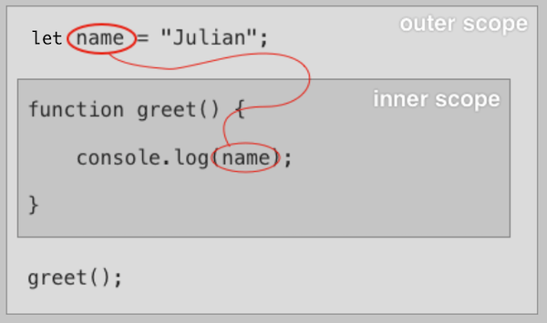

### JavaScript Versions

---

JavaScript's official name is `ECMAScript` and is commonly abbreviated as `ES`.

JS/ES versions are often abbreviated using either:

- The release year, like for example `ECMAScript 2019` or `ES2019`
- The number of the version like for example `ECMAScript 10` or `ES10`


The version`ES6+` is considered `modern JS` because many improvements have been made starting at that version, but since many code bases still use older JS, also referred to as `traditional ES/JS` that was in use around `2005`, **we should know both for some time to come**.

Most modern browsers support ES6+ features well but older browsers do not, so when the compatibility is questionable:

- Use a [Compatibility Table](http://kangax.github.io/compat-table/es2016plus) to determine if the feature is supported
- Use a transpilation tool like [Babel](https://babeljs.io/) to automatically mutate scripts into code that used only features for a particular environment


### How I am approaching this course

---

**The list of files I intend to use as notes in different contexts:**

- questions and answers per lesson and per notes: Once for the notes and once explicitly as another file for later?
- generality notes to keep track of stuff that does not fit anywhere else and for later reference


**The current plan**:

1. The JS introduction book is done in terms of rough notes
2. Finish the course and make notes, do not do much research here
3. Merge the JS intro and course notes and do the research there
4. Make Flashcards when notes are good


#### Code Style

---

- Make flashcards to get the [naming conventions](https://launchschool.com/lessons/7377ece4/assignments/88ed1c52) into my head


### Data Types

---

#### Primitive Data Types

- `Number`
- `Boolean`
- `String`  -  Can hold any UTF-16 Character
- `null`
- `undefined`
- `symbol` (ES6)
- `BigInt` (ES9)


#### Compound Data Type

- `Object`


### Variables

---

#### Assignment and Initializer

A variable can be declared two ways:

1. `Declare` a variable first and then `assign` a value in a separate statement.

   The default value of an un-initialized variable is `undefined`.

2. `Declare` a variable with an `initializer` on the same line.


While assignment and initialization look look identical, they are distinct in terminology:

- `Assignment` is a standalone expression that gives a variable a new value
- An `initializer` is an expression to the right of an `=` in a `variable declaration`


#### Declaring Variables

- `var` is the traditional way to declare variables
- use only `let` and `const` unless you work in an old a traditional environment


#### Dynamic Typing

JS/EC is a dynamically typed language which means that a variable can point to any data type.


### Expressions and Statements

---

#### Expressions

Any valid code that resolves to a value is an `expression` and can be used anywhere JS expects or allows
a value.

**Examples of expressions  -  Remember, these evaluate to an actual value**

- lonely string `'Humpty Dumpty'`
- arithmetic operation `15 + 28`
- assignment `sum = 95`


#### Statements

Statements **do not** evaluate to a value, but rather 'do things' that define the execution of a program.

**Examples of statements  -  Remember, these do not evaluate to an actual value**

- variable declaration **with** an initializer `let a = 255;`
- variable declaration **with** an initializer that used an expression `let f = (p + 55);`
- variable declaration **without** an initializer `let z;`
- if...else if; while; for; etc.


**Examples of invalid constructs with the reason they are not allowed**

- cannot use a statements as part of an expression `let e = (let u = 15);`


### Type Coercions

---

#### Explicit Primitive Type Coercions

Since primitives are immutable, JS returns a new value of a certain type for coercion and does not actually mutate data. Following are some forms of explicit primitive type coercions:

- **Converting Strings to Numbers**

  - **`Number(string)`**  -  The `Number` constructor without `new`?

    Returns a `String` representing the number or `NaN` if the string cannot be converted

  - **`parseInt(string, radix (optional))`**  -  Global function

    Returns a `Number` as integer or `NaN` if the string cannot be converted

  - **`parseFloat(string)`**  -  Global function

    Returns a `Number` as float or `NaN` if the string cannot be converted

- **Converting Numbers to Strings**

  - **`String`**  -  The `String` constructor without `new`?
  - **`Number.prototype.toString`**

- **Converting Booleans to Strings**

  - **`String`**  -  The `String` constructor without `new`?
  - **`Boolean.prototype.toString`**

- **Converting any value to Booleans**

  - **`Boolean`**  -  The `Boolean` constructor without `new`?
  - **Using the binary negation operator twice**  -  `!!someValue`


#### Implicit Primitive Type Coercions  -  Automatic Type Conversion

When the code does not use a function explicitly to convert data types but JS makes sense of an expression that includes different data types and generates some value based on implicit coercion rules.

**Note**: This type of coercion should generally be avoided. Use explicit coercion whenever possible!


The `plus` operator `+` converts **any** value into a Number using a crazy set of rules:

- **Plus operator with a single operand**

  ```javascript
  +('123')        // 123
  +(true)         // 1
  +(false)        // 0
  +('')           // 0
  +(' ')          // 0
  +('\n')         // 0
  +(null)         // 0
  +(undefined)    // NaN
  +('a')          // NaN
  +('1a')         // NaN
  ```

- **Plus operator with two operands**

  Then the hole things depends on the type of operands ...

  - **When one the operands is a String**
    The respective other operand is also converted to a string which results in string concatenation.

    ```javascript
    '123' + 123     // "123123" -- if a string is present, coerce for string concatenation
    123 + '123'     // "123123"
    null + 'a'      // "nulla" -- null is coerced to string
    '' + true       // "true"
    ```

  - **When operands are a combination of Numbers; Booleans; null or undefined**

    All operands are converted to Numbers and simply added together.

    ```javascript
    1 + true        // 2
    1 + false       // 1
    true + false    // 1
    null + false    // 0
    null + null     // 0
    1 + undefined   // NaN - JS considers 'undefined' to be NaN
    ```

  - **When one of the operands is an object, Arrays; Objects or Functions**

    Then both operands are converted to Strings and concatenated together.

    ```javascript
    [1] + 2                     // "12"
    [1] + '2'                   // "12"
    [1, 2] + 3                  // "1,23"
    [] + 5                      // "5"
    [] + true                   // "true"
    42 + {}                     // "42[object Object]"
    (function foo() {}) + 42    // "function foo() {}42"
    ```

- **The other arithmetic operators: `-` `*` `/` and `%`**
  These operators are defined exclusively for numbers, so non-number operands are converted to numbers.

  **Note**: When a String cannot be converted to a number, the operation evaluates to `NaN`

  ```javascript
  1 - true                // 0
  '123' * 3               // 369 -- the string is coerced to a number
  '8' - '1'               // 7
  -'42'                   // -42
  null - 42               // -42
  false / true            // 0
  true / false            // Infinity
  '5' % 2                 // 1
  'Meep' * 255            // 'Meep' cannot be converted to a Number so becomes NaN
  ```

- **Equality operators**

  **Note**: Some expressions may trigger multiple cycles of coercion and evaluation!

  - `Strict Equality and Inequality Operators`

    **Never perform type coercion** and return `true` only when **both** the **type** and the **value** match.

    ```javascript
    1 === 1               // true
    1 === '1'             // false
    0 === false           // false
    '' === undefined      // false
    '' === 0              // false
    true === 1            // false
    'true' === true       // false
    ```

  - `Non-Strict Equality and Inequality Operators`

    **Note**: Non-strict operators work exactly like the strict variant when operands are the same type!

    When operand types are different, the operands are coerced to the same type implicitly.

    - **When one operand is a String and the other a Number  - String is converted to Number**

      ```javascript
      '42' == 42            // true
      42 == '42'            // true
      42 == 'a'             // false -- becomes 42 == NaN
      0 == ''               // true -- becomes 0 == 0
      0 == '\n'             // true -- becomes 0 == 0
      ```

    - **When one operand is a Boolean  -  That Boolean operand is converted to a Number**

      ```javascript
      42 == true            // false -- becomes 42 == 1
      0 == false            // true -- becomes 0 == 0
      '0' == false          // true -- becomes '0' == 0, then 0 == 0
                            // (two conversions)
      '' == false           // true -- becomes '' == 0, then 0 == 0
                            // (two conversions)
      true == '1'           // true
      true == 'true'        // false -- becomes 1 == 'true', then 1 == NaN
                            // (two conversions)
      ```

    - **When both operands are either `null` or `undefined`  -  Always returns true**

      ```javascript
      null == undefined      // true
      undefined == null      // true
      null == null           // true
      undefined == undefined // true
      ```

    - **When one operand is `null` or `undefined` or `NaN`  -  Always returns false**

      ```javascript
      undefined == false     // false
      null == false          // false
      undefined == ''        // false
      undefined === null     // false -- strict comparison
      ```

      ```javascript
      NaN == 0              // false
      NaN == NaN            // false
      NaN === NaN           // false -- even with the strict operator
      NaN != NaN            // true -- NaN is the only JavaScript value not equal to                       // itself
      ```

  - **Relational Operators `<` `>` `<=` `>=`**

    These operators are defined only for Numbers and Strings.

    - **When both operands are Strings  -  Both operands are compared `Lexicographically`**

    - **Otherwise both operands are converted to Numbers and compared accordingly**

      ```javascript
      11 > '9'              // true -- '9' is coerced to 9
      '11' > 9              // true -- '11' is coerced to 11
      123 > 'a'             // false -- 'a' is coerced to NaN; any comparison with NaN is false
      123 <= 'a'            // also false
      true > null           // true -- becomes 1 > 0
      true > false          // true -- also becomes 1 > 0
      null <= false         // true -- becomes 0 <= 0
      undefined >= 1        // false -- becomes NaN >= 1
      ```


#### Best practices

- **For the Launchschool curriculum  -  Always use strict comparison**
- Use explicity type conversion to make intentions clear and not be surprised by implicit conversions
- On the other hand side, code should in general not compare values of different types unless there is a good reason for it. So when we use operators on operands with the same type, the non-strict operators are perfectly fine to use


### Conditionals

---

JavaScript supports the following **two** types of conditional statements.

**Note**: Since these are statements, they do **not** evaluate to a useful value!


#### Truthy and Falsy

When an expression in a conditional does not evaluate to a boolean value, the following rules apply:

- **Only the following six values are falsy in a conditional context**

  ```javascript
  if (false)        // falsy
  if (null)         // falsy
  if (undefined)    // falsy
  if (0)            // falsy
  if (NaN)          // falsy
  if ('')           // falsy
  ```

- **Every other value is truthy in a conditional context**

  ```javascript
  if (true)         // truthy
  if (1)            // truthy
  if ('abc')        // truthy
  if ([])           // truthy
  if ({})           // truthy
  ```


### Functions

---

- invoke function by appending `()` to the name
  but there are more ways to invoke functions
- function names are just local variables that have a function as value
- functions can be bound to variables just like any other value and invoked just as for the original function name!
- how the language works when the argument passed mismatch the parameter list
  - invoking a function with the wrong number of arguments, more or less, does not raise an error
  - a parameter that is note passed as argument is bound to `undefined`
- functions can be nested and there is not real limit here


#### Types of functions and ways to declare them

- **`Function Declarations`  -  `Function Statements`**

  A function declaration **must start with the `function` keyword** and defines a variable of type `function` with the same name as a function that has the function as it's value.

  This 'function variable' obeys the same exact scoping rules like other local variables and can be re-assigned to have another value.

  Re-assigning this function variable to some value other than the function, irreversibly shadows the function! (Right?)

- **`Anonymous Function Expressions`**

  An anonymous function expression defines a function **without a function name** as part of a larger expression, typically to a local variable:

  ```javascript
  const someFunction = function () { ... } // could also use let for the local variable
  someFunction(); // invoke the function just as normal
  ```

- **`Named Function Expressions`**

  Are declared and behave the same as an `anonymous function expression` with the difference that **we associate a function name to the function**. Following are some quirks:

  - The function name is **not** actually in the scope the function is declared, but it is accessible in the function definition itself through `methodName.name`:

    ```javascript
    let someFunction = function someName() {
     console.log(`I am a named function expression. My name is: ${someName.name}`);
    }
    
    someFunction(); // outputs: I am a named function expression. My name is: someName
    ```

  - A good reason to use named function expressions rather than anonymous ones is that the debugger can use the function name in the stack trace so that an error is, possibly, easier to track down.

- **`Arrow Functions`**

  Arrow functions are sort of a shorthand way to write function expressions.

  **Here a list of quirks in terms of arrow functions. Arrow functions ... :**

  - return implicitly i.e. no need to use the `return` keyword for one-line arrow functions

  - parameter list does not have to be encased when there is only a single parameter

  - inherit the `execution context` from the context the arrow function is declared in

  - are most often used as callback functions when function fits on a single line

  - steps of the notation

    1. The normal function declaration

       ```javascript
       const multiply = function(a, b) {
         return a * b;
       };
       ```

    2. Remove the `function` keyword and add the arrow after the parameter list

       ```javascript
       const multiply = (a, b) => {
         return a * b;
       };
       ```

    3. Put everything on a single line and get and get rid of the braces

       ```javascript
       const multiply = (a, b) => return a * b;
       ```

    4. Get rid of the `return` keywords as an arrow function returns implicitly

       ```javascript
       const multiply = (a, b) => a * b;
       ```

       


#### Function Declaration and Function Expression subtleties

If a declaration starts with the keyword `function`, as the very first words **without any leading characters** it is a function declaration, otherwise it is a function expression (anonymous or names).

Wrapping a function declaration inside parentheses is enough to go from declaration to expression:

```javascript
function () { ... }; // proper function declaration
(function () {} );   // not a declaration but an expression since 'function' not first
```


### Function/Functional Scope and Lexical Scoping

---

Every function or block creates a new variables scope.

#### Different types of scopes

- **Global Scope**

  Variables declared outside any functions or blocks exist in the global scope?

  What about declaring variables in some function/block scope and not prepend `let` or `const`, does that have the same effect is that a different mechanism?

- **Function Scope**  - Also referred to as `Local Variable Scope`  -  Yes the same as `Block Scope` Below!

  Function scope is the scope inside a function block. This scope behaves the same as local variable scope in that it can access the scope that surrounds it i.e. the `outer scope` where as the `outer scope` cannot access that `inner scope`.

  


  **Note**: Apparently functions and variables behave the exact same up to the scope outside all blocks.

  ```javascript
  let name = 'Julian'; // global scope  -  Accessible to everyone?
  
  function greet() { // declared in global scope -  nothing special
    function say() { // function scope  -  behaves as local vaiables would
      console.log(name); // nested function scope  -  again, nothing special
    }
  
    say();  // function scope of 'greet' function
  }
  ```

- **Block Scope**  -  Also referred to as `Local Variable Scope`  -  Yes the same as `Function Scope` above!

  The scope introduced when constructs such as `while` loops are used confined to the opening and closing curly braces.

  ```javascript
  let name = 'Julian'; // global scope  -  Accessible to everyone?
  
  function greet() { // declared in global scope -  nothing special
    function say() { // function scope  -  behaves as local vaiables would
      console.log(name); // nested function scope  -  again, nothing special
    }
      
    while(true) {
     console.log("Hello!"); // block scope
    }
  
    say();  // function scope of 'greet' function
  }
  ```


**Note**: Both the function and block scope can also be referred to as `local scope`!

**Note**: Not every region between curly braces is a `block` technically such as the curly braces around an object as well as a function, but usually we refer to a  block when we mean an executable group of statements between curly braces!


#### Lexical Scoping

Lexical scope means that the structure of the source code defines a variable's scope.
Every time we write a function or a construct that have block scope, a new scope is introduced to that scope structure.

A scope is added for every block/scope, executed or not, which is why this type of scoping is referred to as `static scoping`. Every time we refer to some variable in a 'local scope', JavaScript walks up that hierarchy of scope structures from the local up to the global scope (possibly) and resolves a variable with the **first** occurence of that particular identifier/name.

This implies that variable shadowing can occur over this scope hierarchy.


#### Lexical scoping works identically for referencing as it does for assignment

**What happens is that:**

- When we reference a variable, JS walks up the hierarchy/structure of the code until a variable is found up to the global scope
- When we assign a variable to a new value, JS walk up the code structure the same exact way up to the global scope. But when no variable with the same identifier is found, a new, global variable is created!


#### Various Ways to add Variables to a (local) scope

- By using the `let`,  `const` or `var` keyword

  ```javascript
  let a = 15;
  const MEEPS = 5;
  ```

- By defining parameters for a function

  ```javascript
  function woof(a, b) {
    // a and b are local variables in the 'woof' function scope
  }
  ```

- Declaring a function creates a variable with the same name as the function

  ```javascript
  function eek() { /* do stuff */ }
  // eek is accessible as local variable
  ```

- Declaring a class also creates a variable with the class name


#### Some of the scoping rules overview

- Every function declaration introduces a new `local variable scope`, specifically a new `function scope`
- Every block also introduces a new `local variable scope`, specifically a new `block scope`
- Lexical Scopre uses the structure of the source code to determines a variables' scope which has nothing to do with executing the code. Only the static, written structure of the code matters.
- All variables, outside a function and/or block (code structure relatively speaking) are accessible inside these functions and blocks.


### Hoisting

---

#### Differences between declaring variables with `let` and `var`

- **At top-level**, `var` adds a property to the `global` or `window` object (depending on the execution context) where:

  - inside the `node.js` context, a property is added to the `global` object
  - inside the browser context, a property is added to the `window` object

  whereas `let` does not add that property.

  **The takeaway is that, at the top-level of the program, `let` is 'safer' because it does not add properties to the `global` or `window` objects, in other words, no global variable is created!**

- **Inside a function i.e. inside function scope**, `var` does **not** add a property to the `global`/`window`  object or any other object for that matter!

- `let` is `block scoped` which means that the variable is accessible only in the scope where it is originally declared (including nested/inner scopes) which is defined by curly braces **whereas** `var` is `function scoped` which means that the variable is accessible **within the function it is declared in**.

  ```javascript
  function foo() {
    if (true) {
      var a = 1;  // block scope  -  i.e. not accessible outsie the conditional
      let b = 2;  // function scope  - i.e. accessible in the whole 'foo' function
    }
  
    console.log(a); // 1
    console.log(b); // ReferenceError: a is not defined
  }
  
  foo();
  ```

- `block scope` variables that are declared with the `var` keyword are defined without the code ever being executed as in the following example:

  ```javascript
  function foo() {
    if (false) {
      var a = 1;  // this code is never executed, yet the variable is initialized to
    }             // the value undefined
  
    console.log(a); // undefined
  }
  
  foo();
  ```


#### Declared Scope VS Visibility Scope  -  A Mental Model by Launchschool

##### The Term `Global Scope`

This scope is typically referred to by people as `global scope` but the terms `file scope` and `module scope` would technically be more appropriate. 

In JavaScript, a variable cannot be explicitly declared in global scope as in other languages, but all variable declarations are **either one** of the following:

- `function scope`  -  Through the  `var` and `function` keywords

  At the top level of a program, which means outside any function, function scope refers to the entire file,
  in other words, global scope.

- `block scope`  -  Through the `let`; `const` and `class` keywords


**The following code snippet demonstrated the issue this mental model wants to clarify:**

```javascript
let foo = 1;      // variable declaration at top-level i.e. global
console.log(foo);
```

The model is based on the question `what scope does the variable 'foo' have'`?

- Since `foo` was declared with `let` it should have `block` scope
- But `foo` ends up being `global` scope
- Overall `foo` does have `block` scope but this just happens to coincide with the top-level `global` scope
  **in this case**

So what we could say about the `foo` variable scope

- `foo` has `global` scope but was declared in `block` scope
- `foo` has `block` scope but it happens to coincide with the `global` scope


**This is confusing but a common problem of the language in terms using only terminology for scope**

The model expresses the scope of a variable using **two attributes**:

1. **`Declared Scope`  -  Refers to how the variable was declared**

   Specifies if a variables was declared using `let`; `const`; `class`; `var` or `function` of which:

   - `let`;  `const` and `class` declare a variable with `block` scope
   - `var` and `function` declare a variable with `function` scope

   For this model, even if the variable in question is declared **outside** of any block or function, we
   say that is has either `block` or `function` scope. **Nothing else**.


   **Here a few examples:**

   ```javascript
   let foo = 1;        // declared scope is block scope
   var bar = 2;        // declared scope is function scope
   
   if (true) {
     let foo = 3;      // declared scope is block scope
     var qux = 4;      // declared scope is function scope
   }
   
   function bar() {    // declared scope is function scope
     let foo = 5;      // declared scope is block scope
     var bar = 6;      // declared scope is function scope
   
     if (true) {
       let foo = 7;    // declared scope is block scope
       var qux = 8;    // declared scope is function scope
     }
   }
   ```

2. **`Visibility Scope`  -  Refers to the actual visibility of the variable in the program scope**

   Specifies where a variable is visible in terms of it's accessibility in the executing program.

   This can be one of the following:

   - `global` scope  -  outside any function or block

   - `local` scope  -  inside a function or block (or any other combination not outside functions/blocks)

     **Additionally** for this `local` scope, we can specify whether a particular variable either of:

     - `local - function` scope
     - `local - block` scope

     These additional scopes represent where the variables are visible rather than how they were declared, which is why a variable declared with `let` can end up being `local  -  function` because it is declared at the start of the function.

   **Here a few examples**:

   ```javascript
   let foo = 1;        // visibility scope is global
   var bar = 2;        // visibility scope is global
   
   if (true) {
     let foo = 3;      // visibility scope is local (block)
     var qux = 4;      // visibility scope is global
   }
   
   function bar() {    // visibility scope is global
     let foo = 5;      // visibility scope is local (function)
     var bar = 6;      // visibility scope is local (function)
   
     if (true) {
       let foo = 7;    // visibility scope is local (block)
       var qux = 8;    // visibility scope is local (function)
     }
   }
   ```

   **Note**: By default we typically talk about the `visibility` scope of a particular variable because that is
              what we typically need to know for programming.


#### Node.js wraps code in a function whereas the Node REPL does not

When node.js executes code from a file, that code is wrapped into the following function:

```javascript
(function (exports, require, module, __filename, __dirname) {
  // the executed code is wrapped in this anonymous function expression
});
```

whereas the node REPL does **not** do that. This means that execution of certain code can have unexpected results. One notable example of such an unexpected situation is when using top-level `var` declarations.

Running the following code:

```javascript
var bar = 42;
console.log(global.bar);
bar += 1;
console.log(global.bar);

let foo = 86;
console.log(global.foo);
```

- in the node REPL, **line-by-line**, executes as follows: 

  ```javascript
  var bar = 42;
  console.log(global.bar); // 42
  bar += 1;
  console.log(global.bar); // 43
  
  let foo = 86;
  console.log(global.foo); // undefined
  ```

  This is because the `var` keyword adds properties to the `global` object when used at top-level

- and when executed through node directly, executes as follows:

  ```javascript
  var bar = 42;
  console.log(global.bar); // undefined
  bar += 1;
  console.log(global.bar); // undefined
  
  let foo = 86;
  console.log(global.foo); // undefined
  ```

  Which is actually **wrapped into a function in the node environment** and looks as follows:

  ```javascript
  (function (exports, require, module, __filename, __dirname) {
    var bar = 42;
    console.log(global.bar); // undefined
    bar += 1;
    console.log(global.bar); // undefined
  
    let foo = 86;
    console.log(global.foo); // undefined
  });
  ```

  This has the effect that `var` now **does not add properties to the `global` object** but rather add the `bar` variable in `function scope`!


### What is Hoisting?

---

JavaScript engines do not just execute the code but rather execute operate under two phases.

#### Creation Phase  -  Before the program is executed

Does preliminary work to prepare for the execution phase. One task of this phase is to find all declarations such as variable, function and class declarations and move them 'up' to the top of their respective scope where:

- Function scoped declarations are moved to the top of the function (or global!?)
- Block scoped declarations are moved to the top of the block (or global?!)


This is the reason why functions can be invoked 'before' they are declared, in terms of the code structure.

**Illustration of this process**

1. The creation phase scans for, amongst other things, function declarations, such as for example:

   ```javascript
   console.log(getName());// invoking the function before it is defined in code structure
   
   function getName() {   // the creation phase scans the program to find this function
     return "Pete";
   }
   ```

2. The creation phase then moves the function to the top of it's scope, **which can be thought of** re-arranging the original code  into the following:

   ```javascript
   function getName() {  // function declaration is now a the top of it's scope
     return "Pete";
   }
   
   console.log(getName());  // the function can be invoked since it is declared before
   ```


#### Execution Phase  -  The execution of the prepared program

It the process where the program executes line-by-line.


### The Temporal Dead Zone

---

Variables declared with `let`, `const` and `var`  are also hoisted but behave differently in terms of how they are hoisted and how they can be accessed:

- Hoisted `var` variables are initialized with the value `undefined`. Since hoisting happens during the creations phase, `var` variables that are declared on program lines that never execute are also hoisted and initialized with the value `undefined` regardless.

  This is why the variable `meep` in the following code is declared, while never executed!

  ```javascript
  console.log(meep === undefined);  // hoisted and initialized to the value 'undefined'
  
  if (false) {
    // this block will never run
    var meep = 'piep pieep'; // hoisted even if never executed
  }
  
  console.log(meep === undefined);  // the same as the first case
  ```


  **In other words  -  Accessing `var` variables before their declaration resolves to `undefined` ** !

- Hoisted `let` variables and `const` constants are **not** initialized to any value and stay **not-defined** as if they did not exist i.e. as if they are not declared and we get a `ReferenceError` for both `let` and `const`.

  ```javascript
  console.log(foo); // ReferenceError: Cannot access 'foo' before initialization
  let foo;
  ```

  ```javascript
  console.log(qux); // ReferenceError: Cannot access 'qux' before initialization
  const qux = 42;
  ```

  **Note**: Do not use the term `undefined` here since it has nothing to do with the `undefined` primitive!

  

  **In other words  -  Accessing `let` and `const` variables/constants before their declaration results in a `ReferenceError`** !


The `Temporal Dead Zone` is the lines of a program or the places in the scope between the entering/top scope and declaration of these variables/constants where they cannot be accessed.

This Temporal Dead Zone ends when the variable/constants in question are declared.


#### Error messages reflect this

JavaScript engines make the difference between variables that are declared and variables that are not declared:

- If the variable `qux` is declared, hoisted and accessed before definition/initialization:

  > // ReferenceError: Cannot access 'qux' before initialization

- If the variable `baz` is never declared:

  > console.log(baz); // ReferenceError: baz is not defined


#### Hoisting for Function Declarations

The lesson is here is to **never nest function declarations in non-function blocks** and **if you do want to** declare a function in a block such as is an if statement, **always use a function expression**!

Hoisting works as expected for the following example, where a function is declared directly in the function scope of another function:

```javascript
function foo() {
  return bar();  // accessible because the function is hoisted to the top of the scope

  function bar() {// hoisting raises this function definition to the top of function scope
    return 42;
  }
}
```


**Other than the above example, never declare a function in a non-function block as follows:**

```javascript
function meep() {
  if (true) {  // conditionals have block scope
    function mayWorkMayNot() {  // function declaration in block scope - big no no
      // what am I doing
    }
  }
    
  mayWorkMayNot();
}
```

The problem is that implementations are inconsistent in this case and results are unexpected, so never do this, use function expressions instead! (Next up)


#### Hoisting for Function Expressions

When function expressions are used to assign functions as value to a variables or constant, these obey the exact same rules as the `var` and `let/const` hoisting rules above, just that the value of these variables/constants is now a function.


```javascript
console.log(func === undefined);

var func = function namedHoistedFunction() {
  console.log('I am a names, hoisted function!');
}

console.log(typeof(func) === 'function');
```


#### Hoisting when both variables and functions are declared

When a scope contains both functions and variables (including constants) then we can assume that:

1. Function declarations are hoisted **first** i.e. **above variable declarations**
2. Variables and constants are hoisted **second** i.e. **below function declarations**


**Some intuitive illustrations**

- For `var` variables, rather than thinking that it exists at two point with different states, think that the `var` variable in question has the value `undefined` until it's value is defined on a particular line.

- With these shifty rules, always consider if the global scope screws with the expected outcome.

- When nor variables at at play i.e. ther is no conflict between things, nothing is hoisted?

  ```javascript
  boo();
  
  function boo() {
    console.log("Boo!");
  }
  ```

  


#### Best Practices to follow to reduce confusion with hoisting based problems

- don't use `var` for declarations

- if you do have to use `var` for declarations, declare them at the top of the scope in the program structure like so:

  ```javascript
  function foo() {
    var a = 1;
    var b = 'hello';
    var c = false;
    // now we know that all the variables are initialized/defined
  }
  ```

- declare variables and constants using `let ` and `var` as close to their use as possible

- just declare functions **before** invoking them, don't rely on these rules


#### Hoisting Questions and Answers

- **How does the following snipper look after hoisting including functions and variables**?

  **Demonstration:** *The variable is not in scope in the function definition*!

  **Before**:

  ```javascript
  bar();              // logs undefined
  var foo = 'hello';
  
  function bar() {
    console.log(foo);
  }
  ```

  **After**:

  ```javascript
  function bar() {
    console.log(foo);
  }
  
  var foo;
  
  bar();          // logs undefined
  foo = 'hello';
  ```

- **Same thing here**
  **Demonstration** : *Variable is a function and then re-assigned to a string primitive (Not used in this example)*

  **Before**:

  ```javascript
  bar();             // logs "world"
  var bar = 'hello';
  
  function bar() {
    console.log('world');
  }
  ```

  **After**: 

  ```javascript
  function bar() {
    console.log('world');
  }
  
  bar();
  bar = 'hello';
  ```

- **And another one**

  **Demonstration**: *Functions are hoisted first, the variables follow. In this case the `bar` variable follows the function definition and thereby shadows the function 'variable' through which the function was available* 

  **Before**:

  ```javascript
  var bar = 'hello';
  bar();             // raises "TypeError: bar is not a function"
  
  function bar() {
    console.log('world');
  }
  ```

  **After**:

  ```javascript
  function bar() {
    console.log('world');
  }
  
  bar = 'hello';
  bar();
  ```

  

#### Hoisting is not real  -  It is one way to explain how JS works

The behavior we try to explain using the `hoisting` model is merely a consequence of the `creation` and `execution` phase.

The `creation` phase prepares code for execution. Each time the `creation` phase encounters a declaration, this identifier is added to the current scope, which depending on the context, is either the local or global scope (either function or block).

At this point JS know which identifiers exist and what exact scope each one belongs to.

During the `execution` phase JS does not care about the declarations, but it does care about the initialization and function/class definitions. At this point JS merely needs to lookup identifiers as they arrive.


#### Before hosting even occurs

An example:

```javascript
let foo = "hello";

function foo() {
  console.log("hello");
}
```

What happens here is that JS raises a `SyntaxError`:

- **during** the `creation` phase
  **but**
- **before** the hoisting affects how the program is interpreted

At this point the JS engine processes the program from top to bottom and considers identifiers and well as it check for duplicates. This means that if and identifiers is declared more than once, it is reported at this point.

**Note**: For the purpose of Launchschool, pretend that hoisting is something that actually happens!


#### Questions I should be able to answer

- What is hoisting
- How do `var`, `let`, and `const` interact with hoisting? How do they differ?
- How do functions and classes interact with hoisting? How do they differ?
- What part does hoisting play in the way a specific program works?
- How does hoisting really work?


### Various bits of information

---

- JS uses Floating Point to represents all numbers

- `\` at the end of a line forces JS to ignore the new line, this is great to chain long strings together.
  But beware the spaces because JS treats each space/tab etc as an actual space/tab in the string

  - The verbose version

    ```javascript
    let longText = 'esfesvsfawesvef ef sev es esfse es\n' +
                   'esfesf ef sef osjefn sief iosnevion';
    ```

  - The less verbose and less flexible version

    ```javascript
    let longText = 'awdd awca cesesfsefs es se\n\
    dawd  awdwdwad wad wa dwa\n\
    dwawd wf ffesfes skf sef';
    ```

- When making a line wrap using a backward slash, the backward slash must be the last character on that line. Even one space after the slash results in a SyntaxError.

- Because a function declaration:

  - 'creates'  the function
  - creates a variable with the function name with the function as the value

  re-assigning the function name i.e. that local variable really, shadows the actual function!


#### More questions and answers

---

- What is the namespace of different types of values/things?
  The course says that `let`/`const`  declarations cannot have a name identical to a function:

  ```javascript
  let foo = 3;
  function foo() {}; // SyntaxError: Identifier 'foo' has already been declared
  ```

  ```javascript
  function foo() {};
  let foo = 3;  // SyntaxError: Identifier 'foo' has already been declared
  ```

  What else should I know?

- Understand when an identifier is 'taken'.
  Is the rule that:

  > ... can't have two declarations with the same name if one of those names is declared by `let`

  What about functions and classes with the same names?
  I think it does as explaines in the course since both of the following examples raise an error for the same reason, that the identifier is already in use but for different reasons:

  - ```javascript
    let foo = "hello";
    
    function foo() {
      console.log("hello");
    }
    ```

  - ```javascript
    function foo() {
      console.log("hello");
    }
    
    let foo = "hello";
    ```

- What exactly is the `global` object?

- What is the purpose of the `global` and `window` objects and how are they similar and/or different in the node/browser context? Are they the exact same thing but depend on the environment?

- What bits of the language make something a statement? Like the `let ` keyword for example?

- So the global scope is just most outer scope of all? And not some special thing?

- Does type coercion from number to String `let someNumberAsString = String(12.99);` use some function, or operator, or is it just the constructor of the `String` type?

  According to [this](https://stackoverflow.com/questions/50082312/difference-between-string-and-new-string-in-javascript) post, using `new String` vs `String` are completely different things, even up to how the primitives compare!

  **I think the real question here is to ask what the difference between invoking a constructor with the `new` keyword and without it is because apparently they return different things!**

- Make note of the fact that JS consider `NaN` to be a Number

- Understand how lexicographical string comparison works

- Can functions, because their names are local variables, made to point elsewhere so that the function is in-accessible? This would suck!

- For the following code snippet:

  ```javascript
  const name = 'Bob';
  const saveName = name;
  ```

  Is it correct that, given the fact that strings are primitive values, declaring initializing the `saveName` variable using another variable identifier allocates **new storage** in memory and actually copies the `name` string rather than pointing to the same string?
  
- The following code raises an error because the `average` identifier has been declared previously for the functions. Since a function name is just a variable, this makes sense. But is there more to this?

  ```javascript
  function average(someNumbers) { // code here ... }
  let average = average([1, 2, 3]); // average identifier already declared
  ```

- Can functions only be declared using the `function` keyword as first word, or are there options such as with constant?

- Does the 'accessing constant data through an non-constant pointer' problem exist in JS?
  In that we declare something as constant but can then assign that constant thing to a non-constant things and change it through that hack?

  I guess not, but what exactly are the mechanics?

