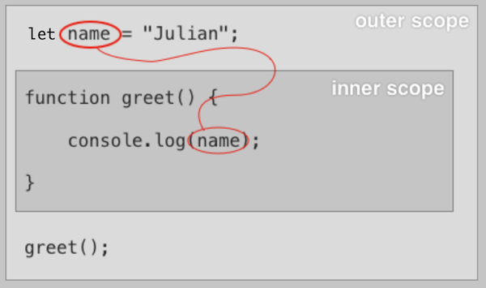
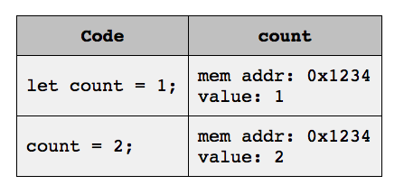
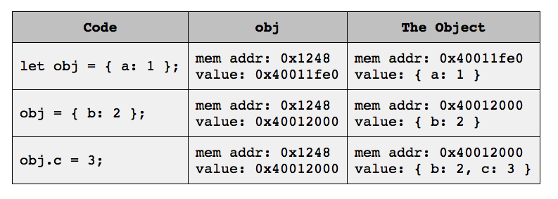
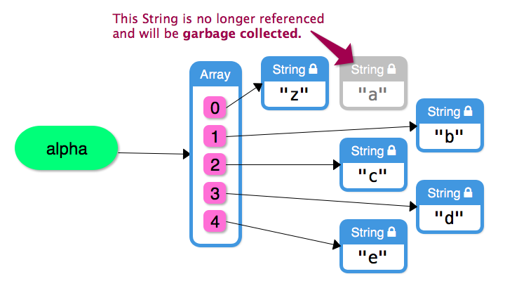

# JS210 Notes Rewrite


## Running comments and thoughts

- Gather up the lists of random nodes per category and determine if they should stay in these random lists or be categorized properly


## Running notes to fit somewhere

- About strings

  - Double and single quotes can be escaped using `\` or the other type used for the
    respective other type of quote

  - Starting and ending the string with backticks (`) enables interpolation in the string using

    ```javascript
    ${someExpression}
    ```

    **Note**: feature is part of `template literals` and works only in a string between backticks!

- Division by zero is `Infinity` in JS, why?


## Terminology

- In terms of the official documentation:

  - `Constructor.prototype.methodName()` refers to an `instance method` which can be referred to as `prototype methods`
  - `Constructor.methodName()` refers to a `static method`

- Traditional JavaScript means ECMAScript versions up to and excluding ES6

- Modern JavaScript means ECMAScript versions starting at and including ES6

- `Explicit coercion` means using functions to convert between data types

- `Implicit coercion` means the JavaScript engine determines the data type based on the context.

  This mechanism can also be referred to as `silent` or `automatic` coercion.

- `Initializer` refers to the expression a newly declared variable is bound to on creation on the same line.


## The JavaScript language and other random JavaScript facts

JavaScript's official name is `ECMAScript` and is commonly abbreviated as `ES`.

JS/ES versions are often abbreviated using either:

- The release year, like for example `ECMAScript 2019` or `ES2019`
- The number of the version like for example `ECMAScript 10` or `ES10`

The version`ES6+` is considered `modern JS` because many improvements have been made starting at that version, but since many code bases still use older JS, also referred to as `traditional ES/JS` that was in use around `2005`, **we should know both for some time to come**.

Most modern browsers support ES6+ features well but older browsers do not, so when the compatibility is questionable:

- Use a [Compatibility Table](http://kangax.github.io/compat-table/es2016plus) to determine if the feature is supported
- Use a transpilation tool like [Babel](https://babeljs.io/) to automatically mutate scripts into code that used only features for a particular environment


**More facts:**

- Dynamically typed language which means that a variable can point to any data type

- When a function is invoked and the same function identifier was used before, the most recent function is invoked.

- A rule about hoisting. When a scope contains declaration for multiple functions with the **same name**, these functions are apparently hoisted in the order from top to bottom, and in the end, the last i.e. the declaration at the bottom is the one invoked **where ever** that function is invoked.

  ```javascript
  function some() { console.log('first'); };
  some(); // third
  function some() { console.log('second'); };
  some(); // third
  function some() { console.log('third'); };
  some(); // third
  
  // because after hoisting
  function some() { console.log('first'); };
  function some() { console.log('second'); };
  function some() { console.log('third'); }; // this is the last declaration
  ```

- The JS `%` is **not** the module operator but the remainer

- `NaN` is the only JS value that is not equal to itself in terms of using equality operators. To equality between `NaN` values, one of the following two method can be used:

    - `Number.isNaN(value)`
    - `Object.is(value, NaN)`

- `Infinity` values are considered Numbers


## Data types

JavaScript differentiates between `primitive` and `complex`data types.


### Primitive data types

Traditional JS specifies `5 primitive data types`:

- `String`
- `Number`  -  The only numerical data type. Used for both integer and floating point numbers.
- `Boolean`  -  Can only every hold the value `true` or `false`
- `Undefined`  -  Represents the absence of a value and can be used explicitly through the literal `undefined`
- `Null`  -  Represents the absence of a value similar to `undefined`


Modern JS introduces `2` more primitive data types over the previous `5`: 

- `Symbol` introduced in `ES6`
- `BigInt` introduced in `ES9`

**Primitive values are immutable. No operation can ever mutate the value of a primitive value but always returns a new value.**


### Complex/Compound/Composite data types

All data types that are not one of the traditional or modern JS primitive data types are referred to as `complex`; `compound` or `composite` data types. These can be made up of other objects and values.

Examples of complex data types are the built-in `Array` and `Simple Object`; `Date` and `Function` .


#### The `typeof` operator

The `typeof` operator returns a string that represents the data type of the operand. Some quirks to be aware of:

- `typeof(null)` returns a string with the value `object` which is an implementation error in the JavaScript implementation which cannot be fixed without breaking all code written so far. So this behavior will stay as is for the forseeable future.

  The ECMAScript  standard specifies that `null` is a `primitive` and **not** an `object` i.e. `null` is to be treated as a primitive value and **not** an object.

- `typeof` with an array operand returns a string with the value `object` because an array is actually an object under the hood


#### `undefined` VS  `null`

- `undefined` is a primitive value that is used when a variable is declared but not initialized.
  This data type can arise implicitly through non-initialized variables.
- `null` is a primitive value that is used when a variable is declared and initialized with an 'empty' value i.e. the absence of a value.


## Type coercion

### Explicit type coercion

Explicit type coercion occurs when functions are used to convert one data type to another. A non-exhaustive list of explicit type coercions:

- **Converting Strings to Numbers**
  - `Number(string)`  -  Returns a `String` representing the number or `NaN` if the string cannot be converted

  - `parseInt(string, radix (optional))`  -  Global function  -  Returns a `Number` as integer or `NaN` if the string cannot be converted

  - `parseFloat(string)`  -  Global function  -  Returns a `Number` as float or `NaN` if the string cannot be converted

- **Converting Numbers to Strings**
  - `String`
  - `Number.prototype.toString`

- **Converting Booleans to Strings**
  - `String`
  - `Boolean.prototype.toString`

- **Converting any value to Booleans**
  - `Boolean`
  - Using the binary negation operator twice `!!someValue`


### Implicit type coercion

Implicit type coercion occurs when the JavaScript engine makes sense of an expression and determines the data type to convert a value to implicitly based on the context of the code in question. Depending on the rules applied, multiple cycles and level of coercions may be triggered before the actual operations are performed.

**Note**: Implicit type coercions in to be avoided in general!


## Operators

### The plus `+` operator

The `+` operator can be used as unary and binary operator.

**As unary operator - The rules are complex and not necessarily useful**

```javascript
+('123')        // 123
+(true)         // 1
+(false)        // 0
+('')           // 0
+(' ')          // 0
+('\n')         // 0
+(null)         // 0
+(undefined)    // NaN
+('a')          // NaN
+('1a')         // NaN
```


**As binary operator - The rules depend on the type of both operands**

- If one operand is of type String, the respective non-string operand is implicitly coerced into a String and the expressions boils down to string concatenation.

  ```javascript
  '123' + 123     // "123123" -- if a string is present, coerce for string concatenation
  123 + '123'     // "123123"
  null + 'a'      // "nulla" -- null is coerced to string
  '' + true       // "true"
  ```

- When operands are any combination of Numbers; Booleans; null and undefined, all operands are converted to numbers and summed together.

  ```javascript
  1 + true        // 2
  1 + false       // 1
  true + false    // 1
  null + false    // 0
  null + null     // 0
  1 + undefined   // NaN - JS considers 'undefined' to be NaN
  ```

- When any of the operands is an object, i.e. an Array; Object or a function, both operands are coerced to a String and concatenated together.

  ```javascript
  [1] + 2                     // "12"
  [1] + '2'                   // "12"
  [1, 2] + 3                  // "1,23"
  [] + 5                      // "5"
  [] + true                   // "true"
  42 + {}                     // "42[object Object]"
  (function foo() {}) + 42    // "function foo() {}42"
  ```


### Arithmetic operators `-`; `*`; `/` and `%`

Non-number operand are coerced into numbers if possible and then the arithmetic is carried out of both number operands.
In case an operand cannot be coerced into a number, the operator evaluates to `NaN` because the operation cannot possible result in a number.
This implies how other data types such as strings and booleans are implicitly coerced into a number.

```javascript
1 - true                // 0
'123' * 3               // 369 -- the string is coerced to a number
'8' - '1'               // 7
-'42'                   // -42
null - 42               // -42
false / true            // 0
true / false            // Infinity
'5' % 2                 // 1
'Meep' * 255            // 'Meep' cannot be converted to a Number so becomes NaN
```


### Equality operators

There are two types of equality operators that vary in their strictness and how the operands and interpreted.


**Strict equality operator -  Identity Operator  -  No implicit type coercion occurs before comparison**

- `true` only when **both** the **type** and **value** of the operands are the exact same
- `false` otherwise

```javascript
1 === 1               // true
1 === '1'             // false
0 === false           // false
'' === undefined      // false
'' === 0              // false
true === 1            // false
'true' === true       // false
```

**Strict in-equality operator - The same as the strict-equality but opposite result**

- `true` when the type **or** value of the operand is different
- `false` when the operand have the same type and value


**Non-strict equality operator  -  Loose equality operator  -  Implicit type coercion may occur before comparison**

Works the same as the strict-equality operator if, and only if both operand types are the same, otherwise the operands may be implicitly coerced to the same type before their values are compared. Here some cases:

- When one operand is a string and the other a number, the string is coerced into a number

  ```javascript
  '42' == 42            // true
  42 == '42'            // true
  42 == 'a'             // false -- becomes 42 == NaN
  0 == ''               // true -- becomes 0 == 0
  0 == '\n'             // true -- becomes 0 == 0
  ```

- When one operand is a boolean, that boolean operator is coerced into a number 

  ```javascript
  42 == true            // false -- becomes 42 == 1
  0 == false            // true -- becomes 0 == 0
  '0' == false          // true -- becomes '0' == 0, then 0 == 0
                        // (two conversions)
  '' == false           // true -- becomes '' == 0, then 0 == 0
                        // (two conversions)
  true == '1'           // true
  true == 'true'        // false -- becomes 1 == 'true', then 1 == NaN
                        // (two conversions)
  ```

- When both operands are either `null` or `undefined`, always evaluates to `true`

  ```javascript
  null == undefined      // true
  undefined == null      // true
  null == null           // true
  undefined == undefined // true
  ```

- When one of both operands is `null`; `undefined` or `NaN` , always returns `false`

  ```javascript
  undefined == false     // false
  null == false          // false
  undefined == ''        // false
  undefined === null     // false -- strict comparison
  ```


  ```javascript
  NaN == 0              // false
  NaN == NaN            // false
  NaN === NaN           // false -- even with the strict operator
  NaN != NaN            // true -- NaN is the only JavaScript value not equal to                       // itself
  ```


**Non-strict in-equality operator  -  Loose in-equality operator  -  The same as non-strict inequality but opposite result**


### Relational operators `<`; `>`; `<=` and `>=`

Specified exclusively for numbers and strings. There are two cases:

- When both operands are strings, both operands are compared `lexicographically`

- Otherwise both operands are coerced into numbers first

  ```javascript
  11 > '9'              // true -- '9' is coerced to 9
  '11' > 9              // true -- '11' is coerced to 11
  123 > 'a'             // false -- 'a' is coerced to NaN; any comparison with NaN is false
  123 <= 'a'            // also false
  true > null           // true -- becomes 1 > 0
  true > false          // true -- also becomes 1 > 0
  null <= false         // true -- becomes 0 <= 0
  undefined >= 1        // false -- becomes NaN >= 1
  ```

  

### Logical operators `!`; `&&` and `||`

Logical operators enable us to combine other operators in various ways.

**The not operator `!`  -  Evaluates to the opposite of the boolean value of it's operand**

The following works for both boolean and non-boolean operands.

- `true` if the operand evaluates to `false`
- `false` if the operand evaluates to `true`


**The and operator `&&`**

Think of it in terms of short-circuit logic. When the first operand is falsy, then and operator is done and returns the first operand. But when the first operand is truthy, we want to check the second operand as well, so that one is returned, boolean or any other type of value.

- returns the first/left operand when the first/left operand is `falsy`
- returns the second/right operand otherwise


**The or operator `||`**

Again, think of it in terms of short-circuit logic. When the first operand is truthy, the operator is done and returns the first opeand. But when the first operand is falsy, we want to check the second opeand as well, so the second operand is returned, boolean or any other type of value.

- returns the first/left operand when the first/left operand is `truthy`
- returns the second/right operand otherwise


### Short Circuit Evaluation

Given a logical expression, JavaScript stops evaluating that logical expression as soon as the result is known and does not evaluate subsequent logical/conditional expressions unless the answer is unknown.


## Expressions and statements

### Expressions

Any piece of code that resolves to a value is an expression, this includes the values `undefined` and `null`.

These expressions can be used anywhere a value is expected. Some examples that evaluate to a value are:

- Literals
- Mathematical operations
- Assignment


### Statements

Any piece of code that **does not** evaluate to a value is a statement. Some examples that **do not** evaluate to a value are:

- Variable declaration **with and without** an initializer
- Control flow constructs such as if-statements; while-loops etc.


The following is an example of an invalid statement. The problem is that the initializer of the `e` variable attempts to use a statement as part of an expression, in this case the variable declaration of the `u`  variable:

```javascript
let e = (let u = 15);
```


## Declaration and assignment of variables and constants

In terms of assigning a value to a variable/constant as part of declaration through an initializer, the `=` is referred to as `assignment operator` rather than just the `equal` operator. In that context, initializing a variable is distinct in terminology:

- `Assignment` is a standalone expression that gives a variable a new value **not during declaration**
- An `initializer` is an expression to the right of an `assignment operator` **during variable declaration**


### Declaration and assignment of variables

Variable can be declared with and without initializer on declaration.
When a variable is not explicitly initialized with an initializer it is implicitly initialized to `undefined`.


### Declaration and assignment of constants

Constants are declared using the `const` keyword and must be initialized upon declaration. Constant identifiers are immutable in that:

- their value cannot be mutated
- they cannot be re-assigned to another value


## Variable scope

**Remember:** Every function definition and block creates a new variable scope in terms of the call stack.

### Conceptual types of scopes

- **Global scope**

  Variables declared outside any function and block have global scope which makes them accessible everywhere in the program.
  This includes declarations using `let` and `const`.

- **Function scope and block scope**
  Function and block scope can both be referred to as `local variable scope` in terms of how the scope works in different parts of the program.
  Both of the following types of conceptual scopes work the same way in terms of relative, i.e. inner and outer scopes, but at different levels because we want to differentiate between function and further, more deeply nested scopes.

  **The differentiation to make is the following:**

  - `Function scope` means that a variable/constant is declared immediately inside a function definition but outside any block inside that function. These variable/constants are accessible in the function as well as any nested/inner function relative to the top level of the function definition, but the specifics depend on which keyword has been used for the declaration, i.e. `let`; `const` or `var` and where the variable/constant was declared.

    

    __*Code example*__

    ```javascript
    let name = 'Julian'; // global scope  -  Accessible to everyone?
    
    function greet() { // function declared in global scope - which makes this a global function
      function say() { // nested function is declared directly in function scope - equivalend to local variable/block scope
        console.log(name); // function invocation in nested function scope
      }
    
      say();  // function scope invocation of the 'say' function
    }
    ```

  - `Block scope`  means that a variable/constant is declared in the confines of a curly-braces delimited block which can be achieved in different ways, for instance:

    - Simple `{}` block that contains the declarations
    - Control flow such as if-statements and switches
    - Looping constructs
    - etc.


    __*Code example*__
    
    ```javascript
    let name = 'Julian'; // global scope  -  Accessible to everyone?
    
    function greet() { // declared in global scope -  nothing special
      function say() { // function scope  -  behaves as local vaiables would
        console.log(name); // nested function scope  -  again, nothing special
      }
        
      while(true) {
       console.log("Hello!"); // block scope
      }
    
      say();  // function scope of 'greet' function
    }
    ```


### Common variable scoping rule gotcha

***Given the following code***:

```javascript
if (true) {
  // We assume that the 'some' variable has not previously been defined in any scope i.e.
  // the following is a declaration and not assignment or re-assignment
  some = 'I am a global now';
}

console.log(some); // 'some' is in scope since it is a global
```

**What is expected**: The `some` variable is declared inside the block scope delimited by the conditional and not accessible outside the conditional

**What actually happens**: The `some` variable ends up being declared as a new global variable

**The lesson**: When a block scope variable is desired declare the variable using `let` or `const`

**The mechanism**: When JavaScript sees the assignment on line `4` it searched up the lexical scope up to the global scope and does not find a declaration for a variable with the identifier `some`. The engine then finally declares a new local variable at the global scope with the identifier `some` and initializes it to the string value `I am a global now`.


## Lexical scope

Lexical scope means that the structure of the source code defines a variable's scope, lexical scope has nothing to do with how the program is executed i.e. the 'static' source code so to say, which is why lexical scope is often referred to as `static scope`.

Every time a function or block is declared, a new variable scope is introduced to that scope structure, executed or not, which is why this type of scoping is referred to as `static scoping`. Every time we refer to some variable in a 'local scope', JavaScript walks up that hierarchy of scope structures from the local up to the global scope (possibly) and resolves a variable with the **first** occurrence of that particular identifier/name.

This implies that variable shadowing can occur over this scope hierarchy.

Whenever we references/access or declare a variable, JavaScript walks up the lexical hierarchy of the source code up to the global scope in order to check if a particular identifier is already declared.


#### Here a few ways new variables are added to a local scope

- By using the `let`,  `const` or `var` keyword

  ```javascript
  let a = 15;
  const MEEPS = 5;
  ```

- By defining parameters for a function

  ```javascript
  function woof(a, b) {
    // a and b are local variables in the 'woof' function scope
  }
  ```

- Declaring a function creates a variable with the same name as the function

  ```javascript
  function eek() { /* do stuff */ }
  // eek is now accessible as local variable
  ```

- Declaring a class also creates a variable with the class name


## Declared scope VS visibility scope  -  A mental model by Launchschool

### The problem with the term `global scope`

While the scope where identifiers are accessible to the whole program or file are typically referred to as `global scope`, the terms `module scope` and `file scope` would technically be more representative of what is actually happening.

In JavaScript, identifiers cannot have their scope specified as global explicitly as is typical in many other languages, but rather, the global scope is a consequence of where and how specifically an identifier is declared.  The keyword used to declare something  has a great impact on the scope at the declaration level:

- When using the `var` and `function` keywords the identifier has `function scope`
- When using the `let`; `const` and `class` keywords the identifier has `block scope`

**Note**: When used at top-level, both `function scope` and `block scope` coincide with `global scope`!


### Example of the ambiguity

***Given the following code***

```javascript
let foo = 1;      // variable declaration at top-level i.e. global
console.log(foo);
```

When we answer the question `What scope does the variable 'foo' have?`, we can deduce the following from the previous explanation:

- Since `foo` was declared using the `let` keyword, `foo` has `block scope`
- But since the variable is declared at top-level, `foo` ends up having `global scope` merely because of where it is declared

**Note**: The result would be the same if `foo` were declared using the `var` keyword. 


This is the ambiguity in talking about what scope a variable has specifically, to clarify the ambiguity in terms of the example, we could say in other words:

- `foo` was declared in `block scope` but  the declaration location is at the top-level so `foo` ends up having `global scope`


**This is the basis for the mental model, the point is to differentiate between:**

- how and where an identifier has been declared

  **and**

- what the final scope of that identifier is


### The mental model

In order to express the actual scope of an identifier with less ambiguity, determine **both** of the following scopes for a particular case:

#### 1) Declared scope  -  Based on which keyword was used to declare something

The declared scope can be one of the following two options:

- If the keyword for declaration used is `var` or `function`, the declared scope is `function scope`
- If the keyword for declaration used is `let`; `const` or `class`, the declared scope is `block scope`


**Note**: Here we disregard where something is declared i.e. we only consider how specifically something was declared based on the keyword!

***A few examples of declared scope***

```javascript
let foo = 1;        // declared scope is block scope
var bar = 2;        // declared scope is function scope

if (true) {
  let foo = 3;      // declared scope is block scope
  var qux = 4;      // declared scope is function scope
}

function bar() {    // declared scope is function scope
  let foo = 5;      // declared scope is block scope
  var bar = 6;      // declared scope is function scope

  if (true) {
    let foo = 7;    // declared scope is block scope
    var qux = 8;    // declared scope is function scope
  }
}
```


#### 2) Visibility scope  -  Based on where something is accessible in terms of the scope of an executing program

When talking about the concept of 'scope' in general, this is typically the scope we are interested in when programming because this tells us where exactly identifiers are accessible.

The visibility scope can be one of the following options:

- If the declaration occurs outside any function and/or block, the visibility scope is `global scope`

  **Note**: An exception here seems to be the case where an identifier is inside a block at top-level and declared with `var`. This is hoisted to a global.

- If the declaration occurs inside any function and/or block, the visibility scope is `local scope`.

  Here we can additionally specify whether an identifier is:

  - `local scope -> function scope`  -  the identifier is not global and has function scope

    **or**

  - `local scope -> block scope`  -  the identifier is not global and has not function scope


***A few examples of declared scope***

```javascript
let foo = 1;        // visibility scope is global
var bar = 2;        // visibility scope is global

if (true) {
  let foo = 3;      // visibility scope is local (block)
  var qux = 4;      // visibility scope is global - it is inside a block but 'var' is used which hoists to top of current scope
}

function bar() {    // visibility scope is global
  let foo = 5;      // visibility scope is local (function)
  var bar = 6;      // visibility scope is local (function)

  if (true) {
    let foo = 7;    // visibility scope is local (block)
    var qux = 8;    // visibility scope is local (function)
  }
}
```


## Hoisting

### Difference between declarations using `let` or `const` and `var`

When a variable is declared using `var` at top-level that identifier is added to the `global` or `window` object as new property.
If the code is executed through Node.js the `global` object is used, in a browser environment the `window` object is used.

When a variable is declared using `var` but **not** at top-level, **no** property is added to the global/window object.

Identifiers declared using `var` have `function scope` while identifiers declared with `let` or `const` have `local scope`.


### The two phases of a JavaScript engine

JavaScript does not just execute code straight away, but rather executes a procedure that can be divided into two steps, the `creation phase` and `execution phase`.

- **Creation phase  -  Before the program is executed**

  Does preliminary work to prepare for the execution phase. One task of this creation phase is to find all declarations, such as variables; constants; and functions, and move them up to the top of their respective containing scope. **This process is referred to as `hoisting`**.

  - Function scoped declarations,  `var` and `function` declarations, are 'moved' to the top of their respective function, which can be global scope!
  - Block scopes declarations, `let` and `const` declarations, are 'moved' to the top of their respective block, which can also be global.


  The creation phase can also raise exceptions. This happens for example when declarations use the same identifier multiple times:

  ```javascript
  let foo = "hello";
  
  function foo() {         // 'foo' has already been declared
    console.log("hello");
  }
  ```

  

- **Execution phase  -  The actual execution of the prepared program**

  Executes the program prepared by the `creation phase`.


### The temporal dead zone

Variables declared with `let`; `const` and `var` are all hoisted, but in different ways, which affects the values a given variable has at different points in the program:

- **When `var` variables are hoisted** during the creation phase (before any execution occurs), they are initialized with the value `undefined`.
  This includes both declarations that will be executed and declarations that will never occur since every declaration is hoisted during the creation phase. 

  ***Example of a defined identifier for a declaration that is never executed during the execution phase***

  ```javascript
  // the 'meep' variable was initialized with value 'undefined' when hoisted
  console.log(meep === undefined);
  
  if (false) {
    // even though this block is never executed, the creation phase
    // still hoists the declarations based on the source code and initialized them
    var meep = 'piep pieep';
  }
  
  // the 'meep' identifier is still defined but un-initialized in terms of the
  // execution phase
  console.log(meep === undefined); 
  ```

  **Note**: Accessing `var` variables resolves to `undefined` before they are initialized during the execution phase

- **When `let` and `const` variables are hoisted** during the creation phase they:

  - are **not initialized** to a value

  - stay **not defined** as if they do not exist up to the lexical point in the program where the variable is declared.

    **Note**: If they are accessed before they are declared in the lexical sense, JavaScript raises a `ReferenceError`.

  In other words, `let` and `const` variables **cannot be accessed before they are declared lexically**.


  ***Example of a program that attempts to access a local variable in the temporal dead zone***

  ```javascript
  console.log(foo); // ReferenceError: Cannot access 'foo' before initialization
  let foo;
  ```

  

  When talking about variables in the temporal dead zone do not call them `undefined` as this is misleading in terms of the language terminology, but call them `not defined`.


The `Temporal Dead Zone` is the region in a program where hoisted variables/constants are not accessible until they are declared, so the dead zone ranges from the point where the hoisting process raises the variable to up to and excluding where the variable is declared.


#### Error messages differentiate between different reference cases

JavaScript engines make the difference between variables that are declared and variables that are not declared:

- If the variable `qux` is declared, hoisted and accessed before definition/initialization:

  > // ReferenceError: Cannot access 'qux' before initialization

- If the variable `baz` is never declared:

  > console.log(baz); // ReferenceError: baz is not defined


### Hoisting functions

There is an important difference between the way variables and functions are hoisted:

- When a function declaration is hoisted, both the local variable identifier and the value that is the function are hoisted together.
  Functions are not initialized to `undefined` when hoisted!
- When a normal variable is hoisted using `var`, the variable is initialized to `undefined`.


Other than that, function declarations of different types such as function declarations and functions expressions behave exactly the same like 'normal' variables when hoisted, with the difference that the variables point to a function instead of anther primitive of object.

This is the reason why functions can be accessed before they are declared lexically.


### Undefined JavaScript behavior in terms of function declaration

Implementations of JavaScript engines are inconsistent when `function declarations` are nested inside `non-function blocks`.

***For example***

```javascript
function someFunction() {
  if (true) {  // conditionals have block scope
    function mayWorkMayNot() { // this function declaration occurs in a non-function block
        // code goes here
    }
  }
    
  mayWorkMayNot(); // this may or may not work
}
```


So never do this, when a conditional function declaration is needed or a function declaration needs to be positioned inside a non-function, use function expressions with variables instead.

```javascript
function someFunction() {
  if (true) {
    // use a function expression instead
    var thisWillWork = function () { // this function declaration occurs in a non-function block
      console.log('This will work!');
    }
  }
    
  thisWillWork();
}
```


### Hoisting when both functions and variables are declared

When a scope contains both functions and variables (including constants) then we can assume that:

1. Function declarations are hoisted **first** i.e. **above variable declarations**
2. Variables and constants are hoisted **second** i.e. **below function declarations**


### Best practices to reduce hoisting based problems

- Do not use `var` for declarations unless it is really necessary for some very good reason

- If `var` must be used for declaration (again, for a very good reason), position the declarations at the top of the scope so the lexical structure of the program resembles the conceptual structure of the program after the creation phase i.e. hoisting.

  ```javascript
  function foo() {
    var a = 1;
    var b = 'hello';
    var c = false;
    // now we know which variables are used in this function and do not have to go hunting for them
  }
  ```

- Declare `let` and `const` variables as close to their usage as possible.

- Declare functions before using them when possible. Even though hoisting enables us to invoke functions before they are declared lexically, we should not leverage that mechanism without a good reason. It is confusing.


### Hoisting is not actually real  -  It is a mental model to explain scope

The behavior we try to explain using the `hoisting` model is merely a consequence of the `creation` and `execution` phase.

The `creation` phase prepares code for execution. Each time the `creation` phase encounters a declaration, this identifier is added to the current scope, which depending on the context, is either the local or global scope (either function or block).

At this point JS know which identifiers exist and what exact scope each one belongs to.

During the `execution` phase JS does not care about the declarations, but it does care about the initialization and function/class definitions. At this point JS merely needs to lookup identifiers as they arrive.


### Hoisting and scope examples

- When using `let` to declare a variable, think of it in terms of `block scope` when the same identifier is used multiple times.

  When the same identifier is used successively in the **same** scope, an error is raised, that that same identifier has been declared:

  ```javascript
  let a = 5; // identifier 'a' now declared
  let a = 8; // identifier 'a' taken because in the same scope - error raised
  ```

    When the same identifier is used in another scope though, that is not a problem.

  ```javascript
  let a = 5; // identifier 'a' now declared in this outer scope
  {
    let a = 8; // identifier 'a' now declared in this inner scope and shadows the
               // previous 'a' identifier
  }
  ```

- When successive `var` declarations are made using a previously declared identifier, the variable is hoisted as if there were only one during the creation phase. When the program is executed, the variable is the re-assigned as the code executes:

  ```javascript
  function meep() {
    var a = 1;
    console.log(a === 1);
  
    if (false) {
      // this code never executes
      var a = 33;
      console.log(a === 33);
    }
    
    var a = 44;
    console.log(a === 44);
  }
  
  meep();
  ```

- **Demonstration:** *The variable is not in scope in the function definition*!

  **Before**:

  ```javascript
  bar();              // logs undefined
  var foo = 'hello';
  
  function bar() {
    console.log(foo);
  }
  ```

  **After**:

  ```javascript
  function bar() {
    console.log(foo);
  }
  
  var foo;
  
  bar();          // logs undefined because it has not bee re-assigned before invocation
  foo = 'hello';
  ```

- **Demonstration** : *Variable is a function and then re-assigned to a string primitive (Not used in this example)*

  **Before**:

  ```javascript
  bar();             // logs "world"
  var bar = 'hello';
  
  function bar() {
    console.log('world');
  }
  ```

  **After**: 

  ```javascript
  function bar() {
    console.log('world');
  }
  
  bar();
  bar = 'hello';
  ```

- **Demonstration**: *Functions are hoisted first, the variables follow. In this case the `bar` variable follows the function definition and thereby shadows the function 'variable' through which the function was available* 

  **Before**:

  ```javascript
  var bar = 'hello';
  bar();             // raises "TypeError: bar is not a function"
  
  function bar() {
    console.log('world');
  }
  ```

  **After**:

  ```javascript
  function bar() {
    console.log('world');
  }
  
  bar = 'hello';
  bar();
  ```

- all from [this](https://launchschool.com/lessons/7cd4abf4/assignments/1d43f233) and the previous page

- When a `var` variable is declared many times as in the following example:

  ```javascript
  var a = 'hello';
  
  for (var index = 0; index < 5; index += 1) {
    // merely re-assigns the local variable 'a' 
    var a = index;
  }
  
  console.log(a); // 4
  ```

  The creation phase scans the code for declarations and ends up initializing the `a` identifier once with the value `undefined` and does not care about the rest. Then during the execution phase, JavaScript merely re-assigns the `a` variable. 

  **Note**: Duplicate declarations of `var`  variables are ignored during the creation phase.


## Flow control

### Truthiness  -  Truthy and Falsy

When an expression in a conditional context does not evaluate to a boolean value, the values are evaluated i.e. coerced based on the following rules:

- **Only the following six values are falsy in a conditional context**

  ```javascript
  if (false)        // false => falsy
  if (null)         // falsy
  if (undefined)    // falsy
  if (0)            // zero  => falsy
  if (NaN)          // falsy
  if ('')           // empty string => falsy
  ```


  **Note**: All types of zero's, i.e. zero, negative and BigInt zero evaluate to falsy in a conditional context!

- **Every other value is truthy in a conditional context  -  i.e. every non-falsy value is truthy**

  ```javascript
  if (true)         // truthy
  if (1)            // truthy
  if ('abc')        // truthy
  if ([])           // truthy
  if ({})           // truthy
  ```


### Operator precedence

Operator precedence governs the order in which operators in a multi-operator expression are evaluated. Operators are resolved in the order governed by operator precedence.

***Example of operator precedence***

```javascript
// multiplication and division operators have precedence over addition and subtraction
const result = (11 - 2 / 5 * 3 + 2);
console.log(result === 11.8);
```


### Operator associativity

Operator associativity governs the order in which operators in a multi-operator expression are evaluated in case the precedence of said operators in that expression are the same.

***Example of operator associativity when the precedence of all operators is the same***

```javascript
// precedence of the multiplication operator is the same accross the expression
// and the associativity of the multiplication operator is left to right
// which means that the order of computation is ((1 * 2) * 3)
const result = 1 * 2 * 3;
console.log(result === 6);
```


### Complex expressions using operators

When expression using operators become complex, we should make our intentions clear with parentheses instead of relying on precedence and associativity rules. 

JavaScript evaluates parenthesized expressions in `algebraic order` which means:

- innermost parentheses are evaluates first towards to outer parentheses
- multiple parentheses at the same 'depth' are evaluated from left to right


### Looping and controlling loop flow

**There are different types of loops**

- **`While Loop`**

  Executes the loop as long as the expression after the `while` keyword evaluates to `true`:

  ```javascript
  while (condition) { // first JS checks is the condition is still truthy
   // runs once, only if the condition is truthy
  }
  ```

- **`Do/While Loop`**

  Executes the loop **at least once** and then works exactly like a `While Loop` after the initial loop execution:

  ```javascript
  do {
    console.log('You see this at least once!');
  } while (condition); // the loop runs again only if the condition is truthy
  ```

- **`For Loop`**

  Executes the loop based on the first line which includes the `initialization`; `condition` and `incrementation`:

  ```javascript
  for(initialization; condition; incrementation) { // looped code ... }
  ```

  **Note**: There are more `for` loop variants in terms of the keywords used. See `iteration of objects`.


**The loop flow can be controlled using the following two keywords**

- **`continue`**  -  Skip the rest of the current iteration and go to the next step based on the loop type
- **`break`**  -  Stop executing the loop immediately and resume execution at the line right after the loop


**Increment and decrement operators**

- **`someVariable++`  -  `Post-Increment Operator`**

  Increments the operand by one and returns the value of the variable **before incrementation**

- **`++someVariable`  -  `Pre-Increment Operator`**
  Also increments the operand by one and returns the new value of the variable **after incrementation**


### Iteration of objects

There are different ways of iterating compound objects, but all of them are based on loops and compound object methods. **Keep in mind that arrays are objects!**

- `[info::1]`

##### Iteration using basic looping constructs

*Using basic loops to iterate over an array for example*

```javascript
const numbers = [5, 88, 14, 39, 27];

for(let index = 0; index < numbers.length; index += 1) {
  console.log(`${index}) ${numbers[index]}`);
}
```


##### Iterating arrays and objects using built-in methods

Using the built-in `Array.prototype.forEach` method:

```javascript
const numbers = [5, 88, 14, 39, 27];

numbers.forEach((num, index) => {
  console.log(`${num} is at index ${index}`);
});
```

Using the built-in `Object.prototype.keys` method. Note that the `keys` method **does not include the keys of the object prototype**.

```javascript
const obj = {a: 65, b:66, c:66};

const keys = Object.keys(obj);
keys.forEach(key => {
  const value = obj[key];
  console.log(`${key}: ${value}`);
});
```


##### Iterating over enumerable object properties

While ES6 iterates objects in a predictable patterns (whereas traditional JS did not), that order should
never be relied on.

We can use a for loop to iterate over objects in two different ways:

- **Iterating all `enumerable properties`  using `for/in`  -  Both traditional and modern JavaScript**

  This technique iterates over the object keys, where the keys of array object are merely the indices.

  When the object iterated over has a prototype, `for/in` iterates over
  the keys of the object specified in the for loop first and then
  over the keys in the prototype object.

- **Iterating all values of an `iterable collection`  using `for/of`  -  Modern JavaScript only**

  This technique iterates over the object values, where the keys of an array are the values stored in cells.

  Another data type that can be iterated over are strings.


  ```javascript
  const someString = 'abc'
  for(character of someString) console.log(character);
  
  const numbers = [11, 22, 33];
  for(number of numbers) console.log(number);
  ```

  

## Functions

### Pass by reference or pass by value

JavaScript used both, there are two cases to differentiate

- primitive values are pass by value
- objects are passed by reference
  

### Mutating the caller

Mutability depends on the type of JavaScript value:

- JavaScript primitives are immutable. They cannot be mutated through methods or functions.
- JavaScript objects are mutable, but not every methods mutates an object. This depends on the specifics of the method.


### Types of functions and ways to declare them

##### `Function declarations`  -  `Function statements`

A function declaration must start with the `function` keyword and defines a variable of type `function` with the same name as a function that has the function as it's value. This 'function variable' obeys the same exact rules as any other local variables in terms of scope etc.

**Note**: Re-assigning this function variable to some value other than the function, irreversibly shadows the function!

```javascript
function foo() { /* function declaration */ }
(function bar) { /* function keyword not the first in this line, so not a function declaration! */ })
```

##### `Anonymous function expressions`

An anonymous function expression defines a function without a function name as part of a larger expression, typically to a local variable and does not start with the `function` keyword.

```javascript
const someFunction = function () { ... } // could also use let for the local variable
someFunction(); // invoke the function just as normal
```

```javascript
// function expression assigned to a local variable  
let meep = function sumsum(a, b) { return a + b; }
```

```javascript
// function expression in parentheses that almost looks like a function declaration
(function woof(food) { // function wrapped in parenthesis
  console.log(`Woofy likes ${food}!`);
})
```

```javascript
// unction expression in higher order function   
function better() {
  return function evenBetter() { // does not start with keyword 'function'
  console.log('This is so much better!');
  }
}
```

##### `Named function expressions`

Are declared and behave the same as an `anonymous function expression` with the difference that we associate the function to an identifier. The function name is **not** actually in the scope the function is declared, but it is accessible in the function definition itself through `methodName.name`:

```javascript
let someFunction = function someName() {
 console.log(`I am a named function expression. My name is: ${someName.name}`);
}

someFunction(); // outputs: I am a named function expression. My name is: someName
```

 A useful advantage of named function expressions rather than anonymous ones is that the debugger can use the function name in the stack trace so that an error is, possibly, easier to track down.

##### `Arrow functions`

Arrow functions are sort of a shorthand way to write function expressions. If the arrow function fits onto a single line, the function returns the value  the expression in the function definition evaluates to implicitly without the need of the `return` keyword.

If the arrow function takes only a single argument, the parameter does not have to be encased in parentheses. An arrow function inherits the `execution context` from the context the function is declared in and so has access to the declaration scope.

If the function spans multiple code lines, the function does not return the last value implicitly as with one-liners and needs to be encased with curly braces.

```javascript
// multiline arrow function
 let getNumber = (text) => { // multiline needs curly-braces
   let input = prompt(text);
   return Number(input);    // must return desired value explicitly because of multiple lines
 };
```


### Function Declaration and Function Expression subtleties

If a declaration starts with the keyword `function`, as the very first words **without any leading characters** it is a function declaration, otherwise it is a function expression (anonymous or names).

Wrapping a function declaration inside parentheses is enough to go from declaration to expression:

```javascript
function () { ... }; // proper function declaration
(function () {} );   // not a declaration but an expression since 'function' not first
```


### Return values

Every JavaScript function returns a value every time. This can happen **two** ways:

- A function returns the value `undefined` implicitly if no return value is specified explicitly using the `return` keyword
- A function return the value specified by the `return` keyword


### Nested functions

Function declarations; functions expressions and arrow functions can be nested in some other function's scope. Nested functions are 'created' and 'destroyed' exactly like any other local variable in function scope and behave the exact same as local variables otherwise.

```javascript
function outerFunction() {
  console.log('I am the outer function!');
  function nestedFunction() {
    console.log('I am the nested function!');
  }

  nestedFunction();
}

outerFunction();
```


### Function composition

This is merely the technique of invoking a function/method as argument to another function/method without intermediate variable creation.

```javascript
function sum(a, b) { return a + b; }
function sub(a, b) { return a - b; }
function mult(a, b) { return a * b; }

// using function composition rather than intermediate variables
mult(sum(1, 5), sub(10, 8));
```


### Variable function arguments

JavaScript does not raise an error for the reason of a function being invoked with the wrong set of arguments. But there are two things to keep in mind:

- An actual argument, for which no corresponding parameters is defined, is discarded
- A formal parameter, for which no corresponding argument is passed, in bound to `undefined`


##### Variable arguments  -  The traditional approach

All arguments passed to the invocation can be inspected using the `arguments` object that is passed to every function that is executed. The `arguments` object is an array-like local variable which contains all the arguments passed to a particular function invocation:

- The `arguments.length` property return the number of arguments passed

  ```javascript
  function countingArguments() {
    console.log(`countingArguments received '${arguments.length}' arguments`);
  }
  
  countingArguments(1, 2, 3, 4, 5);
  ```

- The arguments can be accessed as a normal array using bracket notation

  ```javascript
  function countingArguments() {
    console.log('countingArguments received the following arguments');
    for (let argumentIndex = 0; argumentIndex < arguments.length; argumentIndex += 1) {
      const currentArgument = arguments[argumentIndex];
      console.log(`  ${argumentIndex}) ${currentArgument}`);
    }
  }
  
  countingArguments(true, [], 12345, 'Heidi');
  ```

This is where the similarities end, the `arguments` object does not have a `forEach` method for example.


##### Variable arguments  -  The modern approach

ES6 introduces a new mechanism to access an arbitrary number of argument through an array bound to a local variable that we can choose a name for by specifying a so called `rest parameter` in the parameter list.

***Example specifying a rest parameter***

```javascript
function manyArguments(a, b, ...rest) {
 console.log(a);
 console.log(b);
 console.log(`a parameter is a true array: ${Array.isArray(rest) === true}`)
 console.log(`rest content: ${rest}`);
}

manyArguments('first', 'second', 'all', 'the', 'rest');
```

This is the preferred, ES6+ way to specify variable parameters

**Note**: Do not use the identifier `arguments` for the rest parameter as that will shadow `arguments`

### Other functions facts and terminology

- Functions that always return a boolean value, true or false, are referred to as `predicates`
- Functions that are called on some receiving object/value are referred to as `methods`
- Functions are merely local variables that have a function as the value
- No exceptions/error is raised when a function is invoked with the wrong number of arguments, more or less but when a parameter does not have a correspondent argument on function invocation, that parameter is bound to `undefined`


## Pure functions and side-effects

### What are side-effects

A function that does any of the following is considered to have side-effects


##### The function call re-assigns non-local variables

When variable, that is not local to the function, is re-assigned:

```javascript
let number = 42;
function incrementNumber() {
  number += 1; // side effect: number is defined in outer scope
}
```

##### The function call mutates a value referenced by a non-local variable

When an object, that is passed as argument, is mutated in the function and the mutation persists in state outside of the function:

```javascript
let letters = ['a', 'b', 'c'];
function removeLast(array) {
  array.pop(); // side effect: alters the array referenced by letters
}

removeLast(letters);
```

##### The function call reads from or writes to any data entity that is non-local to that program

This concerns all input and output operations executes during the lifespan of an executed function.

**Examples of this are:**

- **Reading and writing to/from**:

  - files on disk
  - networks
  - keyboard
  - command line
  - display
  - speakers
  - system hardware such as: pointing devices; clock; random number generator, system clock, camera etc.

- **The function call raises an exception**

  When a function raises an exception and does not handle that exception itself.

  ```javascript
  function divideBy(numerator, denominator) {
    if (denominator === 0) {
      throw new Error("Divide by zero!"); // side effect: raises an exception
    }
  
    return numerator / denominator;
  }
  ```

- **The function call invokes another function that has side-effects**

  This includes a very wide range of situations where the function itself only has side effects because the functions it invokes do have side effects.

  **Some illustrative examples are:**

  - `console.log`  -  Writes to the command line
  - `readline.question`  -  Read and writes from/to the command line and probably more under the hood
  - `new Date()`  -  Accesses the system clock
  - `Math.random()`  -  Accesses the system random number generator


### When is a function used as intended

A function is used as intended when:

- all the required arguments are passed to the function on invocation
- all the arguments passed to the function on invocation are of the expected type
- all preparations and precautions specified by the requirements of that function must be met before the function is invoked


### Mixing side-effects and return value

A function should, in general, **either** have a side-effect  **or** return a useful value and **not both**.

This is because we tend to forget one or the other. We may disregard the return value for the side-effect and vice-versa, which is a bad thing.

There are exceptions to this off course, when we want to read data from a database, we want to:

1. Access the database to read some data
2. Return the data returned by the database

When a function has both side-effects and returns a value, the return value should be a useful one!


### What are pure functions

**Pure functions have two principal attributes:**

1. They have **no** side effects
2. They return the **exact same** value given the **exact same input**, **every time**.
   This implies that the function returns a value based **solely** on the arguments.


**These rules assure us that:**

- Invoking a pure function does not affect anything outside the function.

- The inner working of a pure function is not affected by any state external to the function itself.

  This is great for testing because we know that no other part of the program affects how the function operates.


When talking about the purity of functions though, we should focus on the purity of the function `call` and not on the function itself, because the same function can pure when invoked/called with some arguments and not-pure when invoked/called with another set of arguments.


## Variables as pointers  -  A mental model

As usual in JavaScript we differentiate between the case where a value is a primitive and where it is an object.

### The case for primitive values

Primitives are stored at some memory location which is allocated when values are declared. Pointers to primitive values are merely pointers to a value in a piece of memory. A `primitive pointer` so to say.



***Example of initializing a variable to another, 'primitive pointer'***

```javascript
let a = 'I am Groot';
let b = a;

// a and b now point to the same immutable primitive value 'I am Groot'
console.log(a === 'I am Groot');
console.log(b === 'I am Groot');
console.log(a === b);

// re-assign 'b' to another primitive value
b = 'I am Superman';

// 'b' now points to a new memory location that contains the new
// primitive value 'I am Superman'
console.log(a === 'I am Groot');
console.log(b === 'I am Superman');
console.log(a !== b);
```


Primitive values are **immutable** in that **their content cannot be mutated**


Operations on primitives always return a new value of the same type of the immutable value.


### The case for object values

Objects are stored in memory and identifiers that point to object values just point to these pieces of memory. 


When multiple identifiers point to the same object in memory, any mutative and non-mutative operation occurs on the same object pointed at by the identifiers no matter which identifier is used.
This scenario is referred to as `aliasing`, one identifier can be an `alias` for another identifier.

***Example of aliasing***

```javascript
let a = [1, 2]
let b = a;

// both 'a' and 'b' now point the same array(an object) in memory
// 'b' is now an alias of 'a'
console.log(a);
console.log(b);

// operations on 'a' and 'b' now occur on the same exact piece of memory
b.push(3);

// so both identifiers reflect the change because the point to the same data
console.log(a);
console.log(b);
```


Objects **are mutable** in terms of **changing their content without changing the object reference itself**.


Operations on objects may mutate the object. Assigning or re-assigning an array index/element from one value to another value, means to **change what that particular cell is pointing to**.



### How arguments are passed to functions

Conceptually, here is how it works:

- Arguments are always passed by value apparently
- But when the value is an object, the value of that object happens to be it's refrence.
  This seems to coincide with the above table `case for object values`.

This means that inside functions, primitive values are copies of the original primitive and objects are references to the original object in memory. We could say that JS is similar to ruby, JS is:

- pass by value for primitive values
- pass by reference value for objects


## Arrays

JavaScript arrays are `heterogenous`, which means that a single array does not have to contain a single data type but can contain all sorts of data types concurrently.


- continue here with organizing Array content from the temporary `array_temp.md` file into this clean document. At this point the temporary file should contain 95% of the array specific notes from both rough notes documents so no need to scan for more right now.


### Arrays are JavaScript objects

Arrays are implemented as JavaScript `Object`, which has many consequences in terms of an array's capabilities. This is why the `typeof` operator returns `object` and why arrays can house key-value pairs other that indexed array elements.

**Adding here?**

- The array `length` property is always a non-negative integer less than 2^32
- The array `length` is always one larger than the largest array index


### Arrays automatically shrink and expand


### Sparse arrays


### Constant arrays


### Arrays and equality


### Arrays and operators


### Array CRUD operations


## **Input** and Output

### Output

While `node.js` has more output methods through it's environment, the method that works both in node.js and the browser is `console.log();`.

Depending on what environment the program runs in, the `console.log();` method pipes the output to the browser console or the command line interface through node.js.

 ### Input

There are typically two contexts in which we want to get input and both have different mechanisms in place to do so.

1. **Input in the context of a program running in `node.js`**

   The JS input API depends on asynchronous programming concepts and higher order functions. These are explored later in the course.
   A workaround to not deal with asynchronous concepts is to use the `readline-sync` library which can be used as follows in a node.js program:

   ```javascript
   let rlSync = require('readline-sync');
   let number1 = rlSync.question('Prompt message here ...');
   ```

2. **Input in the context of a program running in a browser**

   The browser environment is vastly different from the one node.js operates in and communicates with a JavaScript program in a different manner tht required working knowledge of the concepts:

   - DOM - The Document Object Model
   - Asynchronous programming

   Browsers also typically support the `prompt` input method that uses a pop-up in the browser to get text, user input and pipes it to the executing JavaScript program similar to the terminal application through node.js.

   The `prompt` method can be used as follows:

     ```javascript
   // This JavaScript program should be executed in a browser through HTML
   let name = prompt('Your name: '); // browser uses a pop-up to get user input
   console.log(`Hi, ${name}!`);
     ```

   **The `prompt` function returns the following values based on the user input**

   - if the user pushes the `OK` button, `prompt` returns the entered value as a String, which can be empty
   - if the user pushed the `Cancel` button, `prompt` returns `null` whatever the input was


## The Call Stack

The concept of a Call Stack in terms of JavaScript as a programming language coincides with the concepts I learned in `Grokking Algorithms`.
Nevertheless, here is the concept as illustrative sequence in terms of a JavaScript program:

1. When a JavaScript program starts the `main` call frame is pushed onto the call stack.
2. The flow of the program then dictates, through the functions executes, what other stack frames are pushed onto the stack
3. When a function is executed, a stack frame is pushed onto the call stack containing contextual information about that particular function and it's argument data:
   - function name/address
   - arguments
   - space for local variables

4. Only the topmost stack frame is executed and the stack frames below are paused

5. When a function finished execution, the stack frame from that particular function is popped of the call stack and the stack frame below (if any exists) resumes execution where it left of

6. This happens until the `main` stack frame finished execution and the program exits because it has nothing more to execute


## Discrepancies of code execution between the Node.js REPL and Node.js

### How the same code changes structure

When Node.js executes code, that code is not executed as is but is wrapped inside the following function, and then executed thereafter:

```javascript
(function (exports, require, module, __filename, __dirname) {
  // code executed by Node.js is wrapped in this anonymous function
});
```

**The Node.js REPL does not to that, rather the REPL executes the code line-by-line as is.**

The consequence is that the execution of the same code can behave differently based on whether it is executed through Node.js directly or the REPL.


### Typical problems

Typical problems involve the declarations at the top-level when using the `var` keyword. Running the following code through Node.js and the REPL produces wildly different results:

***The code to to be executed in both contexts***

```java$var bar = 42;
// without any further context we are at top-level here
console.log(global.bar);
bar += 1;
console.log(global.bar);

let foo = 86;
console.log(global.foo);
```


#### Running the code through the REPL line-by-line

*How the code executes in the context of an active Node.js REPL session*

```javascript
var bar = 42;
console.log(global.bar); // 42
bar += 1;
console.log(global.bar); // 43

let foo = 86;
console.log(global.foo); // undefined
```

**Observations to make:**

- The code is executes as is
- Since the code executes at top-level i.e. global scope, the `var` keywords adds a `bar` property to the `global` object
- Declaring the variable `foo` at top-level using `let` does not add a property to the `global` object


#### Running the code through Node.js

*How the code executes in the context of being executed by Node.js*

```javascript
(function (exports, require, module, __filename, __dirname) {
  // with this context we know the code is not executed at top-level as in the REPL
  var bar = 42;
  console.log(global.bar); // undefined
  bar += 1;
  console.log(global.bar); // undefined

  let foo = 86;
  console.log(global.foo); // undefined
});
```

**Observations to make:**

- The code is wrapped into an anonymous function declaration implicitly by Node.js before execution

- Since the variable declaration using `var` is not at top-level, no property is added to the `global` object and is thus `undefined`.

  `bar` is not a global but a variable with `function scope`.

- The situation does not change for the `foo` variable


## ECMAScript conventions

### Styling and formatting conventions

#### Control flow

- Spacing and positioning of curly braces around control flow

  ```javascript
  if (this_is_true) { // do not forget the space before the opening curly bracket
    // more code here
  }
  ```

- `if` `for` and `while` statements always use spaces around around the keywords between parentheses

  ```javascript
  if(true) { // bad - spaces missing }
  if (dingDong) { // good - spaces missing }
  ```

#### Functions

- Spacing and positioning of curly braces around function definition/declaration

  ```javascript
  function meep() { // do not forget the space before the opening curly bracket
      // more code here
  }
  ```

#### Expressions

- Spacing between operands and operators

  ```js
  let meep = 5 + 8
  ```


#### Source code

- Always use spaces and not tabs for indentation


### Naming conventions

#### Functions

- Use `camelCase` for non-constructor function identifiers

  ```javascript
  function oneTwoThreePrint() { /* do stuff */ }
  ```

- Use `PascalCase` for constructor function identifiers

  ```javascript
  function DidYouYeet() { // do stuff }
  ```

#### Variables

- Use `camelCase` for all variables

  ```javascript
  let someThing = 5;
  ```

#### Constants

- For constants that do not point to a function and un-changing configuration values use screaming snake case

  ```javascript
  const MILES_PER_HOUR = 100;
  ```

- For constants that point to a function

  ```javascript
  const someFunction = ... // non constructor functions use camelCase 
  const SomeConstructor = ... //  constructor functions use PascalCase
  ```

#### Variables; Constants and functions

- Identifiers should use only alphanumerical characters and
  - the first character should be an alphabetic letter; underscore `_` or dollar sign `$`
  - should not use consecutive underscores
  - should not use an underscore as last character
  - cannot be a reserved word

#### Idiomatics

- Acronyms should use uppercase

  ```javascript
  function tinyURL() {}; // URL is uppercase because it is an acronym
  ```


### Best practices

- Use strict-equality comparison whenever possible to make the intentions clear and not rely on implicit coercion
- Even though strict-equality should be used, only the same type of values should be compared. The implication is that then, the loose-equality operators are totally fine to use since there would be no implicit coercion.


## Documentation

- [Official ECMAScript Documentation](https://www.ecma-international.org/publications-and-standards/standards/ecma-262/)


## Questions and answers

- I left markers in this document that map questions and comment to different parts of the document for fast mapping of additional information later.

- What are higher order functions?

- Go through this post and add any relevant concept.
  This will fit well into the `variables as pointer` (name of chapter may differ slightly)

- Make note and understand the difference in iteration techniques and how they interact with the inheritance model i.e for example:

  A `for..in` loop iterates over the prototype chain properties while `Object.entries()` does not return these properties.

  This may not be relevant right now, but in terms of OO JS this is really important.

  `[info::1]`
  
- What exactly are and what is the difference between`enumerable properties` and `iterable collections`

- What does console.log show exactly? 
  An empty empty does not have any output for example!