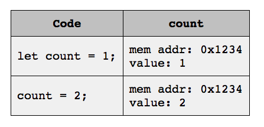
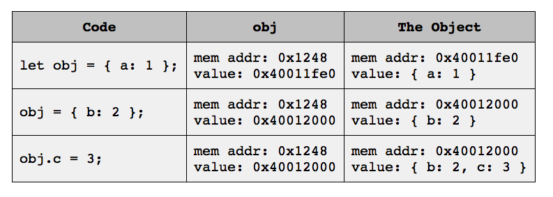

#### Exceptions  - Not everything between curly braces is a block, technically!

**While it is convenient** to think of the following two cases of `block`s **they are technically not blocks**:

- braces that surround an objects literal such as `{ a: 65, b: 66 }`
- braces that surround a function body such as `function meep() { // do stuff }` are not blocks but **can be treated as blocks most of the time** which is why other blocks are usually referred to as `non-function blocks` i.e. blocks that exclude function definitions.

**Note**: Variables declared with `let` and constants declared with `const` have the **same exact scope** !


### Functions

---

#### Return Values

All JS functions evaluate to a value:

- In case a function does not specify an explicit return value through the `return` keyword JS **always** returns an implicit value of `undefined`.

  In this context a context the `return value` of a function and the fact that `a function returns` are not the same things because a function can return or rather finish execution without explicitly returning a value, but still return a value implicitly by default just by getting to the end of the function body which happens when the last function statement is done executing.
- In case a function does however specify an explicit return value through `return`, that is the value returned


#### Nested functions

Nested functions can be specified by specifying a function in the scope of one another function:

```javascript
function funcOut() {
  function funcIn() {
    // the nested function
  }
  
  funcIn(); // in scope
}

funcOut();
funcIn(); // NOT in scope since the nested function is defined in another scope
```


**A nested function such as `funcIn`:**

- is created and destroyed every time the containing function is executed (`funcOut`)
- is `private` in the sense that it cannot be accesses/invoked from the scope outside the 'outside' function (`funcOut`)
- seems to have scope rules similar to variables/constants


#### Terminology

- functions that always return a boolean value, true or false, are referred to as `predicates`
- functions that are called on some receiving object/value are referred to as `methods`


#### Mutating the caller

We can mutate values by invoking mutative method on a particular value/object such as a string.

Some quirks of JavaScript:

- Primitive values are immutable - Their values never change -  Always return new values on operation
  Immutable primitives are: `Number`s; `String`s and `Boolean`s
- Non-Primitive values **may be** mutable through their methods - Not every method mutates the value
  Mutable values are: `Array`s and `Object`s

**Note**: Like in Ruby, to know which method mutates the value of a value use the documentation!


#### Pass-By-Reference or Pass-By-Value

JavaScript uses:

- pass-by-value for primitive values
- pass-by-reference for non-primitive values such as arrays and objects


### Function Composition

---

This is merely the technique of invoking a function/method as argument to another function/method without intermediate variable creation.

```javascript
function sum(a, b) { return a + b; }
function sub(a, b) { return a - b; }
function mult(a, b) { return a * b; }

// using function composition rather than intermediate variables
mult(sum(1, 5), sub(10, 8));
```


​    

### Flow Control

---

#### Operator Precedence and Associativity

For expressions that use multiple operators and sub-expressions, here are some precedences from
**high (top of the list) to low (downwards)** that are good to know by heart:

- `<=`, `<`, `>`, `>=`  - Comparison operators
- `===`, `!==`, `==`, `!=` - Equality operators
- `&&` Logical AND
- `||` Logical OR

Another mechanic to know about is associativity, which specifies in what order operators along with their operands are evaluated when the precedence between operators and their operands is the same.

**Note**: To make the intention of a program clear, always parenthesize the operators we want evaluated first
           instead of working with rules implicitly!

**The rules for complex expressions that use many parentheses to show intended precedence**:

- JS evaluates expressions in the parentheses in the algebraic order.
  This means that innermost parentheses are evaluates first towards to outer parentheses.
- When there are multiple parentheses at the same 'depth', the parentheses are evaluated from left to right.
- Once all parentheses are evaluates, the whole expression is evaluated.


**Note**: Short-circuiting does not change precedence but may be confusing if the expression is complex!


### Loops and Iteration

---

**A short overview of the types and quirks of loops:**

- **`While Loop`**

  Executes the loop as long as the expression after the `while` keyword evaluates to `true`.

  ```javascript
  while (condition) { // first JS checks is the condition is still truthy
   // runs once, only if the condition is truthy
  }
  ```

- **`Do/While Loop`**

  Executes the loop **at least once** and then works exactly like a `While Loop` after the initial loop execution.

  ```javascript
  do {
    console.log('You see this at least once!');
  } while (condition); // the loop runs again only if the condition is truthy
  ```

- **`For Loop`**

  Executes the loop based on the first line which includes the `initialization`; `condition` and `incrementation`:

  ```javascript
  for(initialization; condition; incrementation) { // looped code ... }
  ```


#### Controlling Loop Flow

JavaScript provides **two** keywords to provide more control over how loops execute:

- **`continue`**  -  Skips the rest of the loop and starts the next cycle as if the loop finished execution
- **`break`**  -  Stops looping altogether and resumes execution the line after the loop definition


**Operators**

- **`someVariable++`  -  `Post-Increment Operator`**

  Increments the operand by one and returns the value of the variable **before incrementation**

- **`++someVariable`  -  `Pre-Increment Operator`**
  Also increments the operand by one and returns the new value of the variable **after incrementation**

- **Pre and Post-Decrement operators function the exact same but decrement the value**.


**Note**: Apparently the modern opinion is to **not** use incr/decrement operators for incr/decrementing   
           numbers, apart from a for loop `for(var index = 0; index <= 5; index++) ...` because they can 
           lead to strange bugs/results, especially if programmers are not aware/mindful of the return value.


#### Iterating Arrays using built-in instance methods

One of many ways to iterate through an array is to use the `Array` `forEach` method.
This method is called on an `Array` value and passed a `function` as argument, which the `forEach` method then invokes for every item in the array in order:

```javascript
let names = ['Chris', 'Kevin', 'Naveed', 'Pete', 'Victor']

names.forEach(function(name) {
  console.log(name);
});
```


The following is what happens in the previous code snippet:

1. Line `1` declares an array of names using an initializer
2. Line `3` invokes the `forEach` method on the `names` array and passes it an `anonymous function`, which does not have a name
3. The `forEach` method then iterates the array implicitly and invokes the anonymous function we passed with each element as argument from first to last

**Note**: This `anonymous function` is another type of `first-class function`


The same can be achieved using `arrow functions`:

```javascript
let names = ['Chris', 'Kevin', 'Naveed', 'Pete', 'Victor'];

names.forEach(name => console.log(name));
```


#### Arrays

JavaScript arrays are `heterogenous`, which means that they can contain any value, including other arrays and objects.

**Quirks to understand at some point**

- Assigning a value to a positive, out-of-bounds array index grows the array and pads the array with empty in-between elements if needed.

- for constant array values:

  ```javascript
  const array = [1, 2, 3];
  array[1] = 'X';    // does work, even on a constant array value
  array = [4, 5, 6]; // does not work because the array is a constant
  ```

  - while the constant array variable itself cannot be made to point to another value
  - the array elements/content can be made to point to another valu
  
  
    **This happens because of pointer rules, in this case most importantly:**
  
    - we cannot change what a `const` declaration points to **but**
    - we **can** change the content, i.e. the actual values in memory the constant pointer points to
  
  **Note**: In order to make the array elements follow the same rules, use the `freeze` method.
  
- **JS arrays are `object` i.e.e hashes?** 

  **This has some implications**:

  - the `typeof(someArray)` operator returns a string of value `object` and **not** `array`
  - changing an array's `length` property can truncate and expand the array, where **new elements are not initialized** but left `undefined`.
  - Array can have non-integer and other objects as indexes. These are not true elements but are **properties** on the array `object` and **do not count toward the `length`** of the array!
  - can use the `Object.keys` method to get the object keys of an array `Object.keys(array);`
    This method ignores un-initialized elements that have not been explicitly initialized or re-assigned.

- When array contents are changed, un-initialized elements are treated differently to elements that have merely been set to `undefined` as JS interprets the slots as `empty items.` but the following expression evaluates to true for a given un-initialized array item:

  ```javascript
  let array = new Array(3); // declares a new array with 3 un-initialized elements
  let result = (array[0] === undefined); // true
  ```

  **In other words**, array elements that have not been initialized **can** be treated differently from elements that were set to `undefined` after the fact even though un-initialized elements compare to the primitive `undefined` as true.

**Primer to some common `Array` operations**:

- Accessing elements with `[]`

- Adding elements with `Array.prototype.push` actually **mutates** the array and returns the new length of the array

- Adding elements with `Array.prototype.concat(items, ...)`, which adds one or more values to the array and **returns a new array**.
  `concat` seems to automatically unpack arguments that are elements for that first layer, but deeper nested arrays stay as is.

- `Array.prototype.pop` removes and returns the last element in the array. Is **mutative**.

- `Array.prototype.splice(startingIndex, takeN)` removes the elements starting at the index and for takeN elements. This method **mutates** the array and returns an array with the deleted elements.

- Transforming Array with `Array.prototype.map`  returns a **new array** with the transformed values based on the caller

- `Array.prototype.filter` returns a **new array** that contains all the elements of the original array for which the callback function returns a truthy value.

- `Array.prototype.reduce` effectively reduces all the elements in the array to a **single value**.
  This methods takes a callback method that has two arguments:

  - `accumulator`  -  The current value of the accumulator **before** the accumulator is changes
  - `element`  -  The currently iterated elements of the calling array

  This callback method return the value of the accumulator for the next callback invocation.
  
- `Array.prototype.includes(searchedItem)` scans the caller and returns `true` or `false` wether the item has been found and makes **a strict comparison `===`** , which means that it comes with the same problems as when comparing using the `===` operator.

  ```javascript
  let inner = ['meep', 198];
  let array = [15, false, inner, {}];
  array.includes(['meep', 198]); // false because the arrays are not the same pointers
  array.includes(inner);         // true because the arrays are the same pointers
  ```

- `Array.prototype.slice` can be used to extract a region of the array or duplicate the array altogether

  ```javascript
  let array = ['a', 'b', 'c'];
  let arrayCopy = array.slice();
  console.log(array === arrayCopy); // false
  ```

- `reverse` reversed the array **in place destructively** and returns the same array pointer.
  **Tip**: Duplicate the array using the `slice();` method to not affect the original array


#### Array (and Object?) Equality

The rule is simply:

> JS considers two arrays to be the same if the array operands are the exact same pointer/data in memory

```javascript
/*
	Two different literals may have the same content and length but are
	not the two exact same 'objects' in memory and are therefore not the
	'same'.
*/
[1, 2, 3] === [1, 2, 3] // false

// the arrays are the same though if the variables point to she same array in memory
someArray = [];
thatSameArray = someArray;
someArray === thatSameArray; // true
```

**Note**: When creating custome functions to compare arrays remember that nested arrays, that are 
		   compared using the strict or loose evaluation operator probably do not return the expected result
		   as nested arrays are seldom bound to the same data in memory!


### Objects

---

A JS `Object` is the equivalent of a `Hash` that associates a set of keys with a set of values respectively, which are referred to as the `key/value pairs` of the `Object`.

- An object `key`  **must** be a `String` but note that JS implicitly coerces non-string values into strings before storing the key-value pair!

  **Does JS do the same when accessing a value? Does JS coerce a non-string key to a string?**

  The following will bite you at some point:

  ```javascript
  > let myObj = {}
  > myObj[true] = 'hello'   // implicitly coerces the boolean true to the string 'true'
  > myObj['true'] = 'world' // overrride the value store previously using the boolean
  > myObj[true] // world
  ```

- An object `value` can be any type, including other `object`s


**Ways to declare an object**:

- Using an `Object` `literal`: `let people = {};`
- Using a constructor: `let people = new Object();`


**Here an example of an object initialized with a few key-value pairs:**

```javascript
let person = {
  name:    'Jane',
  age:     37,
  hobbies: ['photography', 'genealogy'],
};
```


**Things about the syntax**:

- While the `key` is a `String` we typically omit the quotes `'` when the key consists of alphanumeric characters and underscores

- The value can be **set and accessed** two ways:

  1. Using the `dot notation`

     ```javascript
     let person = {};
     person.name = 'Willis'; // add key-value pair using dot notation
     person.name;            // access key's value using dot notation
     ```

  2. Using the `bracket notation`. This notation has to be used if the key is a variable and not a literal.

     ```javascript
     let person = {};
     person['name'] = 'Karen'; // add key-value pair using bracket notation
     person['name'];           // access key's value using bracket notation
     ```

- Deleting a key-value pair through the `delete` **operator**:

  ```javascript
  let person = { name: 'Jane', age: 25 };
  delete person.name; // true
  delete person['age']; // ture
  ```


**Objects and Constants**

An `Object` behaves the same as an `Array` in terms of it being a constant.

A constant `Object` pointer can not be pointed to something else but any values in the object are not constant by default and hence can be changed. To make the key and values, i.e. `properties` adhere to the same rules, the `Object.freeze();` method must be used one the object to 'freeze' the properties.

```javascript
const MyObj = Object.freeze({ foo: "bar", qux: "xyz" });
```

**Note**: The behaviour works 1-level deep again and not for nested properties.


#### Prototypes

In terms of objects where a `child` inherits from a `parent`, the `parent` is referred to as the `prototype`.
When we specify some prototype for some object, we refer to this as follows:

> the child X uses parent Y as prototype


#### Iterating Objects

There are several ways to iterate over they keys; values or key-value pairs of objects:

- **`For/In Loop`**

  Iterates the object **keys** through a simplified syntax that enables us to access the value:

  ```javascript
  let person = { name: 'John', age: 28, height: '6 ft' };
  for(name in person) {
    console.log(name); // a key of the person object
  }
  ```

  **Note**: The `For/In Loop` implicitly iterates over the properties of the object's prototype,
         	 child properties first, then prototype properties.
  
- **`Object.keys`**
  Static method that returns the object's keys as array and apparently **does not return the keys of an object's prototype**.

**Note**: While modern JS, starting at ES6+ iterates an Object in a predictable pattern based on some rules,
           we should usually **not rely on these rules and should not depends on it** !

#### Terminology

- In JS, a key-value pair is referred to as `property` but typically we only refer to a pair's `key` to the `property`  **without** implying the value.

- In JS, an object `b` inherits from an object `a` is referred to as `object a is a prototype of object b` which means that the parent in this relationship is the `prototype`.

  

#### Common `Object` operations

- **`Object.values`**
  Returns an array of the object's values **in some order  - DO NOT rely on the order of the values!**

- **`Object.entries`**
  Returns an array of the object's key-value pairs as nested array **in some order**.

  The nested arrays contain:

  1. The key as the first element of the array
  2. The corresponding value as the second element of the array

- **`Object.assign(target, sources ...)`**
  Merges all the `sources` properties into the `target` object by **mutating the target object** and returns the `target` pointer.

  When a new Object is desired use something as the following code:

  ```javascript
  let a = { some: 12 };
  let b = { other: 25 }; 
  let result = Object.assign({}, a, b); // the Object literal is used to merge sources
  ```


### More Stuff

---

### Variables as Pointers

**Note**: The following explanations are models to understand the basic operation but do not reflect how the language actually works under the hood!


- **Working with Primitives  -  Primitive Values**

  Primitives are stored at some memory location which is allocated when values are declared. The identifier is a pointer that points to that particular piece in memory.


  When we have the following:

  ```javascript
  let a = 5;
  let b = a;
  b = 99;
  console.log(a); // 5
  console.log(b); // 99
  ```

  1. `a` points to the primitive value `5` in memory

  2. `b` points to the same primitive value `5` in memory, same as pointer `a`
  3. `b` is then re-assigned to point to the primitive value `99` in memory **without** changing the memory content of variable `a` not where `a` points to

  **The key idea:** The variable itself is a pointer directly to that particular value/data in memory.

  

  **Note**: Since primitive values are stored **directly** in the piece of memory allocated for a primitive value, one primitive value identifier **can never **
             **be** an alias for another primitive value!

- **Working with Objects and non-mutating operations**

  Objects are stored in some memory location similar to primitives, with the difference that:

  ``` javascript
  > let e = [1, 2]  // allocate storage for array [1, 2] and make 'e' point to another pointer that points to the actual array
  > let f = e       // allocate storage for pointer and make it point to the 'middle-pointer', equivalent to the identifier 'e'
  > e.push(3, 4)    // since 'e' and 'f' point to the same piece of memory indirectly, any mutative action on the data is
  > e               // is reflected by both identifiers/pointers because the point to the same exact memory location indirectly
  = [ 1, 2, 3, 4 ]
  
  > f
  = [ 1, 2, 3, 4 ]
  ```

  **Note**: This is referred to as `aliasing` because in the above code snippet, the identifier/pointer `f` is an `alias` for the `e` identifier/pointer!

  - The identifier of an Object points to **another pointer** `Code => obj`
  - That other pointer points to the actual object in memory `obj => The Object`

  

  **Intuitively**: When memory is allocated for an object JS keeps a pointer to that piece of memory and when we assign an object to a new identifier,
                        that identifier only needs to point to that 'middle-pointer' to the original data in memory and nothing is copied.

  **Question**: Why is it modeled with another pointer between the identifier an the object in memory?
                      Does the middle'-pointer' keep track of some meta-information about the data stored in memory?


#### `For/In` and `For/Of`

**Notes to order**:

- uses `variant syntax` for simpler looping over object properties
- `for/in` iterates over **all enumerable properties of an object** including the ones inherited form another object.
  - Using `for/in` on an object iterates the **keys**
  - Using `for/in` on an array **also iterates the keys** which for an array is the indices as strings!
    **Remember: Arrays are objects!**
  - **Supported in traditional and moderns JS**
- `for/of` iterates over **all the values of an iterable collection**. Examples are arrays and strings.
  - For a string, these iterable values seem to be the characters
  - For an array, these iterable values seem to be the array items
  - **Supported only in modern JS ES6 and over**


#### Exceptions

**Notes to order**:

- JS is a more forgiving language and usually fails silently by returning signals like `undefined`, `null` or even `-1`

- These silent errors are dangerous because they can be ignored, but we typically need to handle these problems

- JS exceptions are **not silent** and holds/exits the program when that exception is not 'caught' and dealt with.

- How to catch an exception:

  ```javascript
  try {
    // code that may throw an exception
  } catch(exception) {
    // do something when an exception occured with access to that specific exception
  } finally {
    // executes whether an exception has been raised or not i.e. every time
  }
  ```

- We can raise errors using the `throw` keyword along with an instance of the following [error types](https://developer.mozilla.org/en-US/docs/Web/JavaScript/Reference/Global_Objects/Error)

  ```javascript
  throw new TypeError('Some error message');
  ```

- Use exceptions only for **exceptional circumstances** and avoid throwing exceptions when a return value does the trick and document it well!


#### `SyntaxError`

The `SyntaxError` is a special type of error that executes **before the program is executes** in case there is problem with the syntax. This error **does not depend on runtime conditions** but the JS engine detects it solely based on the source code.


Here some things to keep in mind about how `SyntaxError` is **typically** generated:

- `SyntaxError`  has nothing to to with runtime conditions such as variables and control-flow
- `SyntaxError`  can be reported for a particular line that is far away from where the issue originates from, typically much later
- `SyntaxError`  are caught before the `execution phase`, so the program is not actually executed in this `preliminary phase`

**Note**: There are situations for which the `execution phase` can throw a `SyntaxError` just as other errors, which means that for 
           some cases, a `SyntaxError` can be caught using `try/catch/finally` such as for example:

          ```javascript
          JSON.parse('not really JSON');  // SyntaxError: Unexpected token i in JSON at position 0
          ```


### Other facts

---

- `template literal syntax` is a string that allows embedding expressions i.e. strings that allow interpolation. **These strings are enclosed by backticks rather than double/single quotes!**
- The introduction of `arrow functions` solves a problem referred to as `lost execution context` i.e. `context-loss`


### Questions; Answers and other random things

---

**Note**: Many of these questions will be answered by the course, so just carry them over and go from there.

- One example why knowing when what is coerced in to what is essential to know.
  
  - When `x` is a `String`, the expressions `x = x + 1;` and `x++` are **not equivalent**.
  
  What happens is the following:
  
  - ```javascript
    > let x = "5" // declare a local variable with identifier 'x' to hold the string "5"
    > x = x + 1   // number 1 is coerced into a string and concatenated to the string "5" ==> "51"
    = "51"        // which changes the value of 'x' from "5" to "51"
    ```
  
  - ```javascript
    > let y = "5" // declare a local variables with identifier 'y' to hold the string "5"
    > y++         // string is coerced into a Number and that number is incremented from 5 to 6.
                  // 5 is returned since the post-increment operator returns the number BEFORE incr.
                  // and NOT the number after incrementation
    ```
  
  