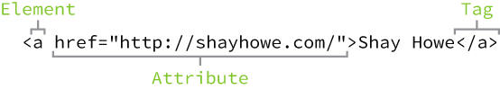

### Lesson 1 - Your first web pages

---


#### Welcome - About this course

- Mastery here is not mandatory because I will do the research necessary when I get stuck
- Only the essentials are taught from which most things can be built
- Best resources to find front-end information:
  - `MDN`  -  Mozilla Developer Network https://developer.mozilla.org/en-US/
  - `W3C`  -  World Wide Web Consortium  https://www.w3.org/
- **Avoid resources based on ` W3 Schools`! This site is often outdated and incorrect. Use `mdn` and `w3c` in the search!**
- The group that will define the HTML and DOM standards in the future: `WHATWG` https://whatwg.org/
  - HTML standard: https://html.spec.whatwg.org/multipage/
  - DOM standard: https://dom.spec.whatwg.org/
    

#### Introduction - What to focus on

- The goal here is not to become an HTML and CSS expert but the be proficient enough

- Vocabulary

  - `element tag`
  - `self-closing tag`
  - `document type definition` (which is the term for the DOCTYPE, DTD)
    - **Tells the browser which markup to expect**.
    - In order to support HTML 5 and earlier, **define the `DTD` uppercase!**
  - `attribute`
  - `selector`
  - `property`
  - `id`, `class` and `name`

- The difference between `HTML`and `CSS`:

  - `HTML` defines the **strucure and content** of a web page
  - `CSS` defines the **look/presentation** of a web page

  But there can be some initially confusing overlap between both technologies.

- Learn to write correct HTML and CSS syntax and how things interact exactly.

- Structure of a web page. Understand the purpose and function of boilerplate tags such as `DOCTYPE`; `<html>`; `<head>`; `<body>` etc.

- The tags I should be immediately familiar with:

  - `<p>` for `paragraph`
  - `<a>` for `anchor`
  - `<h1>` to `<h6>` for `header`
  - also: `<em>`; `<strong>`; `<header>`; `<main>`; `<article>`; `<section>`; `<aside>`, `<div>` and `<span>`

- Become familiar with the **three ways to use CSS in an HTML document**:

  1. `inline`: specify style using a `style` attribute inside an HTML tag (is this the correct vocabulary ???)
  2. `internal`: specify style using the `<style>` tag in one place in the file
  3. `external`: specify style using a dedicated file typically with the extension `.css`

- Become familiar with the **three types of CSS selectors**:

  - `tag` select element based on the **tag** name
  - `id` select element based on the **id** attribute
  - `class` select element based on the **class** attribute

- Learn CSS properties as I go, some to know right are:  color`; `background-color`; `font-family`; `font-size`

- **Use the browser inspector**

- **Use the summary at the end to study to know what I should master**

#### Introduction - Tools

- Always validate HTML using `W3C`s validator https://validator.w3.org/#validate_by_input. A validator checks the source for **conformance to standard**.
  **Validate the source often often**:

  - after boilerplate
  - after significant changes
  - when page does not render as expected
  - before submitting for code review
  -  before using it for production / deploying

- **Linters** check source for **errors, misuse and style**. A few examples are:

  - use of deprecated elements
  - poor element nesting
  - non-standard attributes/properties
  - poor formatting such as indentation
  - even best practices

  Some linters for Sublime are:

  - SublimeLinter-html-tidy: https://packagecontrol.io/packages/SublimeLinter-html-tidy
    **This thing is hell to install - No thanks!**


#### Getting started

- **HTML  vocabulary**

  - HTML gives content and structure  to that content

  - CSS defines the presentation of the content defined by HTML

  - Definitions:
    

    - `element`  -  designator that defined the structure and content of a page; they are in the format `<element>` or `<start></end>`; the part between the angle brackets is the `element name` and the whole thing `<p></p>` is referred to as the `element`
    
    - `tag`  -  element name surrounded by a pair of opening and closing angle bracket like for instance `<div>`; note that **both the  opening and closing portions** are referred to as `tag` (openging or closing) separately.

    - `self-closing elements`  -  Not all elements consist of opening and closing tags. Self closing tags consist of a single tag such as ``

    - there are two types of `tags`:
    
    - `opening tag`  -  marks the beginning of an element; the `<p>` marks the beginning of a `paragraph` element
    
  - `closing tag`  -  marks the end of an element; the `</p>` marks the end of a `paragraph` element
    
  - `element content`  -  The `content` that is **between the opening and closing tags** of a given element is referred to as the `element content`
    
      For example: 
    
      ```html
    <a>Click me!</a>
    ```
    
      - `<a>` is the opening tag of the `anchor element`
    - `</a> ` is the closing tag of the `anchor element`
    
    - `Click me!` is the `anchor` element's `content`
    
    - `attribute`  -  provides additional information about an element such as for example and are **defined within an element's opening tag and after the element name**. Attributes are typically defined as key-value pair but there are single word attributes.Some of the most used attributes are:
    
      - `id`  - associated an element with an id to identify this element through that id
      **Note**: Every HTML element can only ever have a **single or no ID attribute**!
      
      ```html
        <p id="special">some text</p>
      ```
    ```
      
    - `class`  -  classifies the element
      
      ```html
        <div class="container"></div>
    ```
    
    - `src`  -  specifies the source for embeddable content
      
      ```html
        
      ```
    ```
      
    - `href`  -  specifies a (hyper) link to a linked resource
      
        ```html
        <a href="github.com/meeep"></a>
    ```
    
    - `name`  - The browser uses this information to build key/value pairs from, for instance, form elements when sending data to the server:
      So this is the principal mechanism used to name fields so that the server can distinguish the request data of each field using these  names.
    
      **When using forms, always define a name for this particular element using this attribute using semantic names!**
    
      **Note**: `name` attributes with the described functionality are available for input forms, **other `name` attributes are not the same thing**!

- **HTML document structure**

  HTML pages are stored as plain text file, typically with the extension `.html`. Each html page **must contain** **the following base structure of definitions and elements** in order to **inform the browser about how to interpret this html** file:

  - `<!DOCTYPE html>`
  - `<html lang="en">`
    - `<head>`
      - `<meta charset="utf-8">`
      - `<title>Page title</title>`
    - `</head>`
    - `<body>`
      - ... body content here ...
    - `</body>`
  - `</html>` 

- **CSS vocabulary**

  

  - `selector`  -  designates exactly which HTML elements of a page to target for styling; a single selector can consist of one or more `qualifiers`; associates with a block of `CSS` that contains the style to be applied to select(ed) HTML elements; **selectors typically target an attribute value such as `id` and `class`**

  - `selector qualifier`  -  defines which exact elements to affect specifically, this can be as specific or general as we want in terms of selecting html elements

    ```css
    qualifier_1 qualifier_2 { style goes here }
    ```

  - `property`  -  defines the properties of the selected elements (through the `selector`) that are to be applied to the selected elements; properties are **semi-colon separated**:

    ```css
    p {
      font-size: ...;
      color: ...;
      another_property: ...;
    }
    ```

  - `value`  -  defined the value the `property` is to be set to; `property: value` are key value pairs:

    ```css
    p {
      font-size: 25px;
      color: yellow;
      another_property: another_value;
    }
    ```

  - **Working with the different types of selectors - The most common ones**

    - `Type selectors`  -  Selects HTML elements based on their element type and are **considered the most general selector type**;
      For instance to select all elements of type `div`:

      ```html
      <!-- html -->
      <div>first box</div>
      <div>second box</div>
      ```

      ```css
      /* css */
      /* css type selector selects all html elements of type 'div' */
      div { ... }
      ```

    - `Class selectors`  -  Selects HTML elements based on the HTML element' `class` attribute value; **considered more specific than the `type selector` and less specific than the `id selector`**.

      This selector is in the format `.element_class_attribute_value { ... associated_style ... }`

      This selector is typically used to select and apply styles to different elements that have a `class` attribute set to the corresponding class selector. For instance to select HTML elements based their class attribute:

      ```html
      <!-- html -->
      <div class="beep">Beeped division</div>
      <p class="beep">Some beep text this is</p>
      ```

      ```css
      /* css */
      /* css class selector selects all html elements with the html element class attribute value beep */
      .beep { ... }
      ```

    - `ID selectors`  -  Selects HTML elements based on the HTML element' `id` attribute value; **considered the most precise type of selector**.

      This selector is in the format `#element_id_attribute_value { ... associated_style ... }`

      An `id` attribute is special in terms of HTML:

      - **must occur nonce or once** in a given html document
      - have special rules in what string they can contain in terms of the html `id` attribute value

      This selector selects the single element that contains and `id` attribute with the respective value, for instance:

      ```html
      <!-- html -->
      <p>There are many like it</p>
      <p id="oneof">But not this one!</p>
      ```

      ```css
      /* css */
      /* css id selector selects the single html element with the html element id attribute value oneof */
      #oneof { ... }
      ```

    - There are advanced selectors, in case the need arises https://learn.shayhowe.com/advanced-html-css/complex-selectors/

- **Referencing the CSS style to use in an HTML document**
  Use the HTML `link` element to specify which stylesheet to use for the page the `link` element is specified inside the pages `head` content:

  ```html
  <!-- ... boilerplate ... -->
  <head>
      <link rel="stylesheet" href="url_to_css_file">
  </head>
  <!-- ... more boilerplate ... -->
  ```

  The important attributes to define when associating/relating css with a specific web page are:

  - `href`  -  specifies the url to resolve the stylesheet from
  - `rel`  -  stands for `relationship` which specifies how the linked resource is to be related to the html document containing the definition; see [Link types](https://developer.mozilla.org/en-US/docs/Web/HTML/Link_types) for specifics

- **CSS resets**  -  A way to override the browser specific default values for HTML elements by defining a style for a set of elements which is to be applied to the related HTML page before any other style. A popular one is:
  
  - https://meyerweb.com/eric/tools/css/reset/
  
- ### **Getting to know HTML**

  - What does the term `semantics` refer to in terms of HTML?
    The 'practice' of giving content **meaning and structure by using the proper element for the intended content**.
    **Semantic code enables** **other parties** such as reader; browsers and search machines to **interpret and understand the content correctly/adequately as well as it makes the intention of the content clear for developers**.

    In other words, semantics refer to the intended use for a specific type of thing, such as

    > Paragraphs are semantic in that content wrapped within a `<p>` element is known and understood as a paragraph

    So when choosing HTML elements, think about the content is to be interpreted and choose elements accordingly!

    As help refer to [HTML element flow chart](http://html5doctor.com/downloads/h5d-sectioning-flowchart.pdf)

    **Note:** Not every HTML element has semantic values associated with to it, some like `<div>`s exist only for styling purposes, such as `<div> ` and `<span>`.
    
  - Divisions and Spans

    - These two elements **have no semantic meaning** and are **solely used for styling** by **just being generic containers**.
    - useful for selecting a contained set of content for styling
    - `div`  is a **block** element, typically used to contain large groupings of content for layout and design
    - `span` is an **inline** element, typically used to contain smaller groupings of content for layout and design such as text for example

  - `block` vs  `inline` - Most fall in one of the two

    - Block elements **begin on a new line** and occupy that line; they can be nested; typically for larger content supposed to be alone on a 'line'.
      They **can** 'wrap' inline-level elements!
    - Inline elements **do not begin on a new line**, follow the document flow and **maintain the width of their content**; can be nested
      They **cannot** wrap block-level elements!

  - ### **Text based elements**

    - `Heading` 
      -  `block level` 
      -  `<h1>Heading</h1>` 
      - `semantics`  -  used to break up the page content into a hierarchy that makes sense and **not to make text bold or scale it**; help search engines to index and determine page content; should be used in an order that makes sense
      - comes in 6 rankings
        primary content should be rank 1 headers and subsequent content should go down to higher header ranking from there;
    - `paragraphs`
      - ``block level` 
      - `<p></p>`
      - `semantics`  -  used to add information to a page
    - `bold text`  -  learn the difference between the semantics http://html5doctor.com/i-b-em-strong-element/
      - ``<strong></strong>`
        - `inline level`
        - `semantics`  -  give strong importance to text - for instance putting emphasis on a word or to emphasize some other importance
      - ``<b></b>`
        - `inline level`
        - `semantics`  -  stylistically offset text where
          - `offset`  -  refers to make text stand out from the rest
          - `stylistically`  -  to indicate highlighting as opposed to semantically - is purely highlighted for stylistic reason - not because it has any importance over any other text
    - `emphasize`
      - `<em></em>`
        - `inline level`
        - `semantics`  -  stressed emphasis - the most used version
      - `<i></i>`
        - `inline level`
        - `semantics`  -  convey in other tone or voice

  - ### **Structural elements**
    HTML added [structurally based elements](https://dev.opera.com/articles/new-structural-elements-in-html5/).
    These elements are supposed to give the website structure more semantic meaning.

    ### **All of these are block level** - Structural elements

    An example of how structural elements give meaning by using the elements semantically

    ---

    

    

  - ### **The structural elements** - All block level element!

    - Header
      - `<header> ... </header>`
      - `semantics`  -  identify the top of a page structurally - may contain navigation; heading and introductory text
    - Navigation
      - `<nav> ... </nav>`
      - `semantics`  -  identifies a major section of navigational links on a page - should only be used for primary navigation on the page itself - should not be used for one-off links and origins that have nothing to do with the page itself
    - Article
      - `<article> ... </article>`
      - `semantics`  -  designate a section of independent and self-contained content - may be distributed and/or re-used such as blog posts and articles - the content should still make sense on it's own when cut out and shown without as stand-alone content without needing other context or content
    - Section
      - `<section> ... </section>`
      - `semantics`  -  identify a thematically similar group of content that generally includes a heading (` <hx></hx>`) - in other words, show that the content in the section is related - used to break up a page by similar content and provide hierarchy - sections can be nested as desired
    - Aside
      - `<aside> ... </aside>`
      - `semantics`  -  contains content that is **'tangentially' related** **to the content** **surrounding it** - example would be an article + aside where aside contains pointers, insert, brief explanations about the related article
    - Footer
      - `<footer></footer>`
      - `semantics`  -  identifies the closing/bottom end of a page - footer content should be relative to the document or other 'section' it is included in - typically found at the bottom of it's parent
    - Small
      - `<small></small>`
      - inline-/ or block level?
      - `semantics`  -  represents side comments and small print - generally rendered smaller than other content

  - ### Other elements - For reference - May fit in any previous category

    - Head

      - `<head></head>`
      - **not displayed**
      - `semantics`  -  used to outline meta-data about the page like: documents title; relationships to external files; etc.

    - Hyperlink

      - `<a href="linkydinky.com"></a>`

      - `inline level`

      - In general, inline-elements do not wrap block elements but anchor elements are an exception since HTML 5, anchor elements have permission to wrap: block-, inline- or any other level element - this is so entire block of content of a page can link resources

      - Types of hyperlinks:

        - Absolute
          There are many different combinations but the difference principally in what information is provided and how the url is interpreted:

          - absolute, full url; can be the same or different site
            `https://www.somesite.com/meep`

          - absolute, implicit domain name; this is interpreted with the same scheme and domain that served the page, i.e. starts from the sites root directory:

            **Note:** The url starts with a **`/`**
            `/to/myfolder/page_source.html` is interpreted as `https://www.server.com/to/myfolder/page_source.html`

        - Relative

          - Does **not lead with `/`** - does not  - The browser requests `currently loaded page path + relative URL` 
          - Can move back up a directory using `../`

        - Page anchors - Also referred to as an `on page link` - These can be created the following way:

          1. Add an `id` attribute to the element we want the on-page link to go
          2. Use this element's `id` attribute value in a hyperlinks `href` attribute **prefixed with an `#`**

          ```html
          <body id="top">
            ...
            <a href="#top">Back to top</a>
            ...
          </body>
          
          ```

          

      - Define the target using the `target` attribute

      - Interesting: https://developer.mozilla.org/en-US/docs/Learn/Common_questions/What_is_a_URL
        

  ### Getting to know CSS

  - #### The cascade

    - **General**
      All styles cascade from the top to the bottom of the stylesheet where the most recents property values overwrite previous ones.

    - **Scope**  -  I call it scope because it reminds me of scope
      CSS attributes like `class` can be used in any elements because they are `global`, but **most html attributes are specific to certain type of tag/elements**.

    - **Cascading properties**
      The latest/bottommost property definition is the one retained / overwrites previous ones / has precedence.
      **Note**: This is the case if no styling conflicts occur, i.e the selector type specificity does not need to be considered and does not affect this precedence.

    - **Calculating specificity**
      Different selector types have different specificity weights:

      1. `type selectors`
         - `specificity weight` - lowest of all at `point value 0-0-1`
      2. `class selectors`
         - `specificity weight` - medium at `point value 0-1-0`
      3. `id selectors`
         - `specificity weight` - highest of all at `point value 1-0-0`
      
      
        Specificity points are computed using **three colums** where:
      
        1. the first / leftmost column **counts** `id` selectors
        2. the second / middle column **counts** `class` selectors
              3. the third / rightmost column **counts** `type` selectors
      
      
        **Important selector specificity rules**:
      
        - **id selector** has **higher specificity weight** than **class selector**
        - **class selector** has **higher specificity weight** than **type selector**
      
        When a specific element is selected using different types of CSS selectors at different points/cascades in the CSS stylesheet, the selector with the highest specificity weight has precedence over all the others, even if the lower ranking selectors (in terms of specificity weight) precedes the higher ranking selectors in the stylesheet.
      
        Example
      
        ```html
        <!-- paragraph element can be selected using a type selector of type 'p' or an id selector of value 'food' -->
        <p id="food">...</p>
        ```
      
        ```css
        /* two different types of selectors select the paragraph element */
        /* and the ID selector #food has precedence over the type selector 'p' */
        #food {
          background: green;
        }
        p {
          background: orange;
        }
        ```
      
        **Note**: These precedence issues are a common problem when a stylesheet is not interpreted as expected
      
    - **Combined selectors**
      Combined selectors should be **read from right to left** where:

      - The rightmost selector is referred to as the `key selector` which defines which exact elements the style is applied to
      - All selectors left of the key selector are referred to as `prequalifier` which define the 'way to get to the key selected element(s)'
        

      Examples and how to read them using the 'read right to left ' trick:

      - ```css
        .hotdog p {
          background: brown;
        }
        ```

        The combined selector consists of **two selectors** where:

        - a `class selector` named `hotdog` `->` `type selector` of type `p`.
        - Key selector: `p`
        - Prequalifiers: `hotdog`

        **Result:** The elements `selected are paragraph elements residing withing an element of class hotdog`.

      - ```css
        .hotdog p.mustard {
          background: yellow;
        }
        ```

        The combined selector consists of **three selectors** where:

        - a `class selector` named `hotdog` `->` a `type selector` of type `p `->`class selector` named `mustard`
        - Key selector: `mustard`
        - Prequalifiers: `hotdog` and `p`

        **Result:** The elements `selected are paragraph elements of class mustard which reside in an element of class hotdog`

      - Trying to define the behaviour of combined selectors for intuition:

        - **Read** combined selectors from **right to left**

        - Rightmost selector in the chain is the `key selector`

        - `Key selector`  defines the type of elements that are selected where:

          - `some_class`  -  selects elements with class attribute value `some_class`
          - `some_type.some_class`  -  selects elements of type `some_type` with class attribute value `some_class`
          - `gen_class spec_class`  -  selects elements with class attribute value `spec_class` that **reside inside an element with class attribute value `gen_class`**

        - So both different notations to be aware of are:

          1. `a b c`  -  combination of 3 selectors that selects elements defined by `c`
          2. `a b.c`  -  combination of 3 selectors that selects elements defined by `b.c`

          **Note**: The differentiating factor here is the space separated selectors that act differently than when connecting them!

      - Specificity in combined selectors

        - The total specificity weight of a combined selector is done by:

          1. Initialize specificity weight as `0-0-0`
          2. Add the number of times each type of selector occurs in the combined selector and add this sum to the corresponding specificity weight cell.

        - Determining combined selector precedence

          ```text
          1) inline (1-0-0-0)
          2) id     (0-1-0-0)
          3) class  (0-0-1-0)
          4) type   (0-0-0-1)
          ```

          Leading with examples here:

          - **Higher ranking selectors always have precedence over lower ranking selectors** **no matter** how high **the point value** is for the lower ranking selector:

            ```text
               0.0.9.0 (class selector)
            VS 0.1.0.0 (id    selector)
            ----------
               0.1.0.0 has precedence
            ```

          - The point value comes into play when no highest ranking selector exists and the precedence is decided on the highest point value:

            ```text
               0.4.0.1 (4x id & 1x type)
            VS 0.7.0.1 (7x id & 1x type)
            ----------
               0.7.0.1 has precedence
            ```

        Example:

        ```css
        /* 2x class selectors         */
        /* 1x type  selector          */
        /* specificity weight = 0-2-1 */
        .hotdog p.mustard {
          background: yellow;
        }
        
        /* 1x class selector */
        /* 1x type  selector */
        /* specificity weight = 0-1-1 */
        .hotdog p {
          background: brown;
        }
        ```

        

      - Tips on combined selectors

        - Make the selectors as specific as necessary but do not go over the top - a few visual example:
          - `good`  -  `ul#summer-drinks li.favorite`
          - `too complicated`  - `html body div#pagewrap ul#summer-drinks li.favorite`
        - The higher the specificity weights go the more likely things are to break in terms of the expected result

  - #### Lengths

    There are different types of 'length' units/types in css of which some are absolute and some are relative.

    - Absolute lengths - Fixed to a physical measurement

      - `px`  -  Pixel

        There is the notion of a display having a specific number of **pixels per inch** which is the amount of physical pixels that cover one inch of screen real-estate and may vary between lower and higher viewing devices.

    - Relative lengths - Rely on the length of some other measurement/object

      - `%`  -  Percentages
        In order to set an axis of an elements size using percentages, we need to know the dimensions of the parent element, this selected element is nested in.

        So a style like:

        ```css
        .col {
          width: 50%;
        }
        ```

        Sets the element with the class attribute value `col` to 50% width of the element it is nested in, i.e. it's parent element.

      - `em`
        This one is calculated based on an element's font size.
        So if an element has a `font-size` of `11` and a `width` of `7`, then the total width of that object ends up being `em x font-size = 7 x 11 ==> 77`.

        **Note**: If no font-size is explicitly stated for a particular object using the `em` unit for some css property, then the **font-size of the closest parent with a defined font-size is used as the basis for `em`** using the same formula as mentioned above.

  #### HTML and CSS style

  - HTML style guide:
  
    - always write standards-compliant markup despite HTML's forgiving nature
  
    - use semantics elements as much as possible
  
    - always use the proper, standards-compliant  document structure using `doctype`, `html`, `head`, `body`
  
    - keep the syntax clean
  
      - element names; attributes and values should all be **lowercase letters**
      - properly indent nested elements
      - strictly use double quotes
      - **Remove the forwards slash** at the end of self-closing elements
      - omit values on boolean attributes
      - select practical `id` and `class` attribute values that are **not named after the style of the content** 
      - always define alternative text `alt` for images that are as descriptive as possible and can be a bit lengthy for that purpose
      - **never use inline styling**
      - keep the elements and nesting as simple as possible while keeping the semantics straight
      - do not overuse `div` rather user HTML5 `structural elements` whenever appropriate
  
    - refactor when necessary
  
    - max **two elements per line** like for instance `<li><p>Hello world!</p></li>`
  
    - indent by either two spaces, four spaces or a single tab, does not matter, but **stay consistent**!
  
    - do not indent the html tag
  
    - can close auto closing tags with either:
  
      - ``
      - 
  
      Either way is fine but apparently the one with the `/` helps support older versions of HTML. **Just be consistent!**
  
    - When using Flex or Grid place the most significant blocks near the top of the file and least important at the bottom
  
  - CSS style guide:
  
    - use comments when appropriate for documentation
  
    - newline for every new selector and property as well as properly indent everything
  
    - class names should be lowercase and use hyphens a delimiters like so `.lean-and-mean { ... }`
  
    - use short selectors rather than long ones - long selectors raiser the specificity, which makes it more likely for things to break in unforeseen ways
  
    - keep the specificity of the selectors as low as possible i.e do not use many prequalifiers because:
      **keep them 2-3 levels deep!**
  
      > more prequalifiers means higher specificity means selectors are more likely to break the CSS cascade and cause issues
  
    - a class selector is usually more flexible and descriptive - when selectors are used and the html changes, the style also probably breaks.
      it is less of a pain in the ass and more specific, classes ftw!
  
    - use the shorthand properties and values when appropriate and the single ones when only that property needs to be set
  
    - use shorthand hexadecimal color values like `#ddd` over `#DDDDDD` when available using **lowercase characters**.
  
    - drop unit from zero values/constants because whatever the unit in context, zero is always zero!
  
    - the way to indent vendor prefixes apparently
  
      ```css
      div {
      background: -webkit-linear-gradient(#a1d3b0, #f6f1d3);
      background:    -moz-linear-gradient(#a1d3b0, #f6f1d3);
      background:         linear-gradient(#a1d3b0, #f6f1d3);
      -webkit-box-sizing: border-box;
         -moz-box-sizing: border-box;
              box-sizing: border-box;
      }
      ```
  
    - styles assigned to a class should be modular enough to be reused and shared among elements as necessary and the modularity should be reflected by the class name. If it is specific, then name it so, if it is more general, then name it so.
      This is about naming things clearly based on the intent and DRY.
  
    - **a single property per line** unless when defining a fallback, this should be defined on a single line and maybe even a comment added
  
    - format css selector curly brackets scope exactly like the following:
  
      ```css
      some_tag {
        /* css code */
      }
      ```
  
    - each css property/value dividing pair should contain a space after the `:`
  
      ```css
      p {
        really-bad:123
        much-better: 123 /* : followed by a single space */
      }
      ```
  
    - do not lead a `; ` with whitespace
  
      ```css
      li {
        meep-deep: bad :
        meep-eek: good;
      }
      ```
  
    - Watch the order of css properties. They do not have to be ordered in a certain way but they can have side unintentional side effects when more recent properties override previous ones like for example. Depending on the style there is either a **partial override** or a **complete override**:
  
      ``` css
      p {
        margin: 5px;
        margin-right: 10px; /* partially overrides the margin set on the previous line for the -right side from 5 to 10*/
      }
      
      h1 {
        margin-right: 15px;
        margin: 29px; /* completely overrides the margin set on the previous line for the -right side from 15 to 29 */
      }
      ```
  
    - Properties can **optionally** be ordered alphabetically
  
    - List the selectors in groups based on the elements they select
  
    
    
  
  ### General stuff and random things
  
  - HTML `id` and `class` attribute values should be named after the content they contain and **not the style they adhere to**!
  
  - HTML comments `<!-- there be dragons -->`
  
  - if something does not work as intended in terms of css styling check the following:
  
    1. css cascade
    2. specificity
    3. inheritance rules
  
    Some linters like `styleint` can help here
  
  - CSS comments `/* there be dragons, too! */`
  
  - If it is not clear which element to use, choose the element that is semantically closest to the content in question
  
  - When naming classes et Al. prefer semantic names, i.e. names that provide meaning rather that describe the look of things.
    `staff` would be a better, semantic name than `blue_border` etc.
    
  - In terms of CSS, **never type select** based on **an elements `name` attribute**!
  
  - In HTML5 , the **only elements that do not have semantic meaning are** `div` and `span`!
  
  - Again, HTML 5 is **all about semantics** so every object should be used for the proper reason, which sometimes means that elements have to be nested to achieve these semantics.
  
  - By default browser compress whitespace into a single space character
  
  - In what scope can/must/should html entities be used?
  
  - Do not use the `pre` tag to format text as it does not necessarily reproduce the same output in every browser and is in general a poor choice to format text
  
  - if a lone `&` is followed by non-whitespace character and an `;` it may be interpreted as html entity.
    to avoid this when we want to display the char `&` itself, simply avoid this problem by serving it as `&amp;` html entity in the first place so that there are no misunderstandings.
    
  - **Note**: html validators do not complain if character are not defined as html entities. We only find out once it causes problems on a page!
  
  - Again, like in the case of heading elements such as `h1` and `h2`, **do not use these elements to solely highlight/format text** but **use them for their semantic meaning**. Misusing these elements for non-semantic purposes means that search machines/ browsers and readers cannot properly interpret the web page.
  
  - use **`strong` over `b`** **if important text is to be highlighted using boldface** and **`em` over `i` if italics are desired to emphasize words**.
  
  - use the elements for their semantic meaning and adjust their look using CSS - never use an html element for the way it looks (apart from the ones that have this as semantic)
  
  - The CSS color property is inheritable, which means that a color is applied to every descendant of an element unless it is overriden. Links do not take over the color of their 'parents' however as they are style differently!
  
  - Websafe/Cross-browser and operating system fonts info: http://web.mit.edu/jmorzins/www/fonts.html
  
  - For some reason `assigning a label to something` means to add the text to act as label as content of a `strong` element.
  
  - When a font-family property value contains whitespace it should be quoted!
    - `font-family: Verdana;` is valid
    - `font-family: Trebuchet MS;` invalid since `Trebuchet MS` contains whitespace so should be
      quoted like so `font-family: "Trebuchet MS";`
    
  - Always set one of multiple fallback fonts in case the specified one does not work
  
  - apparently there is no real naming convention for naming html attribute values, so I willl be using lowercase snakecase as I do in ruby
  
  - css can select multiple type elements by separating them with a comma
  
  - Links have different default styling behaviour so sometimes they need to be explicitly accounted for.
    Specifically:
  
    - Browsers do not change the default `font-family` property for links but browsers ...
    - **do** change the default `color` of links which means it needs to be overriden
  
  - Crazy CSS operators
  
    - CSS `child combinator` `>` is placed **between two css selectors**. If the selector matches an element, the element is **not selected unless the right selector it is a direct child of the left selector **
    - `Adjacent sibling combinator` - just look it up!
  
- #### CSS Diner for practice - https://flukeout.github.io/

- #### Chrome Dev tools  -  https://developer.chrome.com/docs/devtools/


- ### HTML - Special character encoding
  
  - format is the following `&some_code;`
  - example codes https://copypastecharacter.com/
  
- ### **Questions**
  
  - What does is mean for an HTML element to `wrap` another element?
    
  - What exactly is the difference between inline and block level elements?
    
  - What happens if an `id selector` is used more than once per page?
    By specification, a valid HTML **should not contain more than a single element** with an `id` attribute.
    My research showed that this is mostly because of javascript and what is seems to boil down to is that selection by id seems to be problematic with multiple id's since we don't know what to expect in terms of the returned elements. And javascript libraries in general seem to not play nicely with, rightfully, multiple id's per HTML page!
  
    So just don't do it and forget about the rest.
    
  - Semantics of elements, read this at least once http://html5doctor.com/i-b-em-strong-element/
  
  - what are the naming conventions for CSS and HTML?
  
  - How do HTML character entities work and how are they defined and interpreted?
  
  - When do I have to use HTML entities?
  
  - What does the body type selector actually select? The curriculum refers to the `body type selector` to `select most elements` so which ones are and which ones are  not selected?
  
  - What exactly does the font attribute `normal` refer to? Is it an identifier to keep the currently set attribute value for that specific property in the shorthand version?
  
- Inspiration websites


  - dribble.com