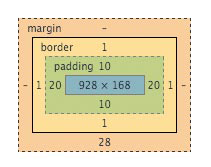

#### Procedure when writing HTML and CSS code

---

1. Change code
2. Test result in development browser
3. Validate HTML and CSS on official sites
4. Test result in other supported browsers


#### Box model

---

Everything in CSS has a box around it.

**The box model properties are:**



- `width` and `height`  - Defines the amount of horizontal and vertical space the box takes up
- `padding`  -  Defines the amount of spacing between the content-box and the border
- `border`  -  Boundary that surrounds the padding
- `margin`  -  Transparent are that surrounds the border and provides separation between elements.
  The margin is not counted towards the box itself but rather affects other content/elements that interacts with the margin boundings.

**There a few types of box models:**
**Note**: The margin is never counted towards the actual box size but it does affect the box surroundings!

Setting the box model is achieved using the CSS `box-sizing` property.

-  `content-box`  -  This is the **standard/default** box model.
                                 The padding and border **outset** the box size.
  Note: The dotted represents the desired dimensions and padding and border grow outwards.
- `border-box`  -  This is the **alternative** box model.
                             More intuitive because the padding and border does not affect surrounding flow.
                             The padding and border **inset** the box size.
  Note: The dotted represents the desired dimensions and padding and border grow inwards.
- `padding-box`  -  **Deprecated. Do not use.**


#### Visual formatting model

---

**Note**: The following discusses **outer box display types** and setting it is achieved using the CSS
`display` property.

In CSS we broadly work with two types of boxes which affects how the elements behave in terms of the flow of the page and other elements both horizontally and vertically. These two types and their principal differences are:

- Defined as outer display  type `block`
  - Breaks onto a new line
  - Takes up 100% of the available, horizontal parent space on the line it is located and leaves the space empty when the content is smaller than the 'line'.
  - The `width` and `height` box model properties are respected
  - Both horizontal and vertical padding; border and margin affect surrounding elements
- Defined as outer display type `inline`
  - Does not break onto a new line
  - The `width` and `height` box model properties are **not** respected
  - Horizontal padding; border and  margin work like in the `block` i.e. **do affect surrounding elements**
  - Vertical padding; border and margin are sized and positioned accordingly but **do not affect surrounding elements** i.e. they render but do not push other elements away.


**The special visual formatting model `inline-block` acts the following way:**

- The middle ground between `block` and `inline`
- Useful when an element should break onto a new line but should not take up all the line space
  by defining a width and height.
- `width` and `height` box properties are respected
- only becomes larger than the content if the `width` and/or `height` are explicitly defined


#### Inner and outer display type

---

An element's outer display type defines whether the CSS box is of type block or inline. 
An element's inner CSS box display type defined how elements that are nested inside that box are laid out.

There are different types of inner display types (the following is just an excerpt, there are more):

- **by default**, i.e. when no other inner display type is defined, the nested boxes are laid out in **normal flow** which is just using `block` and `inline-block` like normal
- `flex` sets the outer display type to `block` and the inner display type to `flex` and any direct children of this element are then laid out according to the `flex` [spec](https://developer.mozilla.org/en-US/docs/Learn/CSS/CSS_layout/Flexbox).
- `grid` ...

**Note:** Think of all boxes to be of type block or inline unless otherwise specified like `flex` for example.


#### Easily defining the box model to be used for all elements

---

I understand the following CSS code:

- specifies the single `html` element to use a specific box model

- makes the selected elements inherit the box model from the parent, in this case all elements because of the wildcards.

  So all elements nested in the html inherit from the html element and so forth.

  ```css
  html {
    box-sizing: border-box;
  }
    
  *, *::before, *::after {
      box-sizing: inherit;
  }
  ```


#### Differences between Padding and Margin

---

- Padding
  - Lies **inside** the border and are **part of the visible and clickable region** of an element
  - Typically have some color assigned to them
  - **Padding** does not collapse
  - Use cases:
    - **Outside** of a container: Affect the visible and clickable area of an element
    - **Inside** of a container: Horizontal separation between container edges and content
- Margin
  - Lies **outside** the border and is typically **invisible** and **not clickable**
  - **Top and bottom margins collapse between `block` elements**
    When two top/bottom margins collapse, they **end up** taking up as much as the **biggest margin of both**. This **does not happen with horizontal margins**!
  - Use cases:
    - General: Spacing between elements
    - Inside of a container: Affect vertical distance between the element and the container

**Note**: This is hard at the beginning and I must not follow any hard rules right now.


#### Dimensions/Measurements/Units

---

The length specification in terms of element properties such as: `12px`, `5rem` and `75%`.


Dimensions

- absolute units
- relative units
- CSS reference pixels
- Why do we need to consider `reference pixels` and `physical pixels` in the wild?
  Why is this important?
- How do `auto margins` work to center blocks horizontally?


#### Random HTML and CSS notes - 

---

- The CSS `vertical-align` property can vertically align adjacent `inline` and `inline-block` elements in different way.
  
- `block` and `inline-block` outer display model boxes **cannot be nested inside** `inline` type boxes
  
- Because HTML collapses multiple whitespace characters into a single whitespace character, this can cause some whitespace to appear and take up room and screw up a design like in the example:
  
 ```html
  <section>
    <article>content</article>
  <article>more content</article>
  </section>
 ```

  The combination of a newline and a few spaces are interpreted as single whitespace, which takes up space and can be enough to cause problems.

  This is why HTML elements are butted up against each other, to avoid this problem:

  ```html
  <section>
    <article>content</article><article>more content</article>
  </section>
  ```


#### Box model related vocabulary and questions from LS course

---


- **Containers**
  A term typically used for block elements that group other elements by nesting them.

- **CSS pseudo elements**  -  A **keyword added to a selector** that enables us to **style a specific part of the selected element** like for instance `p::first-line { /* style first lines */ }`


#### Todo list

---

- clean up notes titled: 'box model related voc' .... into the rest of the notes if they fit
- do the same for the 'random html and css notes'


#### Questions and answers

---

- How does whitespace collapsing work exactly? See [MDN docs](https://developer.mozilla.org/en-US/docs/Web/API/Document_Object_Model/Whitespace)
- How does margin collapsing work? See [MDN docs](https://developer.mozilla.org/en-US/docs/Learn/CSS/Building_blocks/The_box_model)