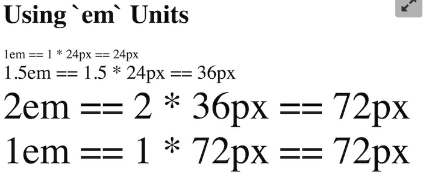
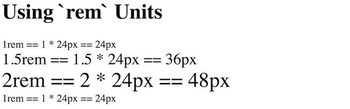
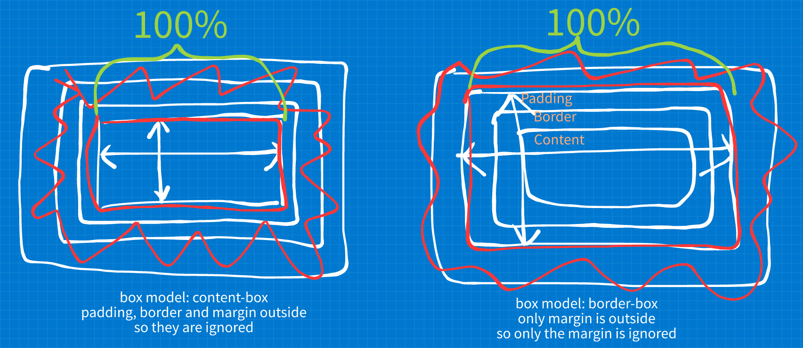

#### Visual formatting model

---

In CSS we broadly work with two types of boxes which affects how the elements behave in terms of the flow of the page and other elements both horizontally and vertically. These two types and their principal differences are:

- Defined as outer display  type `block`
  - Breaks onto a new line
  - Takes up 100% of the available, horizontal parent space on the line it is located and leaves the space empty when the content is smaller than the 'line'.
  - The `width` and `height` box model properties are respected
  - Both horizontal and vertical padding; border and margin affect surrounding elements
- Defined as outer display type `inline`
  - Does not break onto a new line
  - The `width` and `height` box model properties are **not** respected
  - Horizontal padding; border and  margin work like in the `block` i.e. **do affect surrounding elements**
  - Vertical padding; border and margin are sized and positioned accordingly but **do not affect surrounding elements** i.e. they render but do not push other elements away.


**The special visual formatting model `inline-block` acts the following way:**

- The middle ground between `block` and `inline`
- Useful when an element should break onto a new line but should not take up all the line space
  by defining a width and height.
- `width` and `height` box properties are respected
- only becomes larger than the content if the `width` and/or `height` are explicitly defined


#### Easily defining the box model to be used for all elements

---

I understand the following CSS code:

- specifies the single `html` element to use a specific box model

- makes the selected elements inherit the box model from the parent, in this case all elements because of the wildcards.

  So all elements nested in the html inherit from the html element and so forth.

  ```css
  html {
    box-sizing: border-box;
  }
    
  *, *::before, *::after {
      box-sizing: inherit;
  }
  ```


#### Differences between Padding and Margin

---

- Padding
  - Lies **inside** the border
  - **Is** part of the **visible** and **click-able** region of an element
  - Is typically styles through CSS
  - **Padding** does not collapse
  - Use cases:
    - **Outside** of a container: Affect the visible and click-able area of an element
    - **Inside** of a container: Horizontal separation between container edges and content
- Margin
  - Lies **outside** the border
  
  - And is typically **invisible** and **not click-able**
  
  - **Top and bottom margins collapse between `block` elements**
    When two top/bottom margins collapse, they **end up** taking up as much as the **biggest margin of both**.
    
    This **does not happen with horizontal margins!**
    
    
  - Use cases:
    - General: Spacing between elements
    - Inside of a container: Affect vertical distance between the element and the container

**Note**: This is hard at the beginning and I must not follow any hard rules right now.


#### The following was part of the previous notes but it fits better here

---

#### Lengths

There are different types of 'length' units/types in css of which some are absolute and some are relative.

- Absolute lengths - Fixed to a physical measurement

  - `px`  -  Pixel

    There is the notion of a display having a specific number of **pixels per inch** which is the amount of physical pixels that cover one inch of screen real-estate and may vary between lower and higher viewing devices.

- Relative lengths - Rely on the length of some other measurement/object

  - `%`  -  Percentages
    In order to set an axis of an elements size using percentages, we need to know the dimensions of the parent element, this selected element is nested in.

    So a style like:

    ```css
    .col {
      width: 50%;
    }
    ```

    Sets the element with the class attribute value `col` to 50% width of the element it is nested in, i.e. it's parent element.

  - `em`
    This one is calculated based on an element's font size.
    So if an element has a `font-size` of `11` and a `width` of `7`, then the total width of that object ends up being `em x font-size = 7 x 11 ==> 77`.

    **Note**: If no font-size is explicitly stated for a particular object using the `em` unit for some css property, then the **font-size of the closest parent with a defined font-size is used as the basis for `em`** using the same formula as mentioned above.


#### Dimensions/Measurements/Units

---

A `length specification`  is a combination of a numerical `value` and a `unit` such as `12px` where:

- `12`  and `12px`  - referred to as the `measurement` and/or `dimensions`
- `px`  -  referred to as the `measurement unit` and/or `unit`

> The single most important absolute unit in CSS is the `pixel`, abbreviated `px` when used as property unit. 

We must consider the **difference between** the following **different meanings of the term `pixel`**:

- **The Problem**
  Different devices have both **vastly different sized pixels** **and vastly different pixel density**.
  This means that the rendered image on some device X is not necessarily the same as on device Y because of all the mentioned variables.

  This is why CSS distinguishes between the following **two types of pixels**:

- `Physical Pixel`  -  Also referred to as `Device Pixel` or `Display Pixel`
  The physical pixel is defined as 96 pixels per inch and **accounts for the difference in resolution/surface are i.e. pixels per inch.**
  The **browser** then renders the image and **scales** it to the target display **so that the source and destination image** take up the **same amount of horizontal and vertical pixels on both devices**.
  
  
  
- `CSS Reference Pixel`  -  Also referred to as `CSS Pixel` or `Reference Pixel`
  
  The reference pixel **accounts for the difference in display sizes and the `TVD` - Typical Viewing Distance for a specific display**.
  The goal is to scale the images on different displays in a way that the images render at the same **perceived dimensions IF viewed from the `TVD` typical viewing distance for that specific display**.
  
  

**Note**: Again,  the principal absolute unit is the `px`. Other absolute units like `inch` are rarely used because their results are not always as expected.


#### Relative units

---

The principal relative units to use are

- `em`

  - **Proportional** to the `calculated font size`

  - **NOT consistent in a documents** because they **compound**
    

    

  - The `calculated font size`  is the **height of the current font in pixels**

  - Example: If the `calculated font size = 20px` then `1.5em = 30px` because `20px * 1.5 = 30px`

-  `rem`

  - **Proportional** to the `root font size`
  - **Consistent** meaning **anywhere in the document** i.e. `1.5rem` is **always** the same value based on the specified `root font size`
    
  - The `root font size` is the **height of the base font for the document** which is the font size designated to the`html` element
  - Example: If the `root font size = 16px` then `1.5rem = 24px` because `16px * 1.5 = 24px`
  
  **Note**: Just use the `px` unit to specify the `root font size`
  
  **Note**: If I do want to use a  `rem` unit as the `root font size` you **must use a fallback of unit `px` to account for old/buggy browsers**
  
  ```css
  p {
    font-size: 20px; font-size: 1.25rem;
  }
  ```
  
  
  
  **Note**: To account for bugs in older browsers set the `root font size` on **both the html and body element using the `px` unit**
  
- `%`  -  *Technically is not a length value*
  Can be used to define a size based on the containing elements (the container) available content region.

  Using `100%` on as an element's width or height can be trick because:

  - `100%` for a nested element **does not consider the margins** so the element **may end up extending beyond the container bounds**
  - additionally to ignoring the margin, the browser also **ignores the padding, border and margin when the box model is set to `content-box`**

  

  The way I understand this is that `100%` bases the fitting of the nested element on the bounding box and when:

  - the box model is `border-box`, padding and border are inside the bounding box and **only the margin is ignored**
  - the box model is `content-box`, padding, border and margin are outside the bounding box and **all three of them are ignored**

  which causes the nested boxes to extend beyond the container in different ways

  

  

  

  

  

  **Note**: `width` and `height` have not effect on `inline` elements **with the exception of `img` elements!**

- `auto`  -  Is not a length value and how it works **depends on exactly where it is used**.
  `auto` used as value for:

  - `width` or `height` makes the browser **try** to fit the entire element **including it's margin** into it's surrounding container
    **including it's padding, margin and border!**
  - `left-margin` or `right-margin` on a **block element** makes the browser **push the element all the way right or left inside it's surrounding container**. 
    When both the `left` and `right` margins are set to `auto`  on a **block** element, the browser centers the element in the container.
    
  - `auto` as a `top-margin` or `bottom-margon` is **equivalent to** `0`
  - **Padding does not accept `auto`**


**Note**:  Margin centering only works on `block` elements!


#### Setting a font-size fallback for old/buggy/non-rem unit supporting browsers

---

Apparently most, but **not all** modern browsers use a default font-size of `16px`. This is important because we can base the CSS fallback on this common browser behaviour. Here an example of the logic behind approach:

```css
/* setting p elements to a font-size of 1.25rem */
/* if the browser does not support rem units */
/* it falls back to the 20px property value*/
p {
  font-size: 20px; font-size: 1.25rem;
}
```

The logic behind this approach is the following:

- we assume that most browser set a default font-height of `16px`
- because we want, in this case, `p` elements to be `1.25rem` high, the fallback is `20px` just because the common browser default is `16px`.
  This means that in case the `rem` is not used, we still end up with a font height of `20px` because `1.25rem` is `16px * 1.25 = 20px .`

**So using a fallback font height of `16px` on an html document is the best bet.**


#### List of focus topics I have to reflect in my HTML/CSS notes based on the LS focus post for this chapter ??? !!!

---

- How do `auto margins` work to center blocks horizontally?


#### Random HTML and CSS notes - Find a b

---

- The CSS `vertical-align` property can vertically align adjacent `inline` and `inline-block` elements in different way.

- CSS property values that are set to zero should **not have a unit because they are ignored**

- `img` elements are **not `inline-block`** by **default** elements** but **they are `inline`** elements **by default**!

  

#### Box model related vocabulary and questions from LS course

---


- **Containers**
  A term typically used for block elements that group other elements by nesting them.

- **CSS pseudo elements**  -  A **keyword added to a selector** that enables us to **style a specific part of the selected element** like for instance `p::first-line { /* style first lines */ }`


#### Questions and answers

---

- How does a CSS fallback work in conjunction with functionality the browser does not support?
  In the following CSS snippet we want the browser to prioritize the `rem` property but if that is not supported it should fallback to `px`:

  ```css
  p {
    font-size: 20px; font-size: 1.25rem;
  }
  ```

  Is the rule maybe as easy as, along the lines of `if the rightmost property value is supported it takes precedence and if it is not  the the property value immediately to the left is used`?

- What are the exact rules for compounding `em` font heights? Does it have to do with nesting? Maybe just learn the basics and then use `rem`s all the way.

- Do block level elements always expand vertically to fit the content?