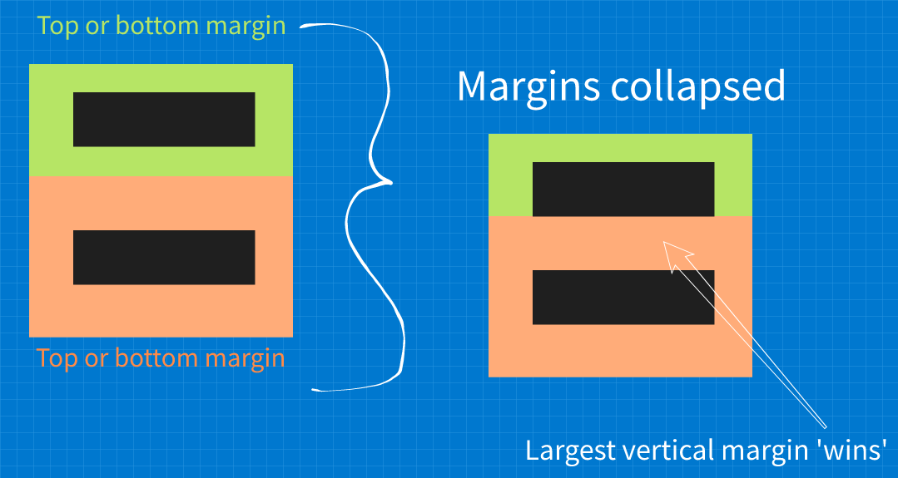
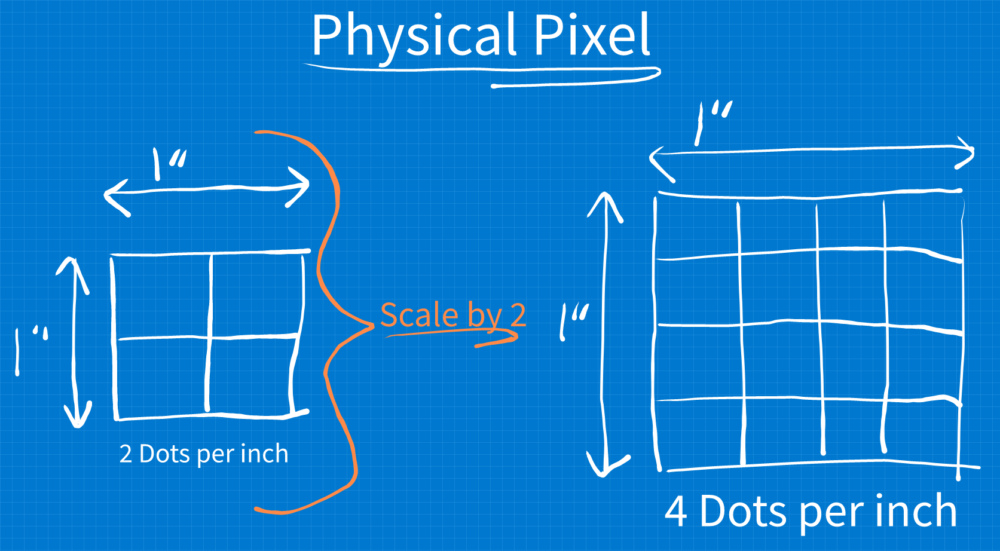
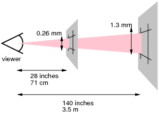
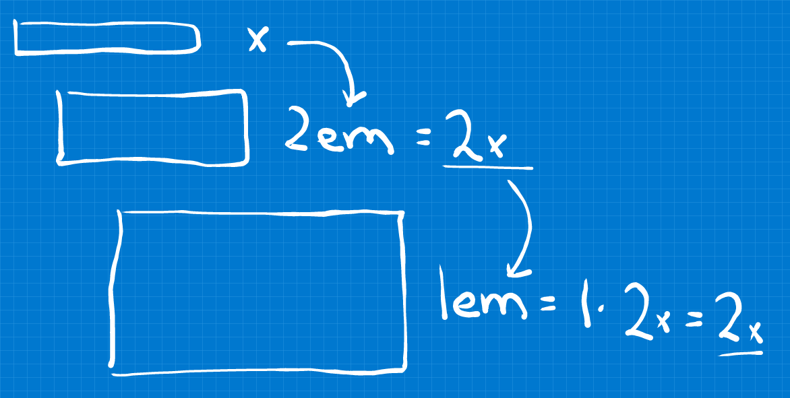
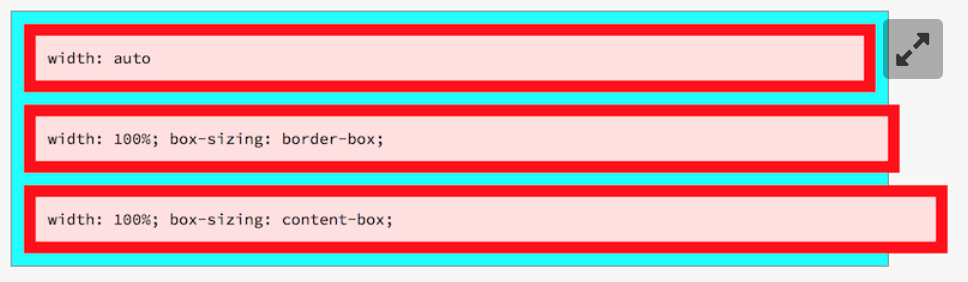
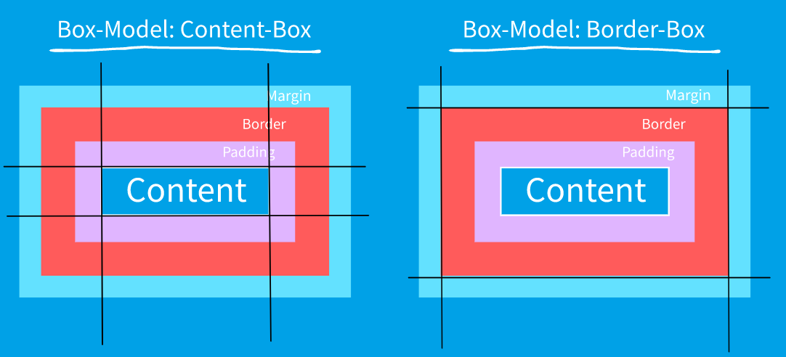
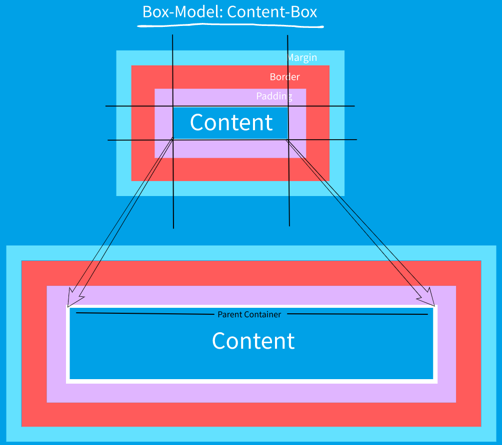
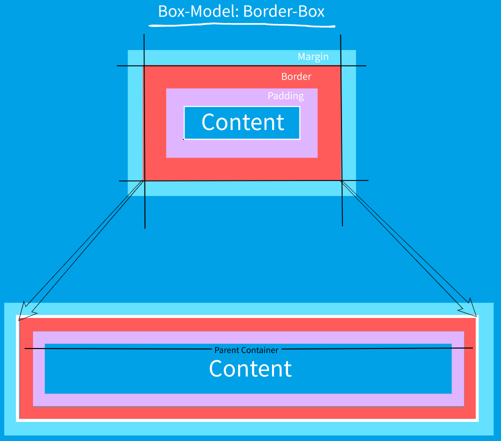
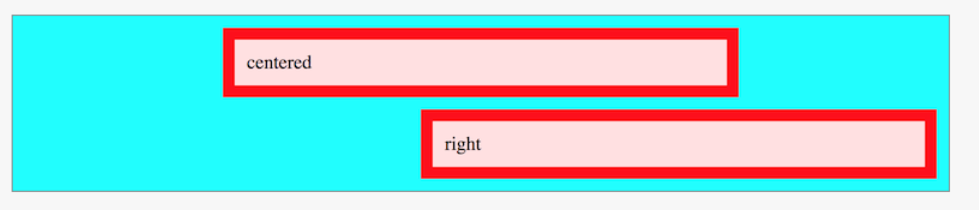

### The CSS Box-Model

---

In the context of CSS **every element** has a bounding box around it which is **made up of different layers**.


The dimensions of these layers can be adjusted using the following CSS Box-Model properties:

- `width` / `height`  -  Defines the horizontal and vertical dimensions of the box(black border)
- `padding`  -  Defines the amount of spacing between the content box (blue) and the border(green)
- `border`  -  Defines the width of the region that surrounds the padding(yellow)
- `margin`  -  Defines the size of the transparent area that provides separation between elements.
                     The margin is **not** counted towards the box itself, regardless of the box-model used.


The Box-Model can be set using the CSS `box-sizing` property an there are **two** values to choose from.

   **Note**: The arrows in the image show the extent of the bounding box **excluding the margins**.

- `content-box`  -  The default Box-Model  - The padding and border are an **outset** of the box size
  **Note**: `content-box` **does not contain** the padding and the border **in the bounding box**!
- `border-box`  -  The more intuitive of the two  -  The padding and border are an **inset** of the box size
  **Note**: `border-box` **does indeed contain** the padding and the border **in the bounding box**!


### The Visual Formatting Model  -  [MDN Docs](https://developer.mozilla.org/en-US/docs/Web/CSS/Visual_formatting_model)

---

The Visual Formatting Model defines how user-agents take the document, process and display it for visual media such as HTML pages.

In order to render the content, each HTML element is associated with zero or more boxes according to **which Visual Formatting Model is used**, which is specified using the CSS `display` property and the following data points:

- Box dimensions and Box-Model type used
- Positioning scheme used (normal flow; float or absolute positioning)
- Relationship between elements in document the tree
- Environmental information such as: viewport size; intrinsic dimensions of images; etc.


##### Differentiating between the outer and inner Visual Formatting Model

The `outer display type` i.e. the `outer display formatting model` defines how the element **itself** behaves and the `inner display type` of that element defines how **it's children** behave!

There are many display types such as for example: `block`; `inline-block`; `inline`; `grid` and `flex`:


### Types of Visual Formatting Models i.e. Display Types

---

**Block elements**  -  Can be specified using `display: block;`

- Breaks onto a new line
- Takes up 100% of the available horizontal space and leaves the rest of the line empty when the content is smaller than the complete line.
- Box-Model `width` and `height` properties are respected
- **Horizontal and Vertical** `padding`; `border` and `margin` **do affect surrounding content**
- The **vertical** margins of **two touching block elements collapse** into **the largest one of both**


**Inline elements**  -  Can be specified using `display: inline;`

- Does **not** break onto a new line
- Takes up only as much width as necessary based on the element content
- Box-Model `width` and `height` properties are **not** respected
- **Horizontal** `padding`; `border` and `margin` **do affect surrounding content**
- **Vertical** `padding`; `border` and `margin` **do not affect surrounding content** but are rendered and positioned accordingly.


**Inline-Block elements**  -  Can be specified using `display: inline-block;`

- Acts as a middle-ground between `inline` and `inline-block`
- Breaks onto a new line like `block`
- Does **not** take up the space like `block`
- Box-Model `width` and `height` properties are respected
- Takes up only as much space as the content **unless** a `width` or `height` is specified


### Difference between Padding and Margin

---

**Padding**

- Lies **inside the border** and is **part of the click-able region**
- Padding cannot collapse
- **Typical use-cases**:
  - **Outside of a container:** Affect the visible and click-able area of an element
  - **Inside of a container**: Horizontal separation between container and content


**Margin**

- Lies **outside the border** and is **not** a part of the click-able region
- Vertical margins **between `block` elements collapse** to the largest margin of both
  
- **Typical use-cases**:
  - General spacing between elements
  - **Inside of a container**: Vertical separation between container and element


### CSS Length Specification Units

---

A `length specification unit` is the combination of a numerical value and a unit such as `16px` where:

- `16` is referred to as the `measurement`
- `px` is referred to as the `unit`


**The Problem**

Modern devices have a vast range of combination of different display dimensions, resolution and physical pixel sizes. This means that an image rendered on one device if very probably different from most other devices in one or another way.

This is the reason why CSS distinguishes between **two types of pixels**:


**`The Physical Pixel`**  -  `Device Pixel`  - `Display Pixel`

The physical pixel is defined for a display with 96 pixels per inch (ppi) and accounts for the difference in resolution and surface.

The browser then renders the image and scales it to the target display so that the source and destination image take up the same amount of horizontal and vertical pixels on both devices.




**`The Reference Pixel`**  -  `CSS Pixel`  -  `CSS Reference Pixel`

The `CSS Pixel` accounts for the **difference in display sizes and the Typical Viewing Distance `TVD`** for a specific display.

The goal is to scale the images on different displays in a way that the images render at the same perceived dimensions **if viewed from the `TVD` typical viewing distance for that specific display**.




**Note**: Units such as `inch` are rarely used because they do not intuitively display as an inch but depend on
           the `TVD`. The primary and single most important CSS sizing unit is the `px`.


**The essential length units  -  Absolute and Relative**

- **Absolute units  -  Physical measurement**

  - `px`  -  Pixel
    Based on the `reference pixel` so one pixel **is not necessarily** a single hardware pixel, but rather whatever CSS, the browsers, operating systems etc scale it and render it too.

- **Relative units  -  Specified in terms of some other element or environment measurement**

  - `%`  -  Percentage  -  Technically not a length value
    Typically based on the **specified calculated property value of the parent**.

  - `em`  -  Emphemeral Unit

    This unit is a scaled version of the `current calculated font-size` where:

    - `current`  -  refers to the current font-size, which is defined by the parent
    - `calculated font-size`  -  refers to the height in pixels


    This unit compounds as the nested elements are based on the calculated, current font-size.

    **Think of it as**: `my parent element's calculated font-size in pixels`

    


    **Example:**

    ```txt
    If the parents fonz-size is 20px
    Then using the font-size '1.5em' in any child evaluates to (1.5 x 20px) = 30px
    And this 30px is then used as drop-in in the children of the children
    ```

  - `rem`  -  Root Emphemeral Unit

    This unit is a scaled version of the `root font-size` which is the font-size specified for the `html` element. **This unit does not compound as it is always based on the same value**.

    **Think of it as**: `the root element's calculated font-size in pixels`

    So when the root element has a font-size of `20px` then the style `font-size: 1.5rem` evaluates to `1.5 * 20px = 30px` for **every element using this style no matter it's nesting or parent**.


### Parent-overshooting boxes when using `width: 100%`

---

When we want an element to take up `100%` of the parent container we can specific `width: 100%`.

Problems arise when we specify `padding` and `border` for that **nested** element because as I understand, what the browser does to make an element fit is:

1. Consider the bounding box based on the Box-Model for the box we want to take up the whole line
2. Scales the box according to that Box-Model bounding box to take up the whole line





**If the bounding box defined by the Box-Model is as on the following image:**




**In other words through a visual example:**

- Making a `content-box` element take up `100%` of the container `width`

  The Box-Model attributes **that are used** by the browser to scale to 100% of the parent box are:

  - content size

  **The rest is ignored** and the result is that **the scaled version overshoots the parent container**!

  
  

- Making a `border-box` element take up `100%` of the container `width`

  The Box-Model attributes **that are used** by the browser to scale to 100% of the parent box are:

  - content size
  - padding
  - border

  **The Margin is ignored** and the result is that **the scaled version does NOT overshoot the parent container unless the margin is defined, which merely pushes the box out after the fact**.

  


**Note**: That while the margin is ignore in the element scaling, the margin still affects the positioning of the 
            nested element!


### Using the `auto` property

---

The `auto` property value behavior depends on where it is used exactly. Following are some use-cases.

**Fitting an element into the surrounding container horizontally**
Setting the element with to `auto` tells the browser to **try to fit** the element inside **including**:

- content-size
- padding
- border
- margin
  

**What does `height: auto; ` mean?**
Apparently `height: auto;` is the default user-agent/browser style which means that the height of the element is based on **the height needed by the children of that element** .


**Left; Right and center aligning `block-level` elements**


- `margin-left: auto;` **right** aligns the element in the container
- `margin-right: auto;` **left** aligns the element in the container
- **both horizontal** margins set to `auto` centers the element in the container


**Note**: Specifying `auto` for `top` and `bottom` margins is equivalent to setting them to `0`
**Note**: The padding property value **cannot be set to `auto`**


### Vertical positioning using `vertical-align`

---

The `vertical-align` property sets the alignment type of `inline` and `inline-block` elements where the vertical alignment is affected by the dimensions of the container.


### Define style for all elements in a few lines of CSS

---

```css
html {
  box-sizing: border-box;
}
  
*, *::before, *::after {
    box-sizing: inherit;
}
```

**This CSS does the following:**

1. Specify the Box-Model to be used on the `html` element
2. Select all elements using the `universal` selector and all pseudo elements and make them inherit the Box-Model


### Setting a fall-back font

---

The preferred unit to specify font-size is `rem` since it is always based on the same specified number and does **not** cascade like it's `em` counter-part.

The problem is that it is not supported in all older browsers, so we have to set a fall-back font-size if the `rem` unit is unsupported. This can be done as follows:

```css
html {
  font-size: 16px;
}
/* select and desired elements for safe the font */
p {
  font-size: 20px; font-size: 1.25rem;
}
```

The idea here is to:

1. use the `1.25rem` font **if** this unit is supported. This always ends up being `16px * 1.25 = 20px`.
2. otherwise use the `20px` font which also always ends up the same exact dimension as the `rem` value


**Note**: Apparently most browsers use a default font-size of `16px`.


### Questions and answers

---

- **How does the CSS fallback technique work?**
  When CSS is parsed and a property-value is not valid the **latest property-value is used**.

  This means that the following:

  ```css
  p {
    font-size: 16px; font-size: 1.75rem;
  }
  ```

  - specifies the font-size to be `1.75rem` when the browser supports it
  - specifies the font-size to be `16px` because when the browser does not support `rem`s

- **What is a formatting context?**

  A formatting context is an area of a document/page that defines that the contained content/elements should be laid out in a particular way. There are different types of `Formatting Contexts` such as:

  - Block Formatting Context
  - Inline Formatting Context
  - Flex Formatting Context

- **Why should root element font-height be specified in `px` and not in `rem`?**
  **How should it be done if we wish define the font-size in `rem`s in a way that all browsers can work with it?**

  Because not every browser supports `rem` units, the fall-back should be specified in `px` and the `rem` should be secondary so that when the browser does not support `rem` units, it can use the latest supported value. This is done as follows:

  ```css
  html {
    font-size: 16px; /* the fallback */
    font-size: 1.25rem; /* not supported by every browser, ignore if unsupported */
  }
  ```

- **What is the probable cause when an element cannot be changed in size using `width` and `height`?**
  The elements are probably `inline-level` elements.

- **Are HTML `img` elements `inline` or `inline-block` level elements by default?**
  By default, HTML `img` elements are `inline` level elements.