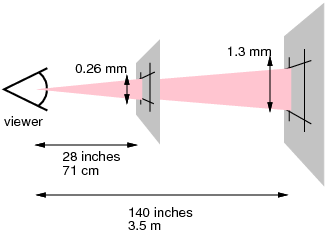

### The CSS Box-Model

---

In the context of CSS **every element** has a bounding box around it which is **made up of different layers**.


The dimensions of these layers can be adjusted using the following CSS Box-Model properties:

- `width` / `height`  -  Defines the horizontal and vertical dimensions of the box(black border)
- `padding`  -  Defines the amount of spacing between the content box (blue) and the border(green)
- `border`  -  Defines the width of the region that surrounds the padding(yellow)
- `margin`  -  Defines the size of the transparent area that provides separation between elements.
                     The margin is **not** counted towards the box itself, regardless of the box-model used.


The Box-Model can be set using the CSS `box-sizing` property an there are **two** values to choose from.

   **Note**: The arrows in the image show the extent of the bounding box **excluding the margins**.

- `content-box`  -  The default Box-Model  - The padding and border are an **outset** of the box size
  **Note**: `content-box` **does not contain** the padding and the border **in the bounding box**!
- `border-box`  -  The more intuitive of the two  -  The padding and border are an **inset** of the box size
  **Note**: `border-box` **does indeed contain** the padding and the border **in the bounding box**!


### The Visual Formatting Model  -  [MDN Docs](https://developer.mozilla.org/en-US/docs/Web/CSS/Visual_formatting_model)

---

The Visual Formatting Model defines how user-agents take the document, process and display it for visual media such as HTML pages.

In order to render the content, each HTML element is associated with zero or more boxes according to **which Visual Formatting Model is used**, which is specified using the CSS `display` property and the following data points:

- Box dimensions and Box-Model type used
- Positioning scheme used (normal flow; float or absolute positioning)
- Relationship between elements in document the tree
- Environmental information such as: viewport size; intrinsic dimensions of images; etc.


##### Differentiating between the outer and inner Visual Formatting Model

The `outer display type` i.e. the `outer display formatting model` defines how the element **itself** behaves and the `inner display type` of that element defines how **it's children** behave!

There are many display types such as for example: `block`; `inline-block`; `inline`; `grid` and `flex`:


### Types of Visual Formatting Models i.e. Display Types

---

**Block elements**  -  Can be specified using `display: block;`

- Breaks onto a new line
- Takes up 100% of the available horizontal space and leaves the rest of the line empty when the content is smaller than the complete line.
- Box-Model `width` and `height` properties are respected
- **Horizontal and Vertical** `padding`; `border` and `margin` **do affect surrounding content**
- The **vertical** margins of **two touching block elements collapse** into **the largest one of both**


**Inline elements**  -  Can be specified using `display: inline;`

- Does **not** break onto a new line
- Takes up only as much width as necessary based on the element content
- Box-Model `width` and `height` properties are **not** respected
- **Horizontal** `padding`; `border` and `margin` **do affect surrounding content**
- **Vertical** `padding`; `border` and `margin` **do not affect surrounding content** but are rendered and positioned accordingly.


**Inline-Block elements**  -  Can be specified using `display: inline-block;`

- Acts as a middle-ground between `inline` and `inline-block`
- Breaks onto a new line like `block`
- Does **not** take up the space like `block`
- Box-Model `width` and `height` properties are respected
- Takes up only as much space as the content **unless** a `width` or `height` is specified


### Difference between Padding and Margin

---

**Padding**

- Lies **inside the border** and is **part of the click-able region**
- Padding cannot collapse
- **Typical use-cases**:
  - **Outside of a container:** Affect the visible and click-able area of an element
  - **Inside of a container**: Horizontal separation between container and content


**Margin**

- Lies **outside the border** and is **not** a part of the click-able region
- Vertical margins **between `block` elements collapse** to the largest margin of both
  
- **Typical use-cases**:
  - General spacing between elements
  - **Inside of a container**: Vertical separation between container and element


### CSS Length Specification Units

---

A `length specification unit` is the combination of a numerical value and a unit such as `16px` where:

- `16` is referred to as the `measurement`
- `px` is referred to as the `unit`


**The Problem**

Modern devices have a vast range of combination of different display dimensions, resolution and physical pixel sizes. This means that an image rendered on one device if very probably different from most other devices in one or another way.

This is the reason why CSS distinguishes between **two types of pixels**:


**`The Physical Pixel`**  -  `Device Pixel`  - `Display Pixel`

The physical pixel is defined for a display with 96 pixels per inch (ppi) and accounts for the difference in resolution and surface.

The browser then renders the image and scales it to the target display so that the source and destination image take up the same amount of horizontal and vertical pixels on both devices.


**`The Reference Pixel`**  -  `CSS Pixel`  -  `CSS Reference Pixel`

The `CSS Pixel` accounts for the **difference in display sizes and the Typical Viewing Distance `TVD`** for a specific display.

The goal is to scale the images on different displays in a way that the images render at the same perceived dimensions **if viewed from the `TVD` typical viewing distance for that specific display**.




**Note**: Units such as `inch` are rarely used because they do not intuitively display as an inch but depend on
           the `TVD`. The primary and single most important CSS sizing unit is the `px`.


### Define style for all elements in a few lines of CSS

---

```css
html {
  box-sizing: border-box;
}
  
*, *::before, *::after {
    box-sizing: inherit;
}
```


**This CSS does the following:**

1. Specify the Box-Model to be used on the `html` element
2. Select all elements using the `universal` selector and all pseudo elements and make them inherit the Box-Model


### Setting a fall-back font

---

The preferred unit to specify font-size is `rem` since it is always based on the same specified number and does **not** cascade like it's `em` counter-part.

The problem is that it is not supported in all older browsers, so we have to set a fall-back font-size if the `rem` unit is unsupported. This can be done as follows:

```css
html {
  font-size: 16px;
}
/* select and desired elements for safe the font */
p {
  font-size: 20px; font-size: 1.25rem;
}
```

The idea here is to:

1. use the `1.25rem` font **if** this unit is supported. This always ends up being `16px * 1.25 = 20px`.
2. otherwise use the `20px` font which also always ends up the same exact dimension as the `rem` value


**Note**: Apparently most browsers use a default font-size of `16px`.


#### ??? Looking Box-Model attributes up on MDN shows what else it affects ???

**Note**: Finish from my notes and check if I can sponge up some interesting MDN facts, then delete this portion!

- for `margin`
  - margin collapsing
  - horizontal centering for modern and old browsers
  - shorthand versions
  - values: length; percentage; auto
- for `padding`  -  Similar to `margin`
- look up `border` too as it has a few quirks?


### Notes flow from old notes

---

###### Box Model

###### Visual Display Model

- Different types of Visual Display Model, what their differences are and how they act
  - Block
  - Block
  - Inline-block
- Inner and outer display type


###### Dimensions , measurements and CSS unit

- types of pixels and why they need to be considered
  - the problem this terminology tries to solve
  - physical pixels
  - reference pixels
- CSS 'length' units
  - absolute units, their quirks and use-cases
    - px
  - relative units, their quirks and use-cases
    - percentages
    - em
    - rem
    - auto  -  while not a length value it has many rules and use-cases to consider
      Also where all these rules apply or not ...
      - use-case with width/height
      - use-case with margin where it interacts differently with horizontal and vertical margins
      - cannot be used with padding?


###### Fallback properties

- how to do it
- preferred syntax
- reasoning behind the numbers for the case of font sizing


###### Things that don't fit anywhere else

- Easily define the same box-model for every element using CSS inheritance

- how vertical align works with box and visual display formatting models

- what img elements are by default and why they need special treatment sometimes

- terminology: container; ? ? ? 

- what pseudo elements are and how they are used

- How margin collapsing works and what are the situations to be aware of?

  

###### Questions and answers - The combo may fit into the course better than in Q&A format

- How do auto-margins work specifically to center blocks horizontally?
  What are the requirements and limitations?

- When using fallbacks in CSS style, are the right or left-most values the first/last considered?

- ... all the ones still in the old notes

- difference between intrinsic and extrinsic attributes?

- what are the different formatting contexts about?
  **These seem to be the governing rules that make understanding this stuff a lot easier?**

  - block formatting context
  - inline formatting context
  - ...

  Learn these and everything gets easier?

- What are the types of flow and why are they important