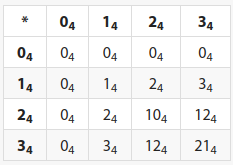

#### What to focus on

---

- usage
  - construct simple lists and nested lists
  - create horizontal lists
  - using pseudo classes `:hover` and `:focus`
  - construct simple tables with headers, body and footers
- list types
  - understand difference between ordered; unordered and description lists
  - explain when to use each type of list
- table structures
  - understand the difference between columns, rows and cells
  - use table-headers; body and footers
  - know the difference between table headers; row headings and column headings
- study from the summary


#### Lists - Overview

---

There are merely `6` tags to implement the following `3` types of lists HTML supports:

- **`Unordered Lists`**
  These render with no visual numbering (but rather symbols like bullets or squares) and render vertically by default.

  **Elements**

  - `<ul></ul>`  -  Unordered List element
  - `<li></li>`  -  List Item Element

  **Example**

  ```html
  <ul>
    <li>Red</li>
    <li>Orange</li>
  </ul>
  ```

- **`Ordered Lists`**
  These do render with numerical numbering by default and can be set to use characters such as roman numbers; alphabetic letters etc.

  **Elements**

  - `<ol></ol>`  -  Ordered List Element
  - `<li></li>`  -  List Item Element

  **Example**

  ```html
  <ol>
    <li>Red</li>
    <li>Orange</li>
  </ol>
  ```

- **`Description Lists`**

  These are made up of `terms` and `definitions` and **each item in this description list contains**:

  - one or more terms
  - one or more definitions

  Good examples of description lists are: dictionaries and phone books.

  **Elements**

  - `<dl></dl>`  -  Description List Element
  - `<dt></dt>`  -  Description Term Element
  - `<dd></dd>`  -  Description Definition Element

  **Example**

  ```html
  <dl>
    <dt>Unordered</dt>
    <dd>A simple list with bullets.</dd>
    <dd>A plain list with no bullets or sequence numbers.</dd>
  
    <dt>Ordered</dt>
    <dd>A simple list with sequence numbers or letters.</dd>
  </dl>
  ```
  


**Note**: Basically every type of list can be nested in every other type of list.


####  Tables

---

A long time ago when there was no CSS, people used Tables for layout purposes because it was the only way to lay HTML content out into columns of content through sort of a grid.

But HTML Tables were intended to be used with  `tabular data` where the horizontal and vertical position of each item in that Table are significant, as in the following `base 4 multiplication table`:



**Today we use tables only for tabular data and never for layout purposes!**


Tags and elements used in the table context:

- `<table></table>`   -  Defines the `table`

- `<tr></tr>`  -  Defines a `table row`  which is a **row of cells** in a table.
                           Each row contains zero or more cells.

- `<td></td>`  -  Defines a `table data cell`  which is a single cell of table content.

- `<th></th>`  -  Defines a `table header cell` which is a header of a group of table cells.
                           The nature of the these groups are defined by the `th`'s `scope` and
                           `headers` attributes.

- `<thead></thead>`  -  Defines a set of table rows `tr` to **represent the head of the columns of the table**.

  ```html
  <thead>
    <tr>
      <th scope="col">Items</th>
      <th scope="col">Expenditure</th>
    </tr>
  </thead>
  ```

- `<tbody></tbody>`  -  Defines a set of table rows `tr` to **represent the body of the table.**

  ```html
  <tbody>
    <tr>
      <th scope="row">Donuts</th>
      <td>3,000</td>
    </tr>
  </tbody>
  ```

- `<tfoot></tfoot>`  -  Defines a set of table rows `tr` to **represent the footer of the table** where the **footer is a set of rows that summarize the columns of the table**.

  ```html
  <tfoot>
    <tr>
      <th scope="row">Totals</th>
      <td>21,000</td>
    </tr>
  </tfoot>
  ```

  

#### Continue at

---

- https://launchschool.com/lessons/8c6e03e3/assignments/fbba940d and finish the table tags portion


#### Horizontal navigation bar mechanics

---

In order to do this the following is apparently necessary:

- set width of the `ul` element
- set `font-size` for `ul` to `0` and restore the font-size for the `li` element
- set list items to `inline-block`
- set the width of the list items as desired which is typically a percentage of the available width


#### How to use HTML and CSS semantically - A reminder

---

- use `header` with a nested `h1` and `p` element for a title with a sub-title.
  The following means semantically that the elements nested in that header are part of the header.
  You should always include a header that is either a page or section header.

  ```html
  <header>
    <h1>The Next Reckoning: Capitalism and Climate Change</h1>
    <p>By NATHANIEL RICH</p>
  </header>
  ```

  

#### HTML and CSS tricks

---

- When trying convert a horizontal to a vertical navbar using the following snippet:

  ```html
  <ul>
    <li><a href="#">Home</a></li>
    <li><a href="#">Projects</a></li>
    <li><a href="#">Team</a></li>
    <li><a href="#">Help</a></li>
  </ul>
  ```

  And each list item is set to 25% it does not work because there is whitespace between the `li` elements. This whitespace can be taken care of in using different techniques:

  - comment out the whitespace
  - butt-up the `li` elements
  - set the font-size of the `ul`  element to zero and re-set the font-size for the `li` to what is desired
    This seems to be the preferred solution for the horizontal navbars.


#### Questions and answers

---

- What are pseudo classes exactly?
  Examples are: :hover; :focus; :last_child; :full-screen etc
- Do my rectified notes answer all the focus on points?
  If yes notes are ok and delete the focus on portion!