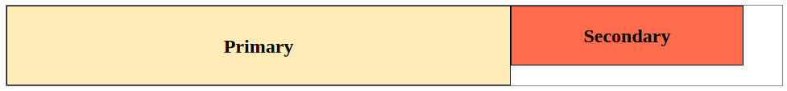
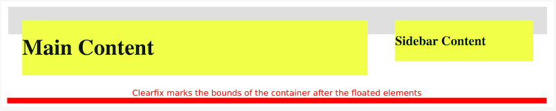
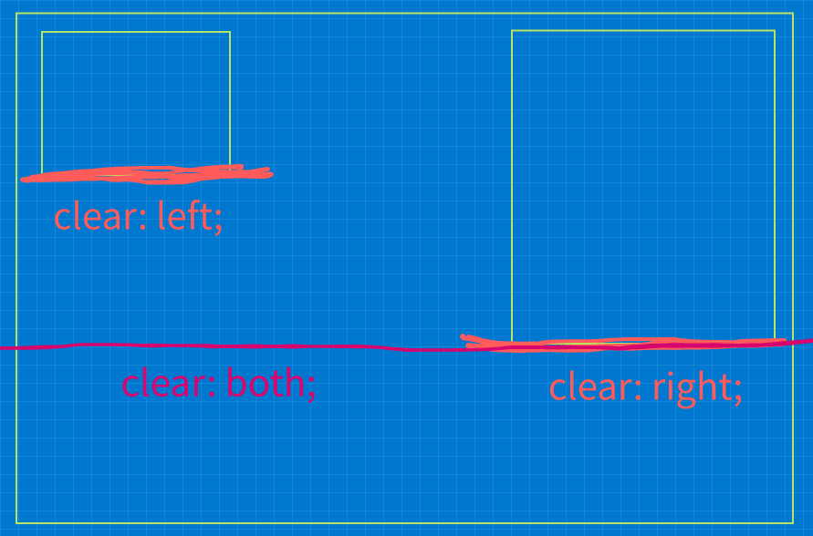
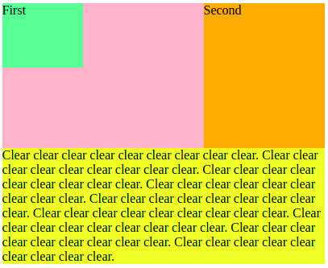
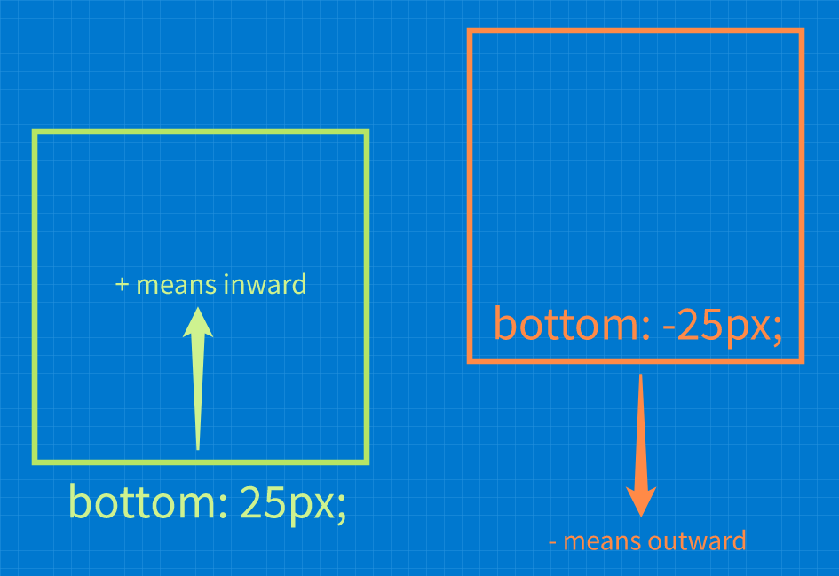

### What to focus on

---

**Note**: This topics are complex and harder to learn. Know the basics and use them. Don't go deeper for now

I should know how to use the following:

- float elements and clear element floats
- positioning using `position: absolute`
- basic media queries
- liquid and fluid layouts


### Floats

---

Floats are an easy way to place elements side-by-side and collapse any in-between element whitespace without hacks like comments or HTML placing **if they fir on the same line/row**.

Floats are used to push element to the far left or right **in their immediate container** which define the maximum left/right boundaries the element can be pushed to.

The space beside floated elements left and right are usable to other elements just as normal and **floated elements only take up as much space as their content takes up, which is why a block level element may be less than full width**!


**When floating an element, the  `display` property value is typically changed to `block`, but there are exceptions depending on the element type**.


**Note**: Floated elements have special behavior in terms of vertical margin collapsing.
**Note**: Floats can be used to swap the position of elements:

```html
<!-- HTML -->
<div class="primary">
  <p>Main Content</p>
</div>

<div class="secondary">
  <p>Sidebar 1</p>
</div>
```

```css
/* Primary is positioned left */
.primary {
  float: left;
}

.secondary {
  float: left;
}
```

**Result**:


**Changin the side using the floats**:

```css
/* Primary is positioned left */
.primary {
  float: right;
}
.secondary {
  float: left;
}
```


**Floats have complex rules which is why we should keep styling with floats as minimal as possible**.

In order to get expected styling when using floats:

- Keep the height of the floated objects the same 
- Keep the float direction of the grouped elements (the ones in the same row!?) to a single direction, **either** left **or** right.


**Floated elements allow text and inline elements to wrap around it**!


**Note**: In general floats seems like something to be avoided and there are typically better options such as Flex, Grid and Frameworks.


### Clearing floats

---

Floating elements often causes the `containing floats problem`:


The problem is that the nested and floated elements are **removed from the normal document flow** which means that the **gray container does not contain the floated items anymore**. So the **browser cannot properly determine the size of the nested, floated elements** anymore!

**Note**: Floated elements **typically do not affect the dimensions of their parents** but **can overlap other content in terms of rendering**.


**There are two solutions to fix this problem**:

- Use `overflow: hidden;` or `overflow: auto`
  **Must be applied to the element containing the floating elements** which forces the container to expand in order to contain and render the floated elements as defined.

  There are two edge cases though for each overflow type:

  1. `overflow: hidden;` can clip content that does not fit if the defined container dimensions if the container has dimensions defined
  2. `overflow: auto;` can add undesired scrollbars and this is browser specific

  ```css
  .container {
    overflow: auto; /* or overflow: hidden; */
  }
  ```

  

  **This fix works because the `overflow` property uses a `block formatting context` which includes floated elements**.
  **This means that the floated elements can now be considered when determining the size of the parent container.**

- Use a `clearfix`:
  A `clearfix` is a **technique** that forces a container to contain it's floated children by appending an empty block-level element **after** the floated elements, in other words, we **trick the container into considering the floated elements** by adding an **empty marker element** **as last container child** on which the **container can base it's calculations to contain all the floated children**.


  **This marking clearfix element has the following characteristics**: 

  1. It is empty
  2. Must be block-level so that it takes up a complete line/row
  3. Must clear the desired floated elements, so that it is positioned exactly under the lowest (desired) floated element
  4. Must be the last i.e. **after** the floated elements in the hierarchy of elements contained in the parent container.

  

  **Here a more intuitive, visual illustration:**

  1. The `containing floats problem` without applying any fix  -  Container cannot consider the floated children for the final container dimensions.
     

  2. Add a clearfix  -  This is an **empty, block-level element** added as the **last container child** that **marks the boundary of the content** 
     vertically.

     ```css
     .container::after { /* add an element to the .container element as the last child i.e. behind any floats */
       content: ""; /* define the clearfix element content to be empty */
       display: block; /* clearfix element must take up the whole line/row */
       clear: both; /* position clearfix element just under the lowest, preceding floating element */
     }
     ```


     

  3. Container can base it's dimension calculations based on the clearfix:
     


### How `clear` works

---

The `clear` property moves **the cleared elements, that follow any floated element**, **just under** the lowest vertical boundary of the defined type of float. **Both non-floated and floated elements** **can be cleared** based on preceding floated element.



**Note**: Always use `clear: both;` unless there is a good reason to choose a specific one!


**Intuitive example illustrations clearing elements from preceding floating elements:**

- When an element is cleared from preceding floats using `clear: both;`
  the cleared element is moved down until it's top edge is under the **lowest** floated element edge, be that `left` or `right`  floats.
  

- When an element is cleared from preceding floats using `clear: left;`
  the cleared element is moved down the same way until it is just under the `left` floated elements.
  

- When an element is cleared from preceding floats using `clear: right;`
  the cleared element is moved down the same way until it is just under the `right` floated elements.
  

  **Note**: In this case clearing `right` and `both` is the same.


### Problems that occur when floating and intuition

---

Always remember that:

- floated elements take up as much space as they need to display the content which is the case of a long line of text can be a very large width!

  If the floated element is too large for the rest of the row/line space, it wraps to the lext line/space.

- when using percentage dimensions always think of the box-model and the present margins and padding of the elements

- always think of the type of display formatting model floated are converted to automatically, since this is typically `block`, floated elements then have all the capabilities and limitations of block-level elements


### How `Offset` properties interact with the `position` property

---

The **offset** properties `left`, `right`, `bottom` and `top`  work together with `position` to determine:

- **which direction** you want to push the element towards
- **how far in that direction** you want to push the element

Each of these `4` offsets **measure offset inward from the border in question** **when the offset is positive**. That is:

- `bottom: 60px;` means 60 pixels **upwards** from the **bottom region border**
- `left: 20px;` means 20 pixels **to the right** form the **left region border**
- `left: -20px;` means 20 pixels **to the left** from the **left region border** because **negative values flip the direction**

**Note**: Negative offset values cause the element to be pushed **outwards from the border in question**.




### The `position` property

---

The `position` property defines **how** the browser should position the selected element. There are different types:

- **`position: static`**

  - This is the default positioning
  - These elements **are part of the page flow**
  - Appear in the order they do in the markup
  - These **static elements** are **not affected by offset properties**

  **Note**: Elements that use `flow`, `grid`, `flex`, `absolute` and/or `fixed` positioning **are removed from the page flow**.

  **Note**: This position value **ignores values from left; right; bottom; top; z-index**!

- **`position: relative`**

  Relative positioning **does not remove the elements from the document flow** but rather **only renders it at an offset**.

  

  
  Think about it this way, at every point in time a relative positioned element has **two things going on**:

  1. the element is still in the flow **exactly as if it were static** and affects the flow exactly as static elements
  2. the element is **merely rendered at an offset to it's static position** where **this offset element does not affect the flow**!

  In other words, the flow is the same as with `static` elements but the browser merely renders the elements at an offset.

  

  **Note**: Only ever use a single offset direction per axis because they have precedence rules and may not work as expected.

  


  **These offset precedence rules are**:

  - `left` overrides `right` for left-to-right languages.

  -   `right` overrides `left` for right-to-left languages.
  -   `top` overrides `bottom` at all times.

  

  **Specifying relative position**

  ```css
  .selector {
    position: relative;
    left: 50px;
    top: -25px;
  }
  ```

- **`position: absolute`**

  Absolute position moves the element to **a new position within a container element** which is the **nearest ancestor element that has either that has a non-static`position`**.

  **If there is no ancestor that fits these criteria the body is used instead, which means that the browser positions the element on the initial page in an absolute position**.

  

  **Other important considerations about `absolute` position are:**

  - Absolute position **does indeed take the elements from the document flow** which means that is does not take up flow space.
    So absolute elements **do not interact with the flow of other elements**!
  - Absolute position initializes the element position at the origin of the chosen ancestor and the offsets work from there!

  

  **Specifying absolute position**

  ```css
  .selector {
    position: absolute;
    top: -50px;
    right; 33%;
  }
  ```

- `position: fixed`

   Fixed position positions the element at a fixed position within the browser window and **does not move** when the user scrolls the page.

   **Note**: Absolute positioning **does take the element from the document flow** i.e. it does not take up any flow space.

   ```css
   .selector {
     position: fixed;
     top: 0;
     right; 25px;
   }
   ```

   **Note**: Launchschool does not cover this type of position and does not give further info.


### Flex and Grid

---

When working with floats and positioning we must deal with all the side effects in the design where two `display` property values support:


- **Flex**  -  `display: flex`
  - Is one-dimensional which means that can work with **one axis at the same**
  - Think in terms of **styling** a **single rows or column**
- **Grid**  - `display: grid`
  - Is two-dimensional which means that can work with **two axes at the same**
  - Think in terms of **styling** a **many rows and columns**


### Random Video notes to extract proper notes from

---

**Flex video notes**

- No more fiddling with typical problems like: `float`, `clear` and fixes like clearfix
- Problems Flex wants to solve
  - Floats are miss-used and the need to clear them
  - Different design files for different screen sizes/devies
  - More intuitive and robust horizontal/vertical spacing
- Features
  - Simple re-ordering of elements through `media-queries` through css without changing the markup
  - The element contents are considered
- `media queries` enable us to style markup through raw css by defining the style requirements.
  Think markup styling shaders.
- Do not use nested Flex containers but rather go grid right away. That's the purpose and avoids overhead because of non-semantic markup that is added solely for styling.

**Grid video notes**

- Problems Grid wants to solve
  - Alternatives to build responsive layouts change the actual markup through external technologies which can mess with the semantics and all technologies that are based on semantics (like accessibility features)
  - The jumbled mess JavaScript solutions can produce
  - Same as for Flex, avoid all the hacky crappy solutions we use everywhere as part of normal development
- Simple to apply and design responsive designs with as well as very flexible
- What to aim for in the big picture
  1. **Build accessible mobile-first layouts with grid**
  2. Use mobile-first layout as fallback for all browsers.
     Because they are the most robust designs and work and work on small **narrow and wide** displays and **not necessarily vice-versa**.
  3. use `@supports`  to detect grid support
  4. apply nested grids and grid areas to have more control over the content
- Implementing a design with Grid is simple and intuitive:
  1. Design how a particular website should look
  2. Design a grid that fits the design
  3. Populate the grid with content through Grid on ... basis:
     - cell
     - row
     - column
     - region
     - ...
- Intuition and philosophy
  - Do not get caught up in making every website look alike per browser/device but rather make it look best for these specific browsers/devices.
- Tools  - Use the browser Grid inspector
- Great resources to learn Grid
  - `gridbyexample`
  - CSS Tricks


### CSS Frameworks

---


**How Frameworks typically work**

Framework grid systems are typically implemented with a **combination of HTML, CSS and JavaScript**.
While these Frameworks **do not currently use Flex and Grid, they probably soon will**.


**The principal technique employed by the frameworks is to generate columns of a certain size based on the usual CSS tricks:**

```html
<ul class="row">
  <li class="one-fourth">8 GB SD card</li>
  <li class="one-fourth">16 GB SD card</li>
  <li class="one-fourth">32 GB SD card</li>
  <li class="one-fourth">64 GB SD card</li>
</ul>
```

```css
/* the clearfix */
.row::after {
  clear: both;
  content: "";
  display: block;
  line-height: 0;
}

/* putting items in a row with that span the desired percentage of the available width */
/* which is 100% / 25% = 4 columns for this particular example */
.one-fourth {
  display: inline-block;
  float: left;
  outline: 1px solid gray;
  vertical-align: top;
  width: 25%;
}
```


**Result**:


These are **proven techniques used by most frameworks** and even **work great with nested rows/columns**.


**So the Framework Grid Systems like for instance `Twitter Bootstrap`:**

1. The **Framework creates a 'grid' system** using the class approach like the examples above
2. We make some **HTML use these classes** provided by the framework


At this point the Frameworks, also provide 'responsive design' capabilities which makes the website design work well on all sorts of devices because the responsive design adjusts to the screen dimensions and browser capabilities.


**Advantages and disadvantages**

While Frameworks may **seem less useful than they were before Flex and Grid**, **Frameworks have the advantage** of **working with browsers that support JavaScript but do not support Flex and/or Grid**.


**Framework advantages over straight CSS Flex/Grid**

- Generic, pre-defined grid systems to use 'out of the box' for devices with all sorts of screen dimensions and browser capabilities
- Work well with browsers that **do not yet support Flex/Grid but do support JavaScript** which means that JavaScript can handle everything that would otherwise need to be done through CSS or CSS Flex/Grid

**Framework Disadvantages over straight CSS Flex/Grid**

- Extra baggage and functionality that may not be needed
- It uses JavaScript **if** it is considered a disadvantage.


### Responsive Design

---

CSS `media queries` enable us to write CSS for different display contexts.

**Media queries**

While media queries have all sorts of functionality, they are most typically used to apply different styles based on the current browser window size. This enables us to write different styles for any display size.

Example:

```css
/* defining a style for when the browser window width is <= 480 */
@media (max-width: 480px) {
  a {
    color: #06c;
  }
}
```


The style conditional can be a mixture of different **media types** and **logical operators can be chained**.

The media types are:

- all``
- `screen`
- `print`
- `speech`


**A media query evaluates to true only when:**

1. The specified media type(s) match the device the document is being displayed on
   **and**
2. All `media features` expressions evaluate to `true`.
   A `media feature` describes a specific feature of the user-agent environment which can be for example:
   - screen dimensions
   - supported features: scripting enabled?
   - hardware information
   - etc

**Note**: Media types that are unknown to a particular device **always evaluate to false**.


### Mobile-first VS Desktop-first

---

When starting a project we must decide to take a `mobile-first` or `desktop-first` approach.

**Whichever we choose is going to be the initial style for which NO media query is active**.

This means that is we choose a mobile-first approach, i.e. primary handle small display devices:

1. we provide initial styles through normal CSS **without**  media queries
2. progressively add media queries to handle larger and larger displays


**Example**

```css
/* CSS for all cell phones and shared cross-browser CSS */

@media screen and (min-width: 481px) {
  /* CSS for tablets and larger - starting at 481 pixels wide*/
}

@media screen and (min-width: 961px) {
  /* CSS for small desktop and laptop screens and larger - starting at 961 pixels wide */
}

@media screen and (min-width: 1501px) {
  /* CSS for large laptop and desktop displays - starting at 1501 pixels wide*/
}
```


Development starts **without** media queries and we start development with the smallest/largest device we want to support that contains the **common styling to all supported designs** like colors for example, which probably don't vary too much across designs for the same application.

This initial, common styling typically goes towards the top and the more specific designs towards the bottom.


**When designing**

Do not try to account for specific devices but rather determine the requirements based on the needed media types and then design for best usability using these media types. Do not worry about the specific devices initially but rather focus on the things that we can control and know.

Think about **what design works best for a given screen dimension or any other requirement**.


**Breakpoint**  -  A breakpoint is the context in which the style is changed to another style.
						   An example is when the screen size goes from `<= 400` to `>= 401` i.e. the breaking point or
					       threshold where another style is to be used based on these requirements.


### Making sure mobile devices use the responsive version

---

**If, and only if the document style uses responsive features through media queries and feature detection, define the following HTML to communicate to the browser to use the page as it is programmed rather than displaying a scaled down, non-responsive version of the document**.

```html
<!-- Include this html element only if responsive styling is to be used -->
<meta name="viewport" content="width=device-width, initial-scale=1" />
```

**Note**: If the document does **not** use responsive design **do not define this tag**!

Long story short, this non-standard HTML definition tells mobile browser how to interpret the document in terms of the vistualized viewport and whether it should use the downloaded documents' design or scale the full sized, non-responsive rendered document down and let users zoom, pan as most small display devices do for non-responsive designs to enable the user to interact with the document whether it is optimized for the particular device or not.

More information here: https://developer.mozilla.org/en-US/docs/Web/HTML/Viewport_meta_tag


### Fluid and Liquid Layouts

---

The following types of layouts are **nearly identical and have minor differences**:

- `Liquid`  -  Typically employ percentage values to **maintain some desired** **width ratio** of elements
                     whatever the dimensions of the window and **typically take up the whole screen-estate**.
  


  **Note**: Both `Liquid` and `Fluid` designs are based on this type of 'synchronized behavior' where if one thing changes, for instance the window size or some box, some other dependent thing changes too.

- `Fluid`  -  This takes a `Liquid` layout a step further by stopping the infinite expansion/collapsing at
                   some pre-defined limit and stops increasing in width, in other words, **Fluid layouts behave **
                   **like Liquid layouts up to a points where the Fluid layout becomes fixed**.

  This is typically implemented using a container that with a max size and the content spans the whole container.

  **Example where Fluid is still expanding based on the ratio:**
  
  


  **Example where Fluid maxes out at some pre-defined width and stops expanding:**

  


- `Responsive`  -  As explained above achieved with media query breakpoints

- `Elastic`

- `Hybrid`


### Continue @

---


### General HTML document tricks and tools

---

- When centering an element horizontally **using offsets**

  1. Center the element using the `left` and `right` offset properties with a percentage value like `50%`.
     This puts the **left edge** of the element in the **center**.
  2. Pull the element back to the left using a negative margin of half the space left of the element.


  ```css
  .center-me {
    width: 400px;
    position: fixed; /* glues to the body viewport */
    left: 50%;
    margin-left: 200px; /* half of the objects width, manually yes ... */
  }
  ```

- Dimming content to accentuate a specific element, like these adds

  1. Add a covering element of the required position and dimensions and set it to a translucent color
  2. Define it's and the other relevant elements' z-index to not rely on the HTML document structure

  ```css
  /* define a translucent plane to cover the content */
  /* make sure to define z-index for all affected elements */
  /* for best expected results */
  .dimmer {
    width: 100%;
    height: 100%;
    background-color: rgba(0, 0, 0, 0.6);
    position: fixed;
    left: 0;
    top: 0;
    z-index: 1;
  }
  ```

- `text-align:` can be used to center content that is nested inside a block-level element

- empty elements added to an element using the `::before` and `::after` pseudo element can be used for defining horizontal dividers:

  ```css
  .container::after {
    display: block;
    width: 100%;
    content: "";
    border-top: 1px dashed black;
  }
  ```

- `line-height` seems to be a great way to set the padding of elements that contain text content

- use the Firefox Grid viewer

- use the Chrome device emulator to test responsive designs


### Questions and answers

---

- what are the following and do they all exist or are some terms the 'same'?

  - pseudo class
  - pseudo element
  - pseudo selector

  **Two of these exist:**

  - `pseudo classes`  -  keyword **added to a selector** that reads special state of the selected elements

    ```css
    selector:hover { /* style */ }
    ```

    **Note**: Use **single colon** for pseudo classes!

  - `pseudo elements`  -  keyword **added to a selector** to style a specific part of the selected element

    ```css
    selector::before { /* style */ }
    ```

    **Note**: Use **two colons** for pseudo elements!

- What is a `block formatting context` at awareness level?
  The important thing to understand is that the `block formatting context` contains **everything** inside the element to which it applies, **including floated elements**!

- How would you implement different styles based on browser window size if there are no variables through pure css i.e. no media queries?
  
- How to vertically center elements like text that have **no pre-defined height** through pure css.
  
- Are floated; grid, flex, absolute and relative elements alway removed from the page flow?
  Are statically positioned elements always part of the page flow?

- Write a list of where, how and with what requirements the types of position differs for quick comparison when I need it.
  Probably not worth it if my notes are clean enough?
  
- How are fonts inherited if at all? LS code keeps defining the same `font` property value for text wrapped in divs.
  
- What is the `Stack`? This concept is used to describe the rules which govern how elements are ordered and used etc. Good to know for rendering with positioned and z-indexed elements!
  
- what does HTML parse as HTML and what characters have to be escaped and how?
  
- flex box can be used to flex everything but also for positioning only
  
- flex does not respect sizing if screen size gets small which we can define through wrapping
  
- flex considers the nesting of elements
  
- **using flex, think:**
  
  - of how the space is supposed to be distributes and how the grid rows/columns/cells are to be arranged
  - that flexbox is used to style **horizontal space** i.e. **is one dimensional** and go from there
  - we can decide to distribute **horizontal and vertical** space
  
  

### What to learn deeply for sure after this lesson

---

- CSS Flex and Grid
- Responsive design using media queries etc


### Good reads and resources

---

- using negative margins: https://www.smashingmagazine.com/2009/07/the-definitive-guide-to-using-negative-margins/
- summary box models, floats and positioning rules: https://d3jtzah944tvom.cloudfront.net/202/projects/lesson_6/box_model_v2/main.html