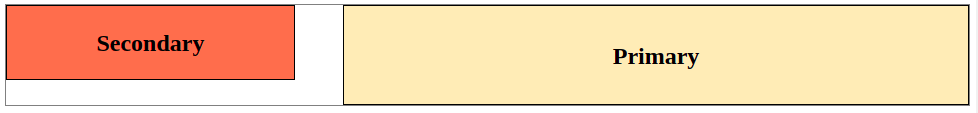
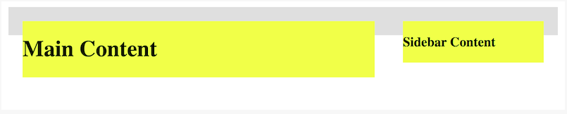
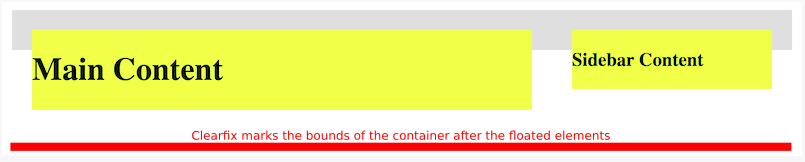
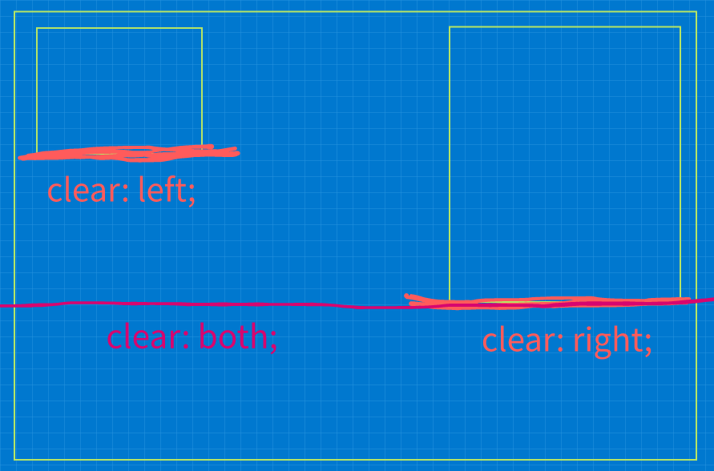
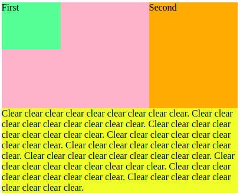
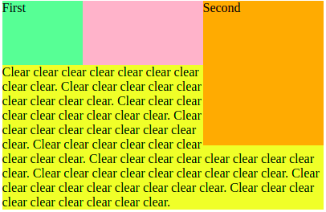
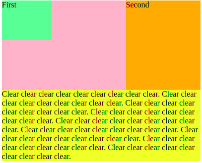
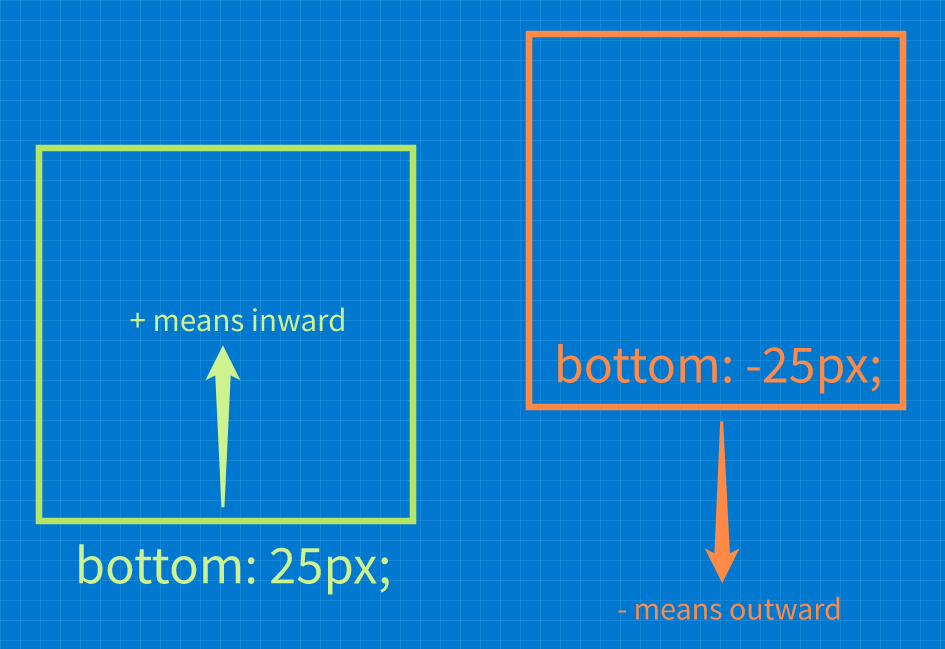
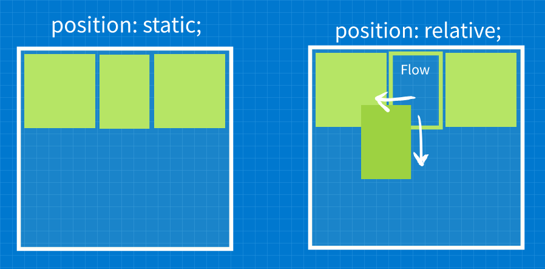

### What to focus on

---

**Note**: This topics are complex and harder to learn. Know the basics and use them. Don't go deeper for now

I should know how to use the following:

- float elements and clear element floats
- positioning using `position: absolute`
- basic media queries
- liquid and fluid layouts


### Floats

---

Floats are an easy way to place elements side-by-side and collapse any in-between element whitespace without hacks like comments or HTML placing **if they fir on the same line/row**.

Floats are used to push element to the far left or right **in their immediate container** which define the maximum left/right boundaries the element can be pushed to.

The space beside floated elements left and right are usable to other elements just as normal and **floated elements only take up as much space as their content takes up, which is why a block level element may be less than full width**!

**Note**: Floated elements have special behavior in terms of vertical margin collapsing.
**Note**: Floats can be used to swap the position of elements:

```html
<!-- HTML -->
<div class="primary">
  <p>Main Content</p>
</div>

<div class="secondary">
  <p>Sidebar 1</p>
</div>
```

```css
/* Primary is positioned left */
.primary {
  float: left;
}

.secondary {
  float: left;
}
```

**Result**:


**Changin the side using the floats**:

```css
/* Primary is positioned left */
.primary {
  float: right;
}
.secondary {
  float: left;
}
```



**Floats have complex rules which is why we should keep styling with floats as minimal as possible**.

In order to get expected styling when using floats:

- Keep the height of the floated objects the same 
- Keep the float direction of the grouped elements (the ones in the same row!?) to a single direction, **either** left **or** right.


**Floated elements allow text and inline elements to wrap around it**!


**Note**: In general floats seems like something to be avoided and there are typically better options such as Flex, Grid and Frameworks.


### Clearing floats

---

Floating elements often causes the `containing floats problem`:


The problem is that the nested and floated elements are **removed from the normal document flow** which means that the **gray container does not contain the floated items anymore**. So the **browser cannot properly determine the size of the nested, floated elements** anymore!

**Note**: Floated elements **typically do not affect the dimensions of their parents** but **can overlap other content in terms of rendering**.


**There are two solutions to fix this problem**:

- Use `overflow: hidden;` or `overflow: auto`
  **Must be applied to the element containing the floating elements** which forces the container to expand in order to contain and render the floated elements as defined.

  There are two edge cases though for each overflow type:

  1. `overflow: hidden;` can clip content that does not fit if the defined container dimensions if the container has dimensions defined
  2. `overflow: auto;` can add undesired scrollbars and this is browser specific

  ```css
  .container {
    overflow: auto; /* or overflow: hidden; */
  }
  ```

  

  **This fix works because the `overflow` property uses a `block formatting context` which includes floated elements**.
  **This means that the floated elements can now be considered when determining the size of the parent container.**

- Use a `clearfix`:
  A `clearfix` is a **technique** that forces a container to contain it's floated children by appending an empty block-level element **after** the floated elements, in other words, we **trick the container into considering the floated elements** by adding an **empty marker element** **as last container child** on which the **container can base it's calculations to contain all the floated children**.


  **This marking clearfix element has the following characteristics**: 

  1. It is empty
  2. Must be block-level so that it takes up a complete line/row
  3. Must clear the desired floated elements, so that it is positioned exactly under the lowest (desired) floated element
  4. Must be the last i.e. **after** the floated elements in the hierarchy of elements contained in the parent container.

  

  **Here a more intuitive, visual illustration:**

  1. The `containing floats problem` without applying any fix  -  Container cannot consider the floated children for the final container dimensions.
     

  2. Add a clearfix  -  This is an **empty, block-level element** added as the **last container child** that **marks the boundary of the content** 
     vertically.

     ```css
     .container::after { /* add an element to the .container element as the last child i.e. behind any floats */
       content: ""; /* define the clearfix element content to be empty */
       display: block; /* clearfix element must take up the whole line/row */
       clear: both; /* position clearfix element just under the lowest, preceding floating element */
     }
     ```


     

  3. Container can base it's dimension calculations based on the clearfix:
     


### How `clear` works

---

The `clear` property moves **the cleared elements, that follow any floated element**, **just under** the lowest vertical boundary of the defined type of float. **Both non-floated and floated elements** **can be cleared** based on preceding floated element.



**Note**: Always use `clear: both;` unless there is a good reason to choose a specific one!


**Intuitive example illustrations clearing elements from preceding floating elements:**

- When an element is cleared from preceding floats using `clear: both;`
  the cleared element is moved down until it's top edge is under the **lowest** floated element edge, be that `left` or `right`  floats.
  

- When an element is cleared from preceding floats using `clear: left;`
  the cleared element is moved down the same way until it is just under the `left` floated elements.
  

- When an element is cleared from preceding floats using `clear: right;`
  the cleared element is moved down the same way until it is just under the `right` floated elements.
  

  **Note**: In this case clearing `right` and `both` is the same.


### Problems that occur when floating and clearing

---

Always remember that:

- floated elements take up as much space as they need to display the content which is the case of a long line of text can be a very large width!

  If the floated element is too large for the rest of the row/line space, it wraps to the lext line/space.

- when using percentage dimensions always think of the box-model and the present margins and padding of the elements


### How `Offset` properties interact with the `position` property

---

The **offset** properties `left`, `right`, `bottom` and `top`  work together with `position` to determine:

- **which direction** you want to push the element towards
- **how far in that direction** you want to push the element

Each of these `4` offsets **measure offset inward from the border in question** **when the offset is positive**. That is:

- `bottom: 60px;` means 60 pixels **upwards** from the **bottom region border**
- `left: 20px;` means 20 pixels **to the right** form the **left region border**
- `left: -20px;` means 20 pixels **to the left** from the **left region border** because **negative values flip the direction**

**Note**: Negative offset values cause the element to be pushed **outwards from the border in question**.




### The `position` property

---

The `position` property defines **how** the browser should position the selected element. There are different types:

- **`position: static`**

  - This is the default positioning
  - These elements **are part of the page flow**
  - Appear in the order they do in the markup
  - These **static elements** are **not affected by offset properties**

  **Note**: Elements that use `flow`, `grid`, `flex`, `absolute` and/or `fixed` positioning **are removed from the page flow**.

- **`position: relative`**

  Relative positioning **does not remove the elements from the document flow** but rather **only renders it at an offset**.

  

  
  Think about it this way, at every point in time a relative positioned element has **two things going on**:

  1. the element is still in the flow **exactly as if it were static** and affects the flow exactly as static elements
  2. the element is **merely rendered at an offset to it's static position** where **this offset element does not affect the flow**!

  In other words, the flow is the same as with `static` elements but the browser merely renders the elements at an offset.

  

  **Note**: Only ever use a single offset direction per axis because they have precedence rules and may not work as expected.

  


  **These offset precedence rules are**:

  - `left` overrides `right` for left-to-right languages.

  -   `right` overrides `left` for right-to-left languages.
  -   `top` overrides `bottom` at all times.

  

  **Specifying relative position**

  ```css
  .selector {
    position: relative;
    left: 50px;
    top: -25px;
  }
  ```

- **`position: absolute`**

   Absolute position moves the element to **a new position within a container element** which is the **nearest ancestor element that has either:**

  - relative position
  - absolute position
  - sticky position (not handled in this course)

  **If there is no ancestor that fits these criteria the body is used instead, which means that the browser positions the element on the initial page in an absolute position**.

  

  **Other important considerations about `absolute` position are:**

  - Absolute position **does indeed take the elements from the document flow** which means that is does not take up flow space.
    So absolute elements **do not interact with the flow of other elements**!
  - Absolute position initializes the element position at the origin of the chosen ancestor and the offsets work from there!

  

  **Specifying absolute position**

  ```css
  .selector {
    position: absolute;
    top: -50px;
    right; 33%;
  }
  ```

- `position: fixed`

   Fixed position positions the element at a fixed position within the browser window and **does not move** when the user scrolls the page.

   **Note**: Absolute positioning **does take the element from the document flow** i.e. it does not take up any flow space.

   ```css
   .selector {
     position: fixed;
     top: 0;
     right; 25px;
   }
   ```

   **Note**: Launchschool does not cover this type of position and does not give further info.


### General HTML document tricks

---

- When centering an element horizontally **using offsets**

  1. Center the element using the `left` and `right` offset properties with a percentage value like `50%`.
     This puts the **left edge** of the element in the **center**.
  2. Pull the element back to the left using a negative margin of half the space left of the element.


  ```css
  .center-me {
    width: 400px;
    position: fixed; /* glues to the body viewport */
    left: 50%;
    margin-left: 200px; /* half of the objects width, manually yes ... */
  }
  ```

- Dimming content to accentuate a specific element, like these adds

  1. Add a covering element of the required position and dimensions and set it to a translucent color
  2. Define it's and the other relevant elements' z-index to not rely on the HTML document structure

  ```css
  /* define a translucent plane to cover the content */
  /* make sure to define z-index for all affected elements */
  /* for best expected results */
  .dimmer {
    width: 100%;
    height: 100%;
    background-color: rgba(0, 0, 0, 0.6);
    position: fixed;
    left: 0;
    top: 0;
    z-index: 1;
  }
  ```

  


### Things to add to the previous matching portions about positioning

---

**Is the following correct?**

>  **Note**: Absolute and Fixed elements typically **do not affect the dimensions of their parents**.


### Questions and answers

---

- what are the following and do they all exist or are some terms the 'same'?

  - pseudo class
  - pseudo element
  - pseudo selector

  **Two of these exist:**

  - `pseudo classes`  -  keyword **added to a selector** that reads special state of the selected elements

    ```css
    selector:hover { /* style */ }
    ```

    **Note**: Use **single colon** for pseudo classes!

  - `pseudo elements`  -  keyword **added to a selector** to style a specific part of the selected element

    ```css
    selector::before { /* style */ }
    ```

    **Note**: Use **two colons** for pseudo elements!

- What is a `block formatting context` at awareness level?
  The important thing to understand is that the `block formatting context` contains **everything** inside the element to which it applies, **including floated elements**!

- Are floated; grid, flex, absolute and relative elements alway removed from the page flow?
  Are statically positioned elements always part of the page flow?

- Write a list of where, how and with what requirements the types of position differs for quick comparison when I need it.
  Probably not worth it if my notes are clean enough?


### Good reads

---

- https://www.smashingmagazine.com/2009/07/the-definitive-guide-to-using-negative-margins/