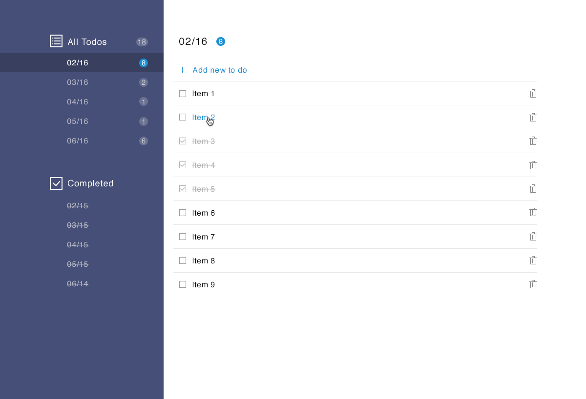

### Technologies used in this projects

---

- Manually developed HTML
- Manually developed CSS

### What will function and not function in this project

---
**Functioning features**:

- Pop-up modal used for adding new todos
- Responsive hamburger should show and hide navigation bar ...

**Non-functioning features**:

- Select different todo lists
- Add and remove and mark todos

### Project views overview

---

- **Todo list page**  -  list of todo items and  `nav` pane for viewing groups of todos
- **Mobile device version of the todo list page**  -  that hides the `nav` pane by default but can be revealed   by clicking on a responsive hamburger
- **The Modal**  -  the dialog that lets a user add a Todo item

### View  -  Todo List  -  Desktop and mobile version

---

